# 🚀 Full-Stack DevOps Learning Project — The Complete Guide

> **Everything in one place.** This is a comprehensive, production-grade learning project that takes a simple Notes App from a browser click all the way to a globally distributed, auto-scaling, fully observable, security-hardened cloud deployment.
>
> Every layer is taught hands-on through 141+ structured tasks across 21 technology categories.

---

## 📋 Table of Contents

1. [What is This Project?](#what-is-this-project)
2. [The Notes App](#the-notes-app)
3. [Big Picture — Everything Connected](#big-picture--everything-connected)
4. [Layer 0 — Micro-Frontend Architecture](#layer-0--micro-frontend-architecture)
5. [Layer 1 — Client & Network Edge](#layer-1--client--network-edge)
6. [Layer 2 — Load Balancer & Reverse Proxy (NGINX)](#layer-2--load-balancer--reverse-proxy-nginx)
7. [Layer 3 — API Gateway & Microservices](#layer-3--api-gateway--microservices)
8. [Layer 4 — Event Streaming (Kafka)](#layer-4--event-streaming-kafka)
9. [Layer 5 — Databases & Storage](#layer-5--databases--storage)
10. [Layer 6 — Container Orchestration (Kubernetes)](#layer-6--container-orchestration-kubernetes)
11. [Layer 7 — GitOps & Helm](#layer-7--gitops--helm)
12. [Layer 8 — Service Mesh (Istio)](#layer-8--service-mesh-istio)
13. [Layer 9 — CI/CD Pipelines](#layer-9--cicd-pipelines)
14. [Layer 10 — Security](#layer-10--security)
15. [Layer 11 — Observability (Logs, Metrics, Traces)](#layer-11--observability-logs-metrics-traces)
16. [Layer 12 — Infrastructure as Code (Terraform + Ansible)](#layer-12--infrastructure-as-code-terraform--ansible)
17. [Layer 13 — Cloud Deployment (AWS / GCP / Azure)](#layer-13--cloud-deployment-aws--gcp--azure)
18. [Layer 14 — Serverless (Lambda / Cloud Functions)](#layer-14--serverless-lambda--cloud-functions)
19. [Layer 15 — Distributed Systems](#layer-15--distributed-systems)
20. [The Full Learning Roadmap](#the-full-learning-roadmap)
21. [Task Categories & File Index](#task-categories--file-index)

---

## What is This Project?

This repository is a **complete, end-to-end DevOps learning curriculum** built around one real application: a Notes App. Every concept is not just explained — it's implemented hands-on, connected to the same codebase, and built toward a production-ready architecture.

**The philosophy:** _Learn by building. Everything is connected._

- The app starts as a plain Node.js + React app
- Each phase adds a real production capability
- By the end, the same app runs on Kubernetes, with Istio mTLS, Kafka event streaming, HashiCorp Vault secrets, Prometheus/Grafana observability, GitOps via Argo CD, and Terraform-provisioned infrastructure — all on EKS

### Current Learner-First Execution Order

1. App with mock server (no backend)
2. App with backend fixed responses (no database)
3. Backend with real database
4. Containerization
5. Microfrontend
6. Microservice
7. Microservice challenges
8. Kubernetes
9. Ansible
10. Production-readiness extras

---

## The Notes App

The foundation application is deliberately simple so that all learning energy goes to the infrastructure:

| Feature | Implementation |
|---------|---------------|
| User registration | REST API → PostgreSQL |
| User login | JWT (access + refresh tokens) |
| Create a note | REST API → MongoDB |
| List notes | REST API with Redis caching |
| Upload attachment | S3 pre-signed URL |
| Email on note created | Kafka event → Lambda → SES |
| Search notes | Kafka event → Elasticsearch |

**Tech stack:**

| Layer | Technology |
|-------|-----------|
| Frontend | React / Next.js / Tailwind CSS |
| **Micro-Frontends** | **Webpack 5 Module Federation, Nx MFE, single-spa** |
| Backend (main) | Node.js / Express |
| Microservices | Node.js (Nx monorepo), Go, Python |
| Auth | JWT (HS256, access + refresh) |
| Databases | PostgreSQL, MongoDB, Redis, Elasticsearch |
| Messaging | Apache Kafka |
| Containerization | Docker |
| Orchestration | Kubernetes (EKS) |
| Service Mesh | Istio |
| IaC | Terraform + Ansible |
| Secrets | HashiCorp Vault |
| CI/CD | GitHub Actions + Jenkins |
| GitOps | Argo CD + Flux |
| Observability | Prometheus + Grafana + Jaeger + ELK |
| Cloud | AWS (primary), GCP + Azure (alternatives) |
| Serverless | AWS Lambda, GCP Cloud Functions, Azure Functions |

---

## Big Picture — Everything Connected

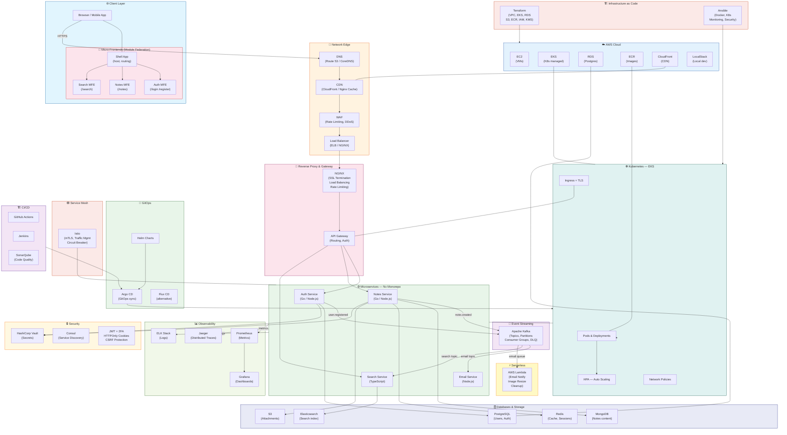

---

## Layer 0 — Micro-Frontend Architecture

> **The frontend is also decomposed.** Just as the backend is split into microservices, the Notes App UI is split into independently deployable **Micro-Frontends** — one per feature domain — orchestrated by a Shell App using Webpack 5 Module Federation.

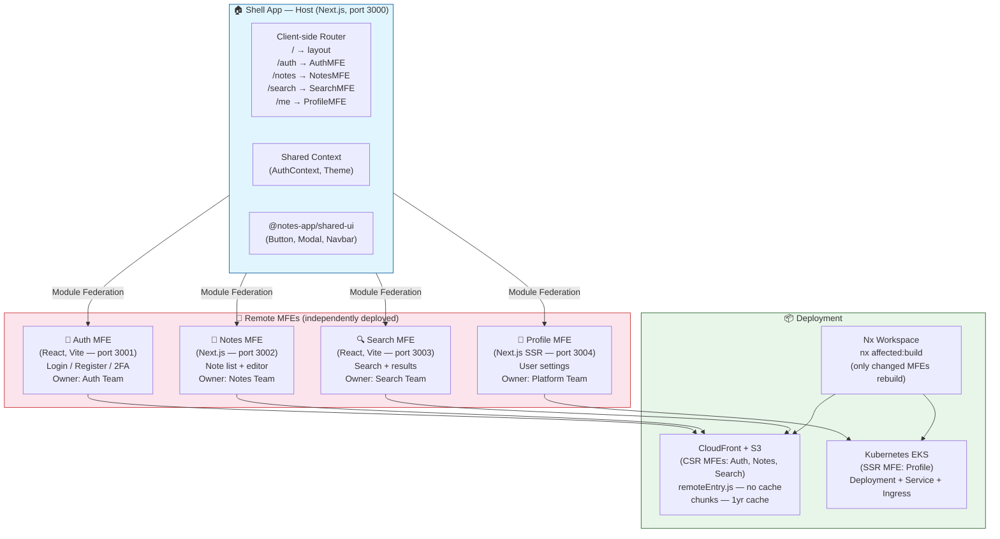

### MFE ↔ Microservice Mapping

| Micro-Frontend | Calls | Backend Microservice |
|---------------|-------|---------------------|
| Auth MFE | REST `/api/auth/*` | Auth Service (Go/Node.js) |
| Notes MFE | REST `/api/notes/*` | Notes Service (Go/Node.js) |
| Search MFE | REST `/api/search/*` | Search Service (TypeScript) |
| Profile MFE | REST `/api/auth/*` + `/api/notes/*` | Auth + Notes Services |

### Module Federation Architecture

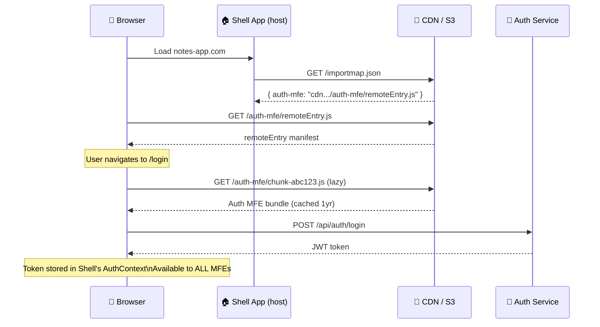

**Tasks:** `tasks/micro-frontend/`
- `task-001-introduction-to-micro-frontends.md` — Architecture, decomposition, when to use
- `task-002-module-federation-webpack5.md` — Webpack 5 Module Federation, shared singletons
- `task-003-single-spa-orchestration.md` — single-spa alternative, framework-agnostic
- `task-004-nx-monorepo-micro-frontends.md` — Nx generators, shared libs, `nx affected`
- `task-005-deploy-mfe-kubernetes-cdn.md` — S3+CloudFront (CSR) + K8s (SSR), cache strategy

---

## Layer 1 — Client & Network Edge

> **Request journey start:** Browser makes an HTTPS request. Before it reaches any server, it passes through DNS, CDN, WAF, and Load Balancer.

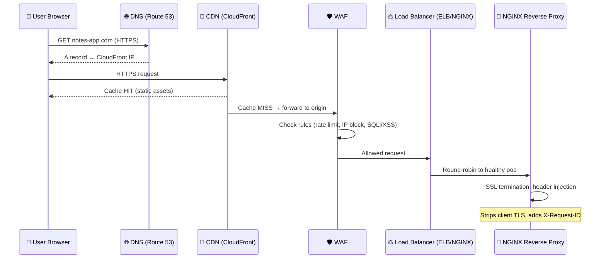

**Tasks covering this layer:**
- `tasks/networking/` — DNS, TCP/IP, HTTP/2, TLS handshake (11 tasks)
- `tasks/nginx/` — Reverse proxy, load balancing, rate limiting, SSL/TLS (10 tasks)

---

## Layer 2 — Load Balancer & Reverse Proxy (NGINX)

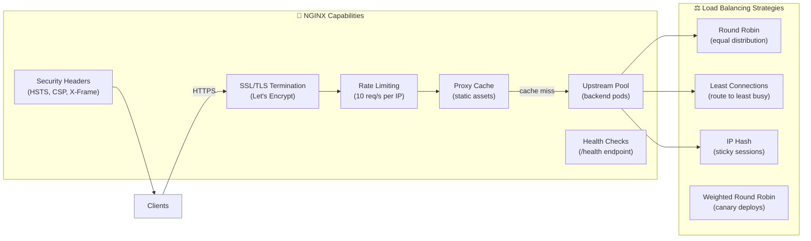

**Key config patterns:**
- NGINX as Kubernetes Ingress Controller
- Rate limiting: `limit_req_zone` per IP
- SSL offloading with Let's Encrypt cert-manager
- Health checks: `upstream` + `proxy_next_upstream`

**Tasks:** `tasks/nginx/task-001` through `task-010`

---

## Layer 3 — API Gateway & Microservices

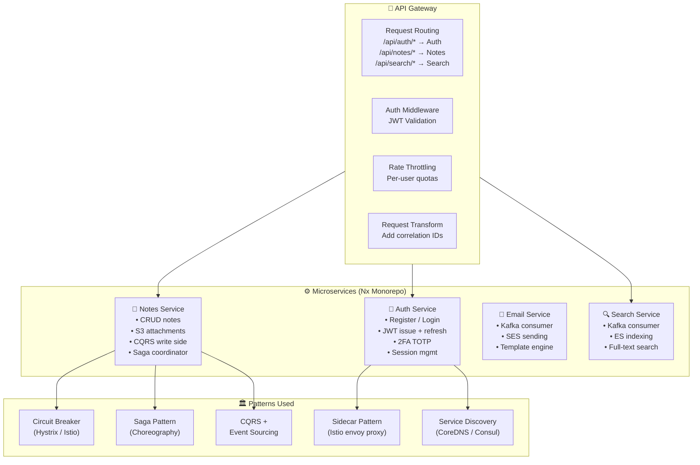

**Tasks:** `tasks/microservices/task-001` through `task-014`  
**Implementation:** `implementation/microservices/`  
**Nx Workspace:** `implementation/microservices/task-009-nx-monorepo/`

---

## Layer 4 — Event Streaming (Kafka)

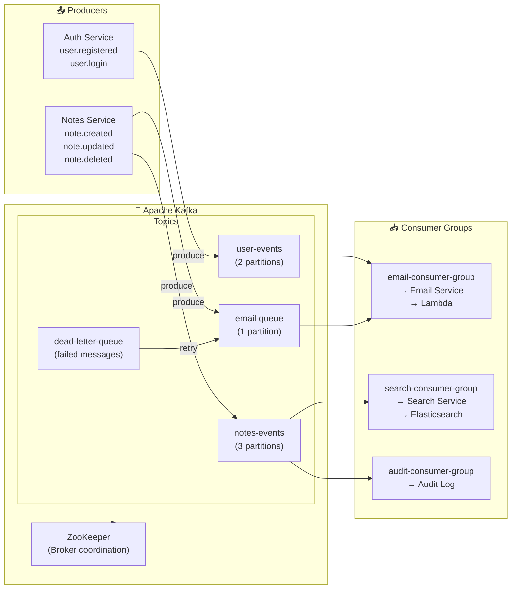

**Tasks:** `tasks/messaging/`
- `task-001-kafka-setup.md`
- `task-002-dead-letter-queue.md`
- `task-003-retry-patterns.md`
- `task-004-kafka-partitions.md`
- `task-005-consumer-groups.md`

---

## Layer 5 — Databases & Storage

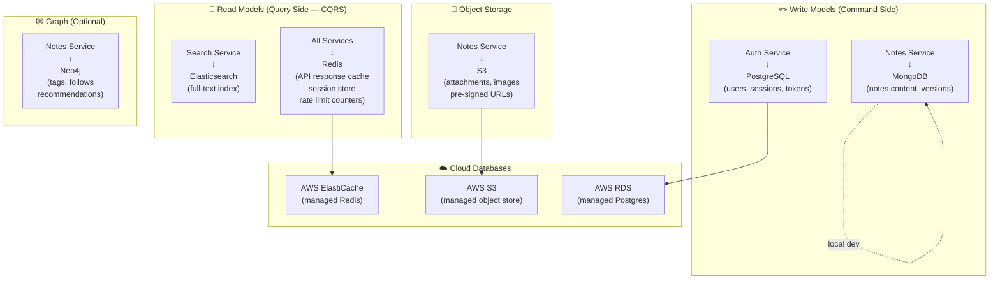

**Tasks:**
- `tasks/aws/task-005-provision-rds-database.md`
- `tasks/terraform/task-005-provision-rds-database.md`
- `tasks/system-design/task-004-caching-strategy.md`

---

## Layer 6 — Container Orchestration (Kubernetes)

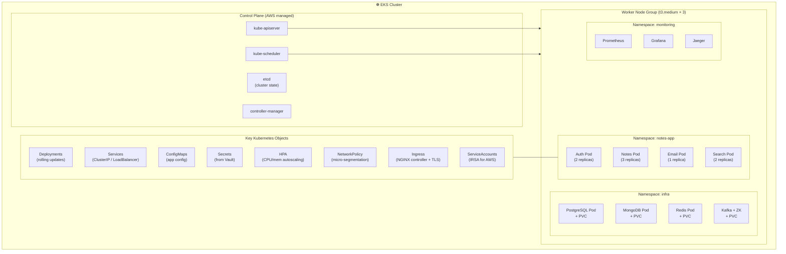

**Tasks:** `tasks/kubernetes/task-001` through `task-013`
- Deployments, Services, Ingress, ConfigMaps, Secrets
- HPA (Horizontal Pod Autoscaler)
- Rolling updates + pod probes (liveness/readiness/startup)
- Network Policies (micro-segmentation)
- Deploying to cloud (EKS/GKE/AKS)

---

## Layer 7 — GitOps & Helm

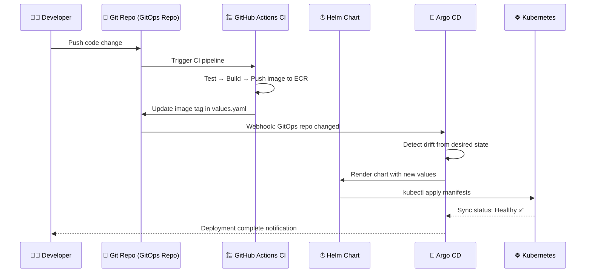

**Tasks:**
- `tasks/helm/` — Install Helm, create charts, multi-env values, CI/CD integration
- `tasks/gitops/` — Flux CD, Argo CD, multi-cluster, best practices

---

## Layer 8 — Service Mesh (Istio)

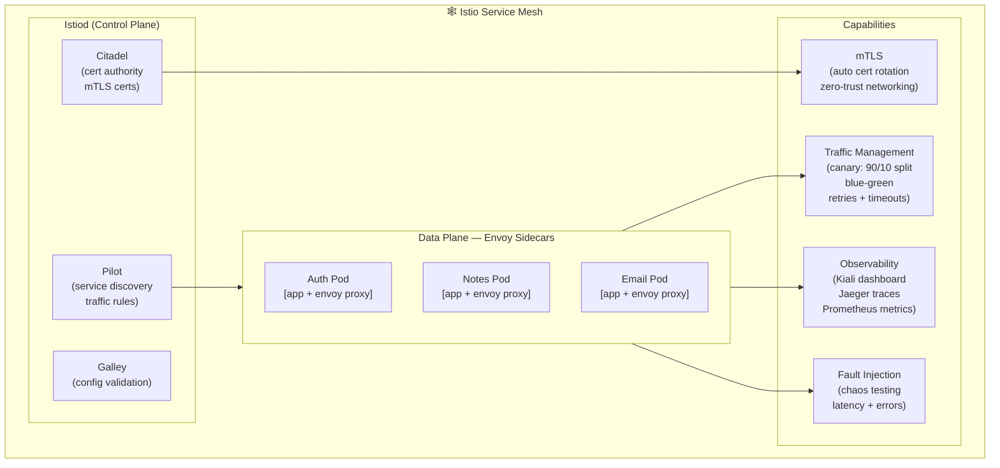

**Tasks:** `tasks/service-mesh/`
- `task-001-setup-istio.md`
- `task-002-istio-traffic-management.md` (canary, blue-green)
- `task-003-istio-security-mtls.md`
- `task-004-istio-observability.md`

---

## Layer 9 — CI/CD Pipelines

```mermaid
flowchart LR
    subgraph Trigger["⚡ Triggers"]
        PR["Pull Request"]
        Push["Push to main"]
        Tag["Git Tag\n(release)"]
    end

    subgraph CI["🔍 CI Stage — GitHub Actions / Jenkins"]
        Lint["Lint\n(ESLint, Prettier)"]
        Test["Unit + Integration\nTests (Jest, Go test)"]
        Sonar["SonarQube\nCode Quality Gate"]
        Security["Security Scan\n(Trivy, Snyk)"]
        Build["Docker Build\n(multi-stage)"]
        Push["Push to ECR\n(image:sha)"]
    end

    subgraph Gate["🚦 Quality Gate"]
        Gate1{"Coverage > 80%?"}
        Gate2{"No Critical CVEs?"}
        Gate3{"Sonar Quality Gate?"}
    end

    subgraph CD["🚀 CD Stage — Argo CD"]
        UpdateValues["Update Helm\nvalues.yaml\nimage tag"]
        ArgoDeploy["Argo CD detects\nGit change"]
        Deploy["kubectl apply\n(rolling update)"]
        Smoke["Smoke Tests\n(/health endpoint)"]
        Rollback["Auto Rollback\n(on failure)"]
    end

    Trigger --> Lint
    Lint --> Test
    Test --> Sonar
    Sonar --> Security
    Security --> Build
    Build --> Push
    Push --> Gate1
    Gate1 -->|pass| Gate2
    Gate2 -->|pass| Gate3
    Gate3 -->|pass| UpdateValues
    UpdateValues --> ArgoDeploy
    ArgoDeploy --> Deploy
    Deploy --> Smoke
    Smoke -->|fail| Rollback

    style Gate fill:#fff3e0
    style Rollback fill:#ffcdd2
```

**Tasks:** `tasks/ci-cd/task-001` through `task-014`
- GitHub Actions workflows, Jenkins pipelines
- SonarQube integration (setup, configure, pipeline gating)
- Automated testing in CI
- Pipeline gating: CI must pass before CD

---

## Layer 10 — Security

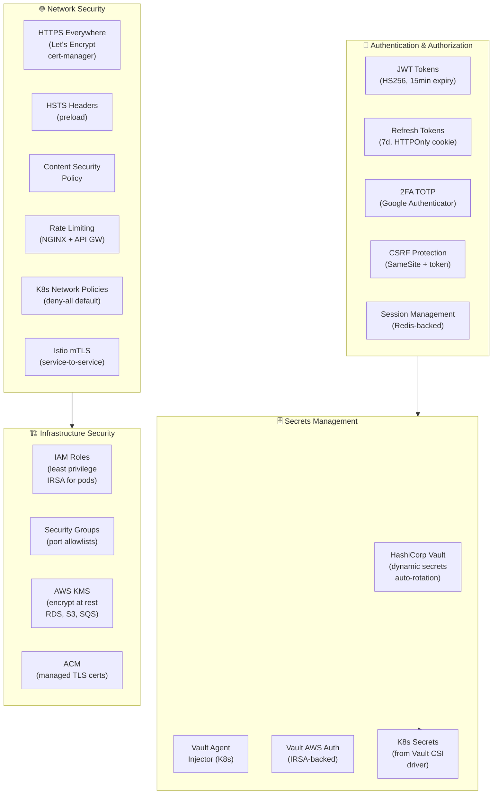

**Tasks:**
- `tasks/security/` — JWT, sessions, 2FA, OWASP, HTTPOnly cookies, CSRF (13 tasks)
- `tasks/vault/` — Vault install, K8s integration, AWS auth, dynamic secrets (10 tasks)

---

## Layer 11 — Observability (Logs, Metrics, Traces)

> The **Three Pillars of Observability**: Logs tell you *what* happened. Metrics tell you *how much*. Traces tell you *where*.

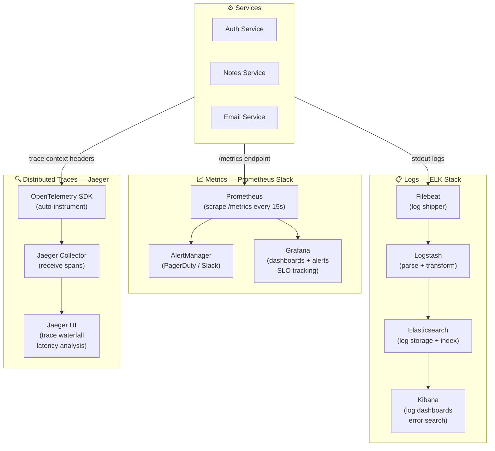

**Tasks:** `tasks/logging/task-001` through `task-011`
- ELK setup, Filebeat, Fluent Bit
- Prometheus + Grafana
- OpenTelemetry + Jaeger
- Observability Three Pillars (`task-011-observability-three-pillars.md`)

---

## Layer 12 — Infrastructure as Code (Terraform + Ansible)

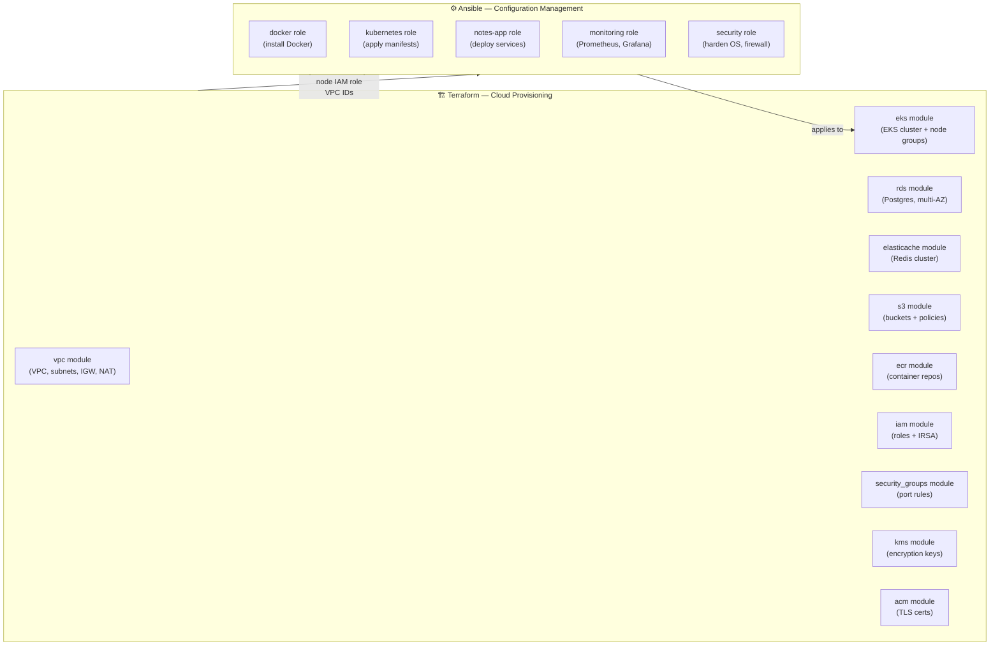

**Tasks:**
- `tasks/terraform/task-001` through `task-010` — Full Terraform curriculum
- `tasks/ansible/task-001` through `task-010` — Full Ansible curriculum
- `automation/terraform/` — 10 production Terraform modules
- `automation/ansible/` — 5 production Ansible roles

---

## Layer 13 — Cloud Deployment (AWS / GCP / Azure)

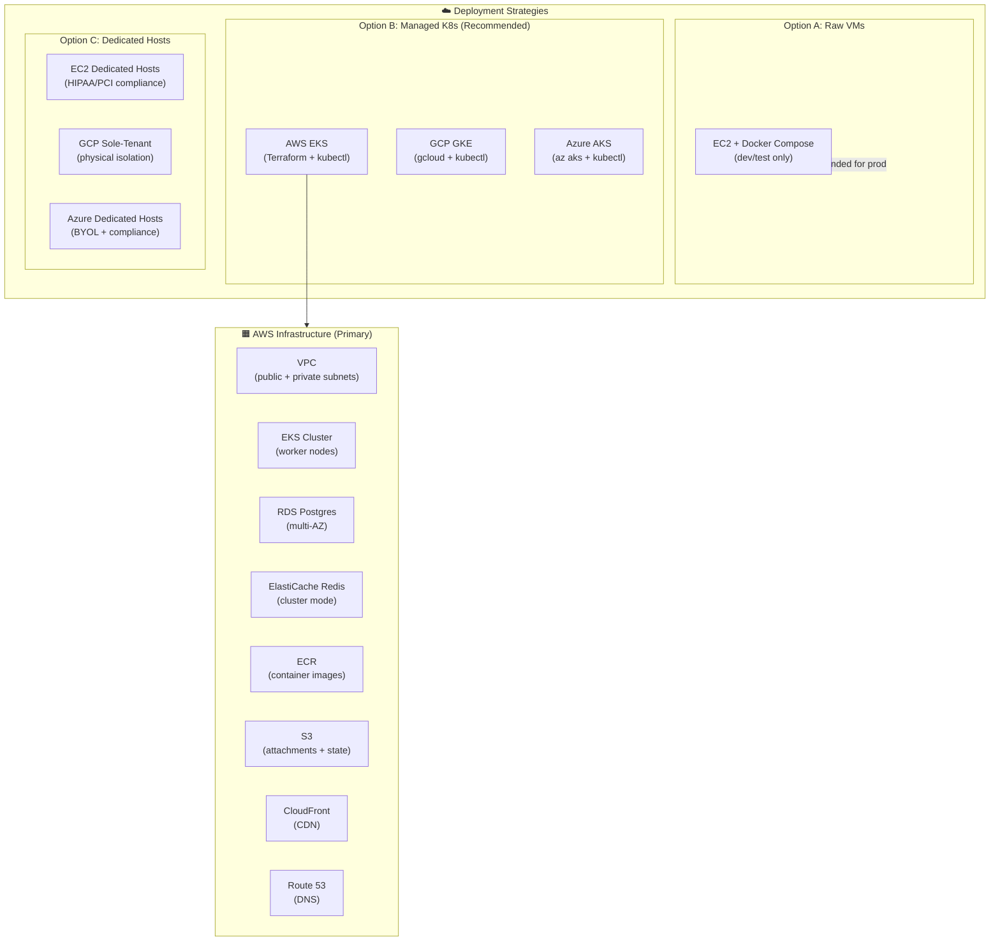

**Tasks:** `tasks/kubernetes/task-013`, `tasks/aws/task-001` through `task-015`

---

## Layer 14 — Serverless (Lambda / Cloud Functions)

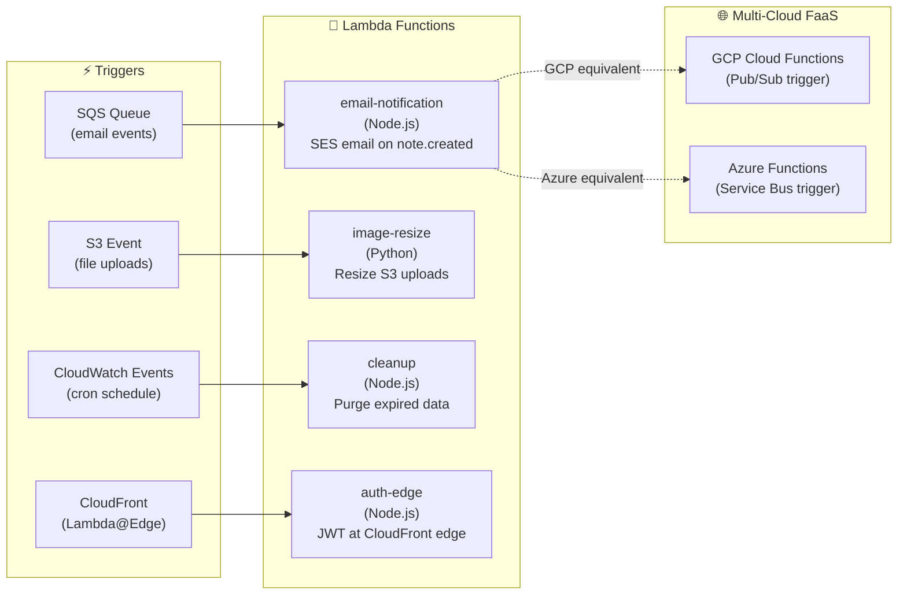

**Tasks:** `tasks/aws/task-016-serverless-lambda.md`

---

## Layer 15 — Distributed Systems

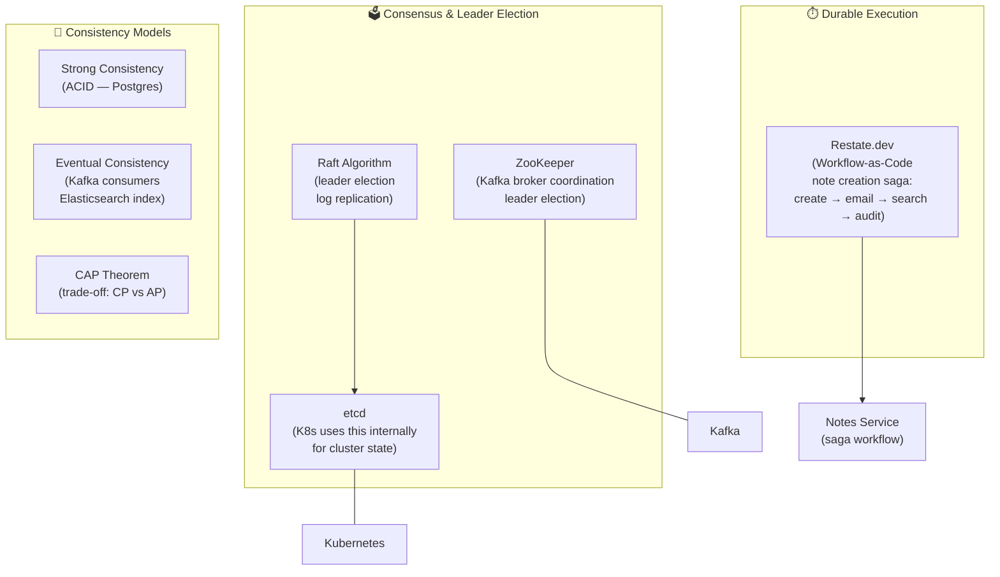

**Tasks:** `tasks/distributed-systems/`
- Raft consensus + simulation
- Durable execution with Restate
- ZooKeeper fundamentals + leader election

---

## The Full Learning Roadmap

```mermaid
graph LR
    P0["🏁 Start"] --> P1
    P1["Phase 1\nDocker\n9 tasks"] --> P2
    P2["Phase 2\nKubernetes\n13 tasks"] --> P3
    P3["Phase 3\nCI/CD\n14 tasks"] --> P4
    P4["Phase 4\nSecurity\n13+ tasks"] --> P5
    P5["Phase 5\nLogging + Obs\n11 tasks"] --> P6
    P6["Phase 6\nNGINX\n10 tasks"] --> P7
    P7["Phase 7\nAnsible\n10 tasks"] --> P8
    P8["Phase 8\nAWS + Cloud\n16 tasks"] --> P9
    P9["Phase 9\nIntegration\n10 tasks"] --> P10
    P10["Phase 10\nNetworking\n11 tasks"] --> P11
    P11["Phase 11\nGitOps\n4 tasks"] --> P12
    P12["Phase 12\nService Mesh\n4 tasks"] --> P13
    P13["Phase 13\nMicroservices\n14 tasks"] --> P14
    P14["Phase 14\nHelm\n4 tasks"] --> P15
    P15["Phase 15\nHashiCorp\n(Vault+Consul\n+Nomad)"] --> P16
    P16["Phase 16\nDistributed\nSystems\n6 tasks"] --> P17
    P17["Phase 17\nKafka\nMessaging\n5 tasks"] --> P18
    P18["Phase 18\nSystem Design\n4 tasks"] --> P19
    P19["Phase 19\nTerraform\n10 tasks"] --> P20
    P20["Phase 20\nServerless\n1 task"] --> P21
    P21["Phase 21\nMicro-\nFrontends\n5 tasks"] --> DONE
    DONE["🎯\nProduction\nReady"]

    style P0 fill:#4CAF50,color:#fff
    style DONE fill:#2196F3,color:#fff
```

---

## Task Categories & File Index

| Category | Directory | # Tasks | Key Topics |
|----------|-----------|---------|-----------|
| **Docker** | `tasks/docker/` | 9 | Dockerfiles, Compose, healthchecks, volumes, networks, logging |
| **Kubernetes** | `tasks/kubernetes/` | 13 | Deployments, Services, Ingress, HPA, Network Policies, rolling updates, cloud deploy |
| **CI/CD** | `tasks/ci-cd/` | 14 | GitHub Actions, Jenkins, SonarQube, pipeline gating, automated testing |
| **Security** | `tasks/security/` | 13+ | JWT, sessions, 2FA, HTTPOnly cookies, CSRF, WAF, OWASP |
| **Logging** | `tasks/logging/` | 11 | ELK stack, Filebeat, Fluent Bit, Prometheus, Grafana, Jaeger, observability pillars |
| **NGINX** | `tasks/nginx/` | 10 | Reverse proxy, load balancing, rate limiting, SSL, security headers |
| **Ansible** | `tasks/ansible/` | 10 | Playbooks, roles, inventory, idempotency, provisioning |
| **AWS** | `tasks/aws/` | 16 | EC2, S3, RDS, EKS, LocalStack, cloud alternatives, Lambda/serverless |
| **Integration** | `tasks/integration/` | 10+ | Frontend + backend integration, end-to-end flows |
| **Networking** | `tasks/networking/` | 11 | DNS, TCP/IP, HTTP/2, TLS, BGP, VPC, subnets |
| **GitOps** | `tasks/gitops/` | 4 | Flux CD, Argo CD, multi-cluster, best practices |
| **Service Mesh** | `tasks/service-mesh/` | 4 | Istio setup, traffic management, mTLS, observability |
| **Microservices** | `tasks/microservices/` | 14 | Architecture, DB design, service discovery, circuit breakers, Saga, CQRS, event sourcing, Nx monorepo, testing |
| **Helm** | `tasks/helm/` | 4 | Charts, environments, CI/CD integration |
| **HashiCorp** | `tasks/hashicorp/` | 6 | Consul (service discovery, config), Nomad (job scheduling, vs K8s) |
| **Vault** | `tasks/vault/` | 10 | Install, policies, K8s integration, AWS auth, dynamic secrets, HA |
| **Distributed Systems** | `tasks/distributed-systems/` | 6 | Raft, etcd, ZooKeeper, Restate durable execution |
| **Messaging** | `tasks/messaging/` | 5 | Kafka setup, DLQ, retry patterns, partitions, consumer groups |
| **System Design** | `tasks/system-design/` | 4 | Architecture diagrams, load testing (k6), scaling strategies, caching |
| **Terraform** | `tasks/terraform/` | 10 | Install, basics, EC2, RDS, S3, VPC, EKS, state, modules |
| **Micro-Frontend** | `tasks/micro-frontend/` | 5 | Module Federation, single-spa, Nx MFE, CSR/SSR deploy to CDN + K8s |

---

## 📁 Repository Structure

```
request-journey-client-to-server/
│
├── README.md                    ← You are here — complete project guide
├── CONSTITUTION.md              ← Project rules, diagram standards, task format
├── docs/
│   ├── diagrams/                ← 12 standalone Mermaid architecture diagrams
│   │   ├── 00-big-picture.md
│   │   ├── 01-request-journey.md
│   │   ├── 02-microservices-architecture.md
│   │   ├── 03-cicd-pipeline.md
│   │   ├── 04-observability-stack.md
│   │   ├── 05-database-topology.md
│   │   ├── 06-kafka-messaging.md
│   │   ├── 07-kubernetes-architecture.md
│   │   ├── 08-security-model.md
│   │   ├── 09-distributed-systems.md
│   │   ├── 10-aws-infrastructure.md
│   │   └── 11-nx-monorepo.md
│   └── AUTOMATION_REFERENCE.md  ← IaC reference matrix
│
├── tasks/                       ← 141+ learning tasks (21 categories)
│   ├── docker/
│   ├── kubernetes/
│   ├── ci-cd/
│   ├── security/
│   ├── logging/
│   ├── nginx/
│   ├── ansible/
│   ├── aws/
│   ├── integration/
│   ├── networking/
│   ├── gitops/
│   ├── service-mesh/
│   ├── microservices/
│   ├── micro-frontend/          ← NEW: Module Federation, Nx MFE, single-spa, CDN deploy
│   ├── helm/
│   ├── hashicorp/
│   ├── vault/
│   ├── distributed-systems/
│   ├── messaging/
│   ├── system-design/
│   └── terraform/
│
├── implementation/              ← Starter + final-solution code for each task
│   ├── docker/
│   ├── kubernetes/
│   ├── microservices/           ← Nx monorepo workspace
│   └── ...
│
├── automation/                  ← Production-grade IaC
│   ├── terraform/
│   │   ├── main.tf              ← Root module wiring all modules
│   │   └── modules/
│   │       ├── vpc/             ← VPC, subnets, IGW, NAT
│   │       ├── eks/             ← EKS cluster + node groups
│   │       ├── rds/             ← Postgres RDS
│   │       ├── elasticache/     ← Redis
│   │       ├── s3/              ← S3 buckets
│   │       ├── ecr/             ← Container registries
│   │       ├── iam/             ← Roles, IRSA
│   │       ├── security_groups/ ← Firewall rules
│   │       ├── kms/             ← Encryption keys
│   │       └── acm/             ← TLS certificates
│   └── ansible/
│       ├── site.yml             ← Master playbook
│       └── roles/
│           ├── docker/
│           ├── kubernetes/
│           ├── notes-app/
│           ├── monitoring/
│           └── security/
│
├── issues/                      ← Processed GitHub issues archive
│   ├── ISSUE_TRACKER.md         ← Master tracking spreadsheet
│   ├── issue-032.md ... issue-168.md
│
└── plans/                       ← Phase and integration plans
    ├── 01-roadmap-standardization.md
    ├── ...
    └── 19-phase-10-production-extras.md
```

---

## 🔑 Key Principles

1. **Everything is connected** — Every task contributes to the same Notes App production architecture
2. **Learn raw, then automate** — Tasks teach manual steps first; `automation/` provides the IaC equivalent
3. **Diagrams are mandatory** — Every task has an inline Mermaid diagram (enforced by `.cursor/rules/`)
4. **Automation Reference section** — Every task ends with a table linking to `automation/terraform/` or `automation/ansible/`
5. **Nx monorepo for everything** — Node.js/TypeScript microservices AND micro-frontend apps share a single Nx workspace with shared libraries (`shared/ui`, `shared/auth`, `shared/types`)
6. **Micro-frontends = microservices for the browser** — Frontend is also independently deployed per feature domain using Webpack 5 Module Federation
6. **GitOps by default** — All Kubernetes changes go through Git → Argo CD, never `kubectl apply` by hand in production

---

## 🚀 Getting Started

```bash
# 1. Clone the repository
git clone https://github.com/FoushWare/request-journey-client-to-server.git
cd request-journey-client-to-server

# 2. Browse the tasks
ls tasks/

# 3. Start with app foundation phase 1 (recommended first phase)
cat tasks/app-foundation/task-001-run-notes-app-with-mock-server.md

# 4. For local cloud dev (AWS services without real AWS)
docker-compose up localstack

# 5. For the full IaC stack
cd automation/terraform
terraform init && terraform plan
```

---

*This project is a living curriculum — new issues are continuously added as GitHub issues and converted into learning tasks. Track progress in `issues/ISSUE_TRACKER.md`.*
