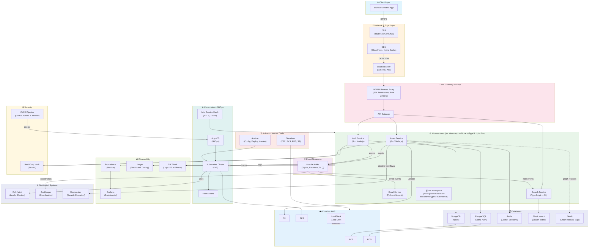

# 🗺️ Big Picture — Full Project Overview

> This diagram shows how ALL the major systems in this project connect together.  
> Every box represents a topic/phase you will learn hands-on through the tasks.

## Learner-First Reading Order

Read and execute this system map using the canonical sequence:
1) mock server, 2) fixed backend responses, 3) real database, 4) containerization, 5) microfrontend, 6) microservices, 7) microservice challenges, 8) kubernetes, 9) ansible, 10) production extras.

---

## Full System Map

---

## Learning Journey Map

---

## Issue → Phase Mapping

| Issue Range | Phase | Category |
|-------------|-------|---------|
| #32–40 | Docker | Containerization |
| #41–50 | Kubernetes | Orchestration |
| #51–60 | CI/CD | Automation |
| #61–70 | Security | Security hardening |
| #71–80 | Logging | Observability |
| #81–90 | NGINX | Reverse proxy |
| #91–100 | Ansible | Config management |
| #101–110 | AWS | Cloud |
| #111–120 | Integration | End-to-end |
| #121–131 | Networking | Protocols |
| #132–146 | K8s Advanced / Microservices / GitOps / Helm | Advanced |
| #147–149 | AWS Advanced / LocalStack | Cloud Advanced |
| #150, #158 | Distributed Systems (Raft, ZooKeeper) | Consensus |
| #151 | Durable Execution (Restate) | Distributed |
| #152 | Email Service | Microservices |
| #153–154 | System Design Diagrams + Scale | Design |
| #155 | Auth Mechanisms | Security |
| #156–157 | Kafka DLQ + Partitions | Messaging |
