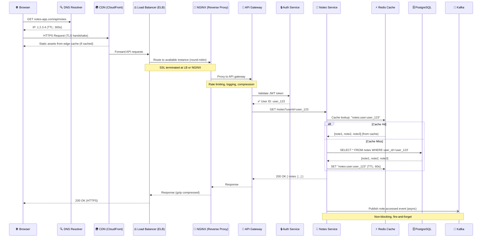
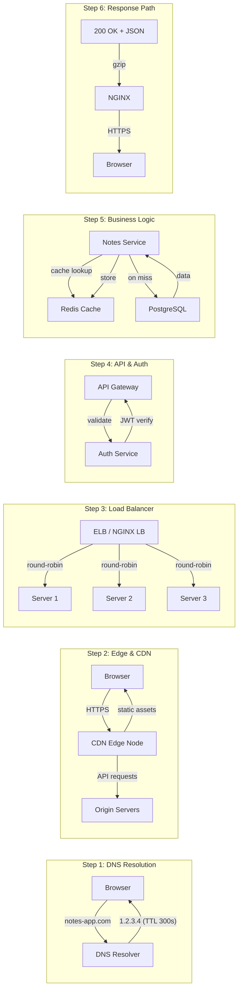
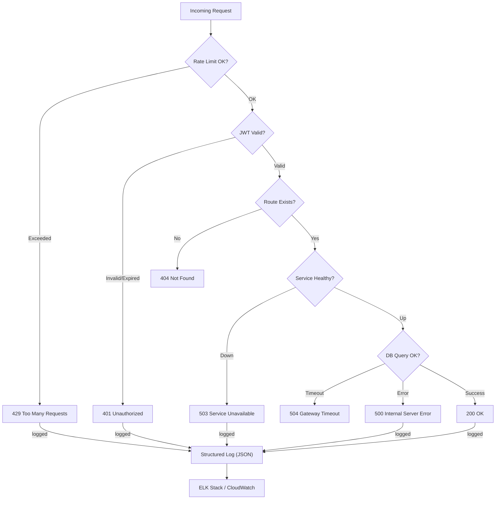

# 🔄 Request Journey — Client to Response

> This diagram traces the **full lifecycle of a single HTTP request** from the browser to the database and back.  
> Each step in this journey is a lesson in this project.

---

## Full Request Journey

---

## Component Roles in the Request Journey

---

## Error Handling in the Journey

---

## Latency Budget for a Request

```mermaid
gantt
    title Request Latency Budget (Total: ~100ms target)
    dateFormat X
    axisFormat %Lms

    section DNS
    DNS Lookup (cached)    : 0, 1
    section TLS
    TLS Handshake          : 1, 11
    section Network
    Client → CDN           : 11, 16
    CDN → Load Balancer    : 16, 17
    section Processing
    NGINX proxy            : 17, 18
    Auth token validation  : 18, 23
    Redis cache lookup     : 23, 24
    Notes DB query (miss)  : 24, 44
    Redis store            : 44, 45
    section Response
    JSON serialization     : 45, 48
    gzip compression       : 48, 50
    Response transport     : 50, 60
```

> **Goal**: < 100ms P95 for cache hits, < 250ms P95 for cache misses  
> Use `tasks/system-design/task-002-load-testing-k6.md` to measure this.
