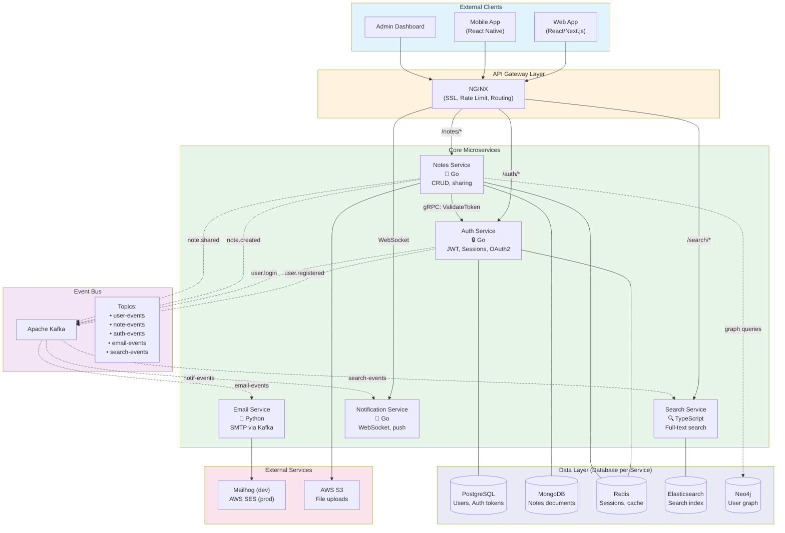
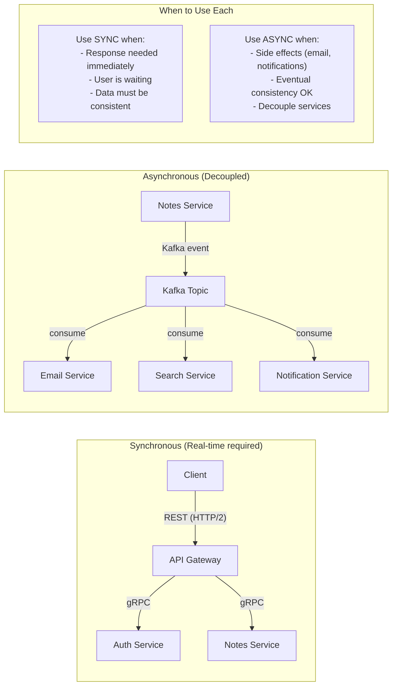
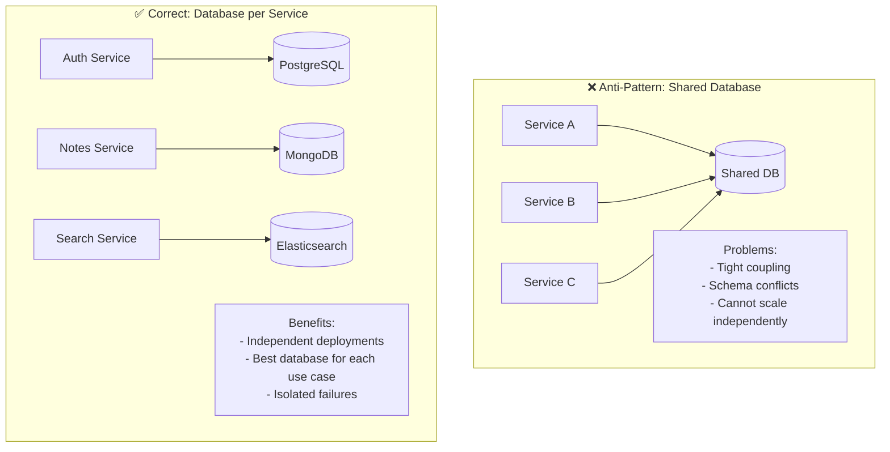
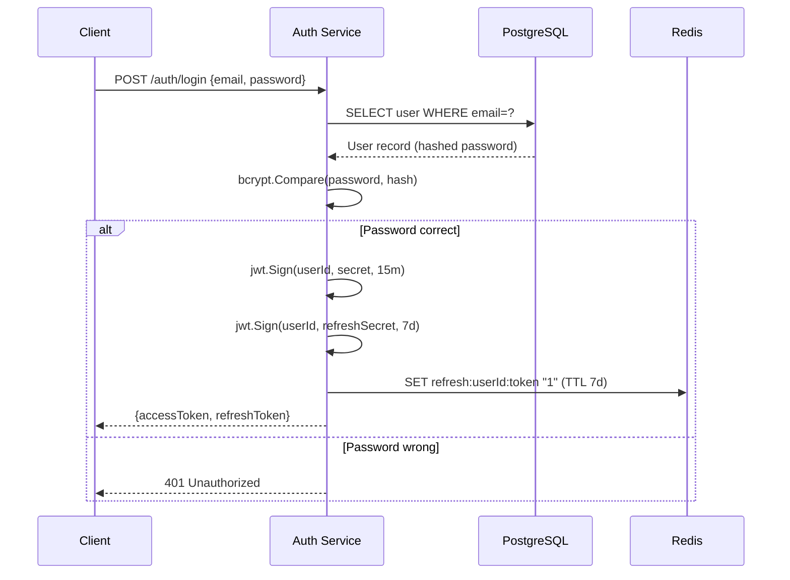

# ⚙️ Microservices Architecture — Notes App

> This diagram shows the microservices decomposition of the Notes App,  
> how they communicate, and what each service owns.

---

## Service Map

---

## Service Communication Patterns

---

## Database per Service Pattern

---

## Auth Service — Internal Flow

