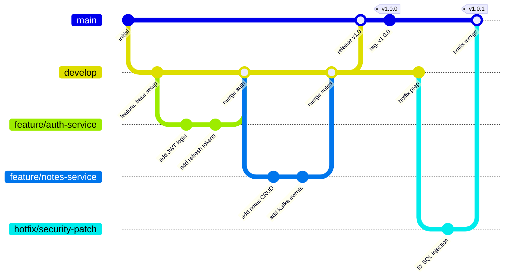
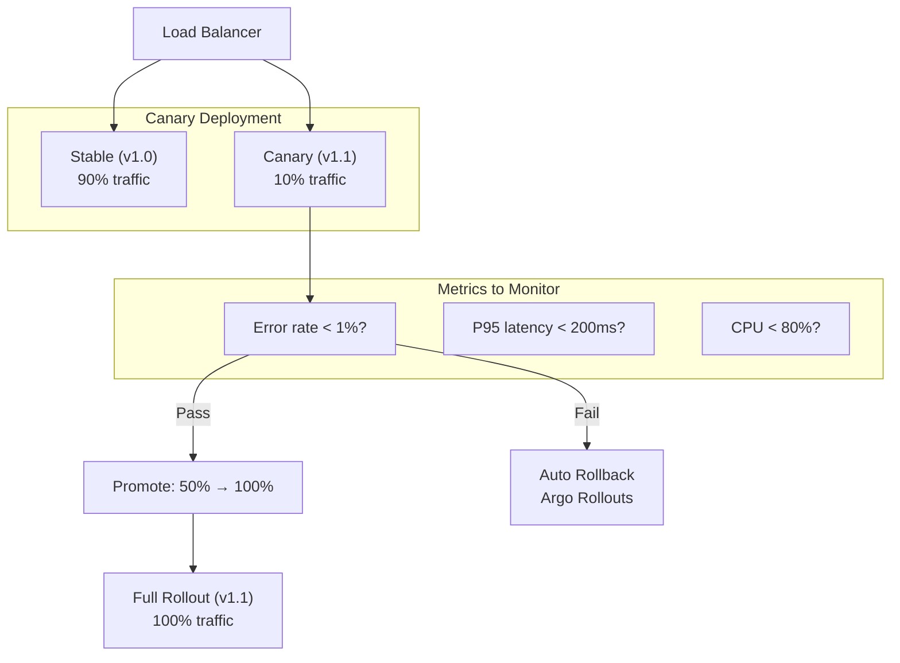

# 🔁 CI/CD Pipeline — Automated Deployment

> From a `git push` to production deployment, fully automated.

---

## Full CI/CD Pipeline

```mermaid
graph LR
    subgraph Dev["👨‍💻 Developer"]
        Code["Write Code"] --> Commit["git commit"]
        Commit --> Push["git push"]
    end

    subgraph GitHub["🐙 GitHub"]
        PR["Pull Request"] --> Review["Code Review"]
        Review --> Merge["Merge to main"]
    end

    subgraph CI["⚙️ CI — GitHub Actions"]
        Trigger["Triggered on push/PR"]
        Lint["Lint & Format<br/>(golangci-lint, eslint)"]
        Test["Unit Tests<br/>(go test, jest)"]
        IntTest["Integration Tests<br/>(docker-compose)"]
        SecScan["Security Scan<br/>(Trivy, SAST)"]
        Build["Docker Build<br/>(multi-stage)"]
        Push_Registry["Push to Registry<br/>(ECR / DockerHub)"]

        Trigger --> Lint
        Lint --> Test
        Test --> IntTest
        IntTest --> SecScan
        SecScan --> Build
        Build --> Push_Registry
    end

    subgraph CD["🚀 CD — Argo CD (GitOps)"]
        GitOps_Repo["GitOps Repo<br/>(k8s manifests)"]
        ArgoCD["Argo CD<br/>Watches for changes"]
        Staging_Deploy["Deploy to Staging"]
        E2E["E2E Tests<br/>(Playwright / k6)"]
        Prod_Deploy["Deploy to Production<br/>(Canary/Blue-Green)"]

        GitOps_Repo --> ArgoCD
        ArgoCD --> Staging_Deploy
        Staging_Deploy --> E2E
        E2E --> Prod_Deploy
    end

    Push --> PR
    Push_Registry --> GitOps_Repo

    style Dev fill:#e3f2fd
    style GitHub fill:#f5f5f5
    style CI fill:#e8f5e9
    style CD fill:#fff3e0
```

---

## Branching Strategy

---

## GitHub Actions Workflow Structure

```mermaid
graph TB
    subgraph "ci.yml — On PR and push to main"
        Job1["job: lint
        - golangci-lint (Go)
        - eslint (TypeScript)
        - yamllint (K8s manifests)"]

        Job2["job: test
        - go test ./...
        - jest --coverage
        - Coverage: >80% required"]

        Job3["job: security
        - trivy (Docker image scan)
        - gosec (Go SAST)
        - npm audit
        - OWASP ZAP (DAST)"]

        Job4["job: build
        - docker buildx
        - Multi-arch: amd64, arm64
        - Push to ECR on main branch"]

        Job1 --> Job2
        Job2 --> Job3
        Job3 --> Job4
    end

    subgraph "cd.yml — On push to main"
        Job5["job: update-manifests
        - Update image tag in GitOps repo
        - Open PR in GitOps repo"]

        Job6["job: staging-deploy
        - Argo CD sync staging
        - Wait for healthy"]

        Job7["job: e2e-tests
        - Playwright browser tests
        - k6 load test (smoke)"]

        Job8["job: production-deploy
        - Argo CD sync production
        - Canary: 10% → 50% → 100%
        - Rollback on error rate > 1%"]

        Job5 --> Job6
        Job6 --> Job7
        Job7 --> Job8
    end
```

---

## Deployment Strategy — Canary

