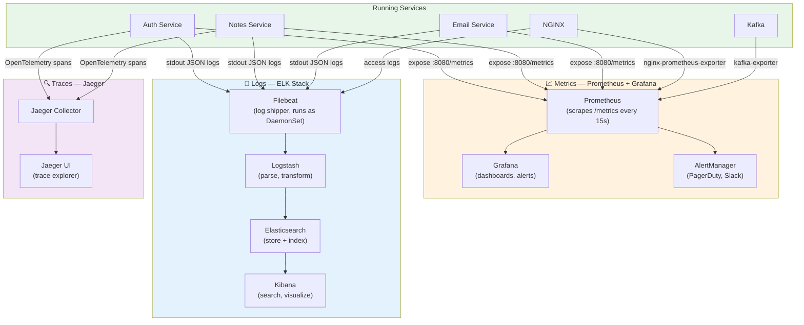
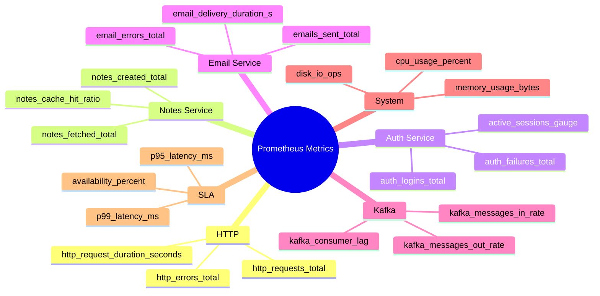
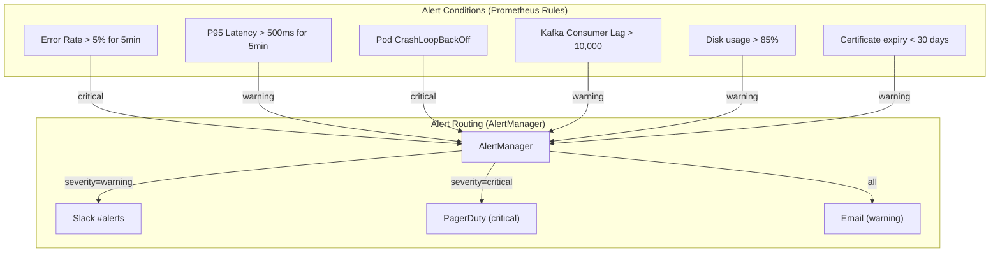
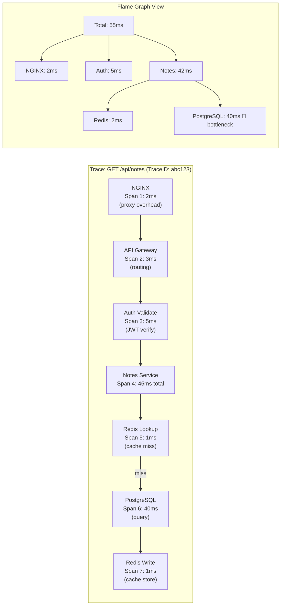
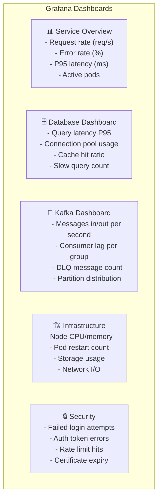

# 📊 Observability Stack — Metrics, Logs, Traces

> Visibility into what the system is doing in production.  
> Three pillars: **Metrics** (Prometheus/Grafana), **Logs** (ELK), **Traces** (Jaeger).

---

## Three Pillars of Observability

---

## Prometheus Metrics — What to Measure

---

## Alerting Rules

---

## Distributed Trace — Notes API Call

> The trace shows PostgreSQL is the bottleneck.  
> Action: Add index on `user_id` or add Redis caching with longer TTL.

---

## Grafana Dashboards — What to Build

