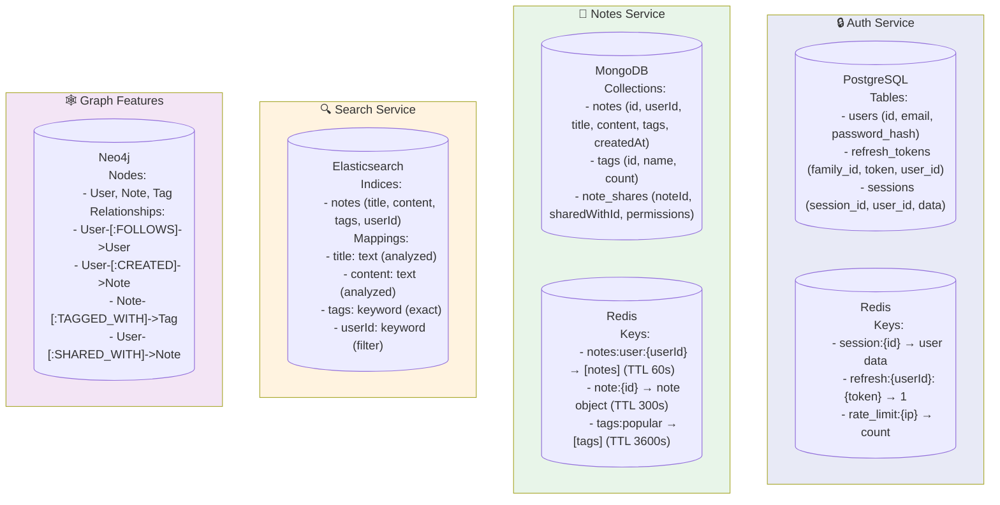
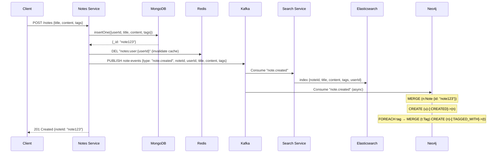
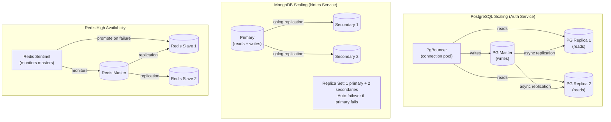
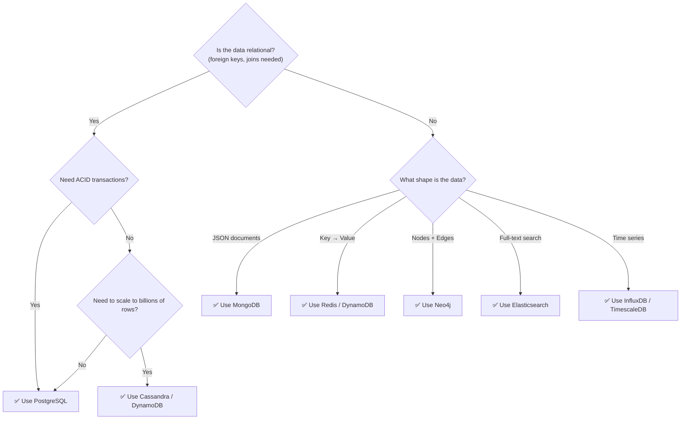
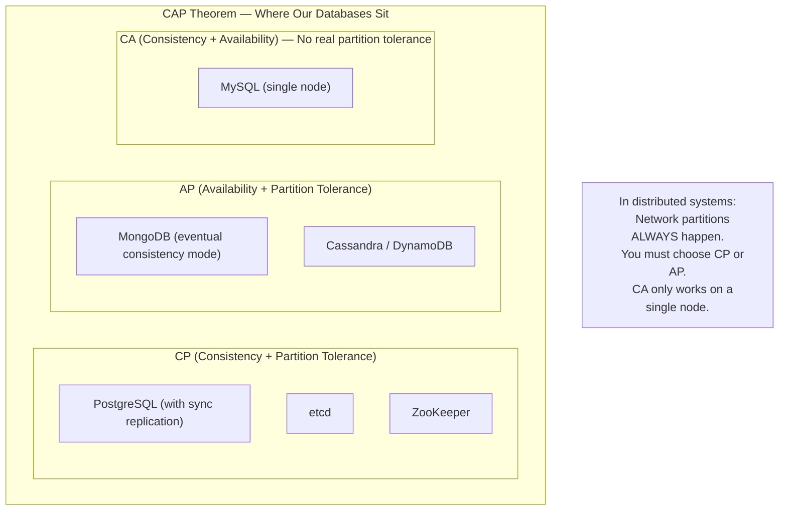

# 🗄️ Database Topology — Storage Architecture

> Each microservice owns its data. No shared databases.  
> This diagram shows what data lives where and why.

---

## Database Ownership Map

---

## Data Flow — Creating a Note

---

## Database Scaling Patterns Applied

---

## SQL vs NoSQL Decision Guide

---

## CAP Theorem — Our Databases

