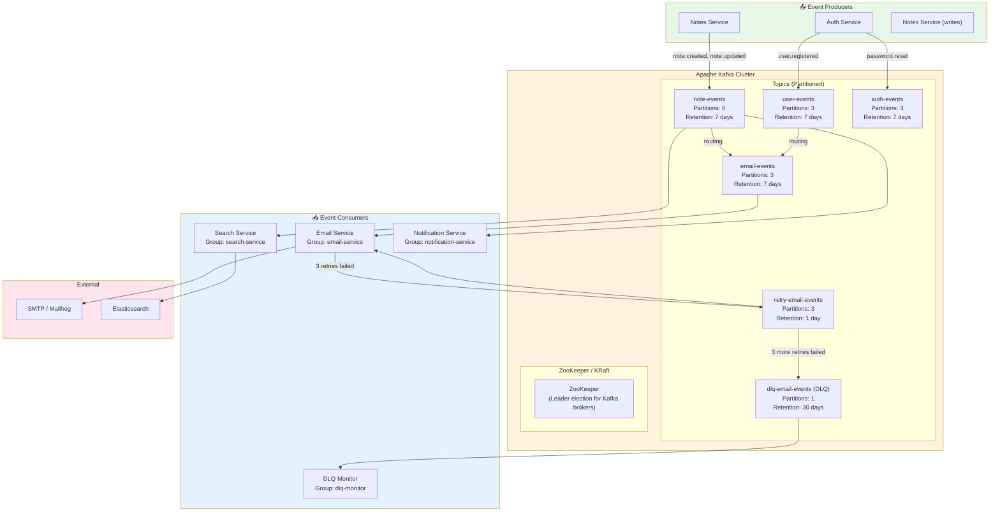
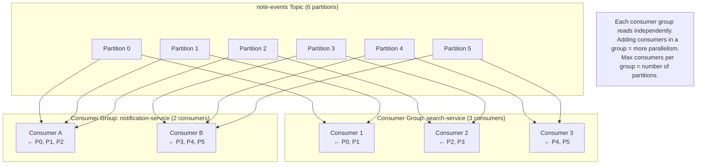
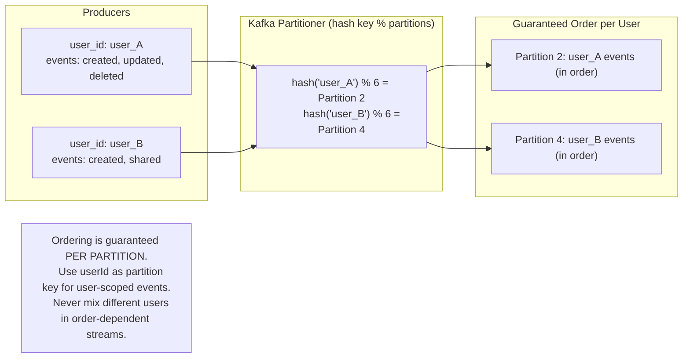
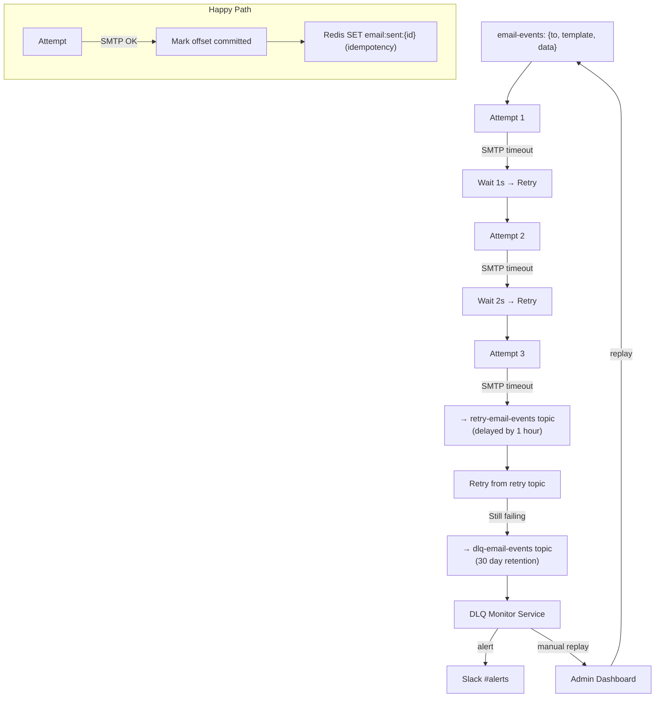
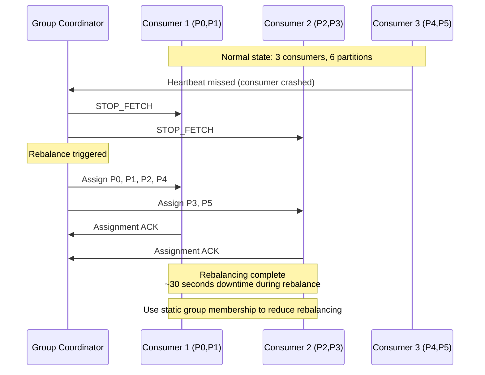

# 📨 Kafka Messaging Architecture — Events, DLQ, and Consumer Groups

> Apache Kafka is the event backbone of the Notes App.  
> This diagram shows topics, consumers, partitions, and failure handling.

---

## Kafka Architecture Overview

---

## Kafka Partitioning and Consumer Groups

---

## Message Ordering with Partition Keys

---

## Dead Letter Queue (DLQ) Flow

---

## Kafka Rebalancing

