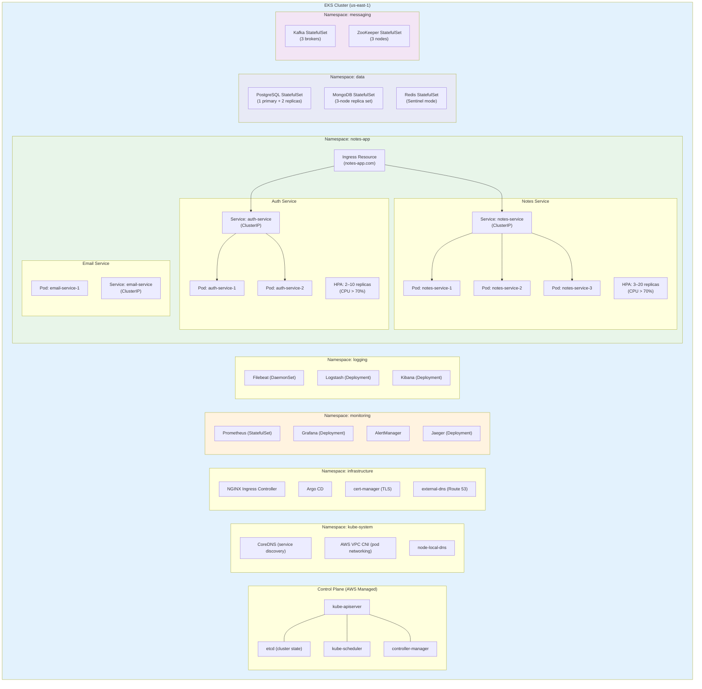
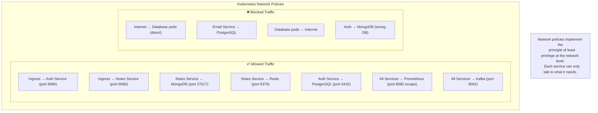
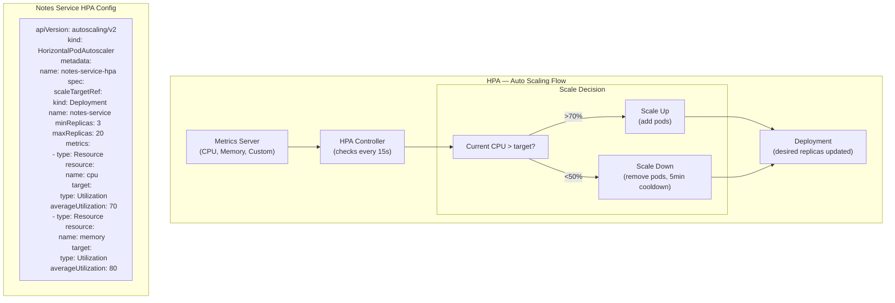
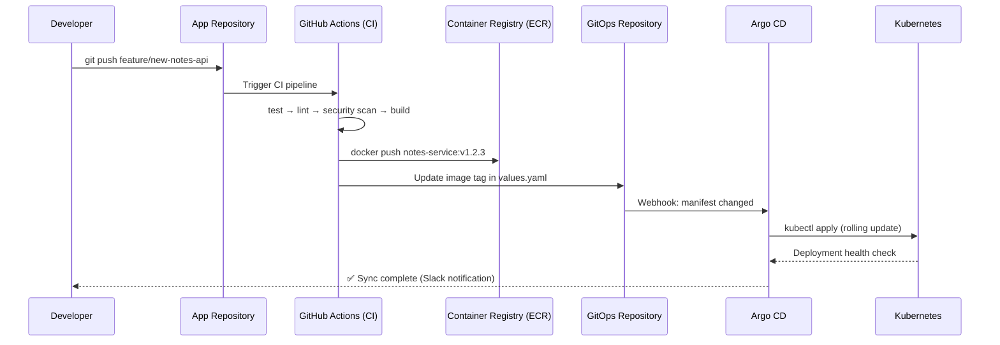

# ☸️ Kubernetes Architecture — Cluster Layout

> How the Notes App is deployed on Kubernetes (EKS).  
> Including namespaces, network policies, ingress, HPA, and GitOps.

---

## Cluster Architecture

---

## Network Policies

---

## Horizontal Pod Autoscaler (HPA)

---

## GitOps Flow with Argo CD

