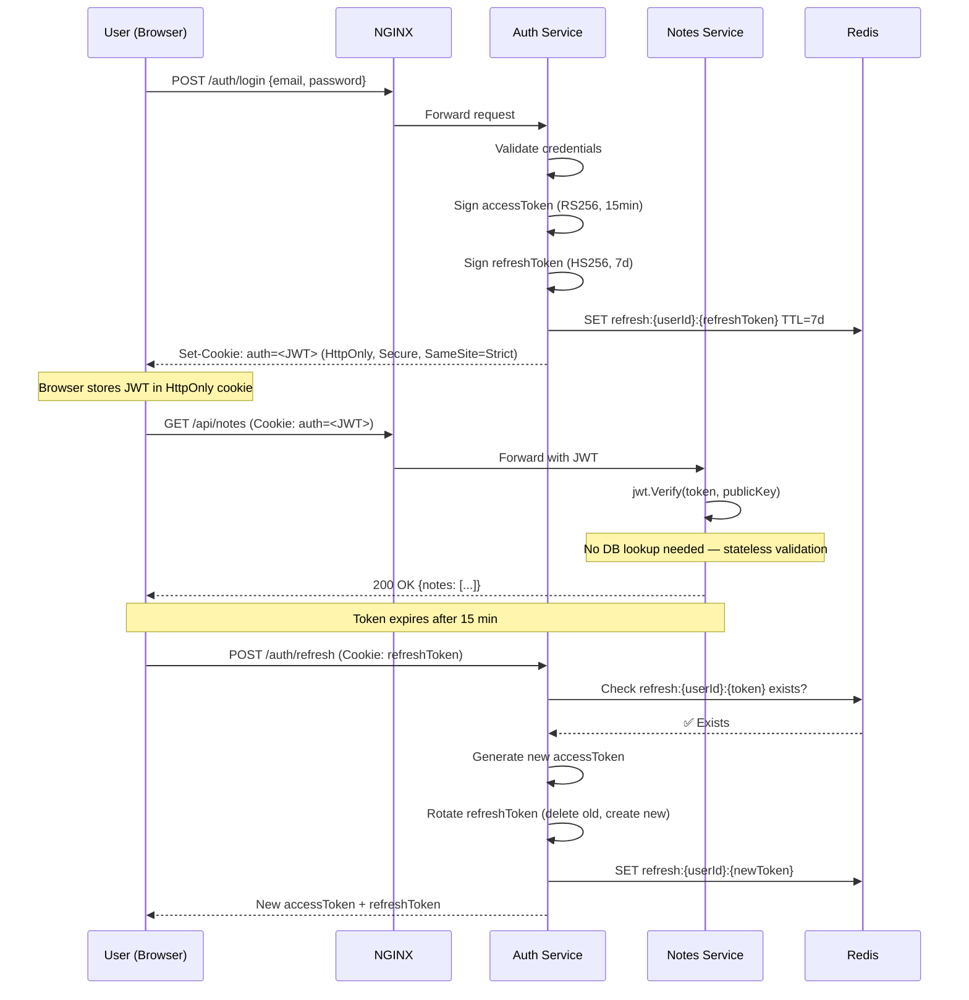
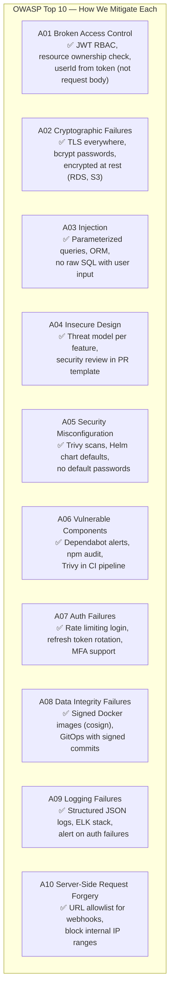

# 🔒 Security Model — Auth, Encryption, and Secrets

> End-to-end security: from the browser to the database.

---

## Security Layers

```mermaid
graph TB
    subgraph L1["Layer 1: Perimeter"]
        WAF["AWS WAF<br/>(block bad IPs, SQLi, XSS)"]
        DDoS["AWS Shield<br/>(DDoS protection)"]
        CloudFront2["CloudFront<br/>(TLS 1.3 only)"]
    end

    subgraph L2["Layer 2: Ingress / NGINX"]
        RateLimit["Rate Limiting<br/>(100 req/min per IP)"]
        TLS["TLS Termination<br/>(cert-manager, Let's Encrypt)"]
        Headers["Security Headers<br/>(HSTS, CSP, X-Frame-Options)"]
        CORS["CORS Policy"]
    end

    subgraph L3["Layer 3: Auth Service"]
        JWT["JWT Validation<br/>(RS256, 15 min expiry)"]
        Refresh["Refresh Token Rotation<br/>(7d, family-based theft detection)"]
        Sessions["Session Management<br/>(Redis, HttpOnly cookies)"]
        MFA["MFA (TOTP support)"]
    end

    subgraph L4["Layer 4: Service-to-Service"]
        mTLS["Istio mTLS<br/>(all service comms encrypted)"]
        RBAC["K8s RBAC<br/>(service accounts, least privilege)"]
        NetPol["Network Policies<br/>(pod-level firewall)"]
    end

    subgraph L5["Layer 5: Secrets Management"]
        Vault2["HashiCorp Vault<br/>(rotate secrets, dynamic creds)"]
        IRSA["AWS IRSA<br/>(K8s pods → AWS IAM via OIDC)"]
        SecretStore["External Secrets Operator<br/>(sync Vault → K8s Secrets)"]
    end

    subgraph L6["Layer 6: Data"]
        EncTransit["Encryption in Transit<br/>(TLS between all components)"]
        EncRest["Encryption at Rest<br/>(RDS, S3, EBS encrypted)"]
        HashPwd["Password Hashing<br/>(bcrypt, cost 12)"]
    end

    Internet["🌐 Internet"] --> WAF
    WAF --> DDoS
    DDoS --> CloudFront2
    CloudFront2 --> L2
    L2 --> L3
    L3 --> L4
    L4 --> L5
    L5 --> L6

    style L1 fill:#ffebee
    style L2 fill:#fce4ec
    style L3 fill:#f3e5f5
    style L4 fill:#ede7f6
    style L5 fill:#e8eaf6
    style L6 fill:#e3f2fd
```

---

## JWT Authentication Flow

---

## Secrets Management with Vault

```mermaid
graph TB
    subgraph Dev_Loop["Development"]
        DevEnv[".env file (local only, gitignored)"]
    end

    subgraph CI_Loop["CI/CD Pipeline"]
        GH_Secrets["GitHub Actions Secrets<br/>(DOCKER_TOKEN, AWS_ACCESS_KEY)"]
    end

    subgraph Prod["Production — Vault + K8s"]
        Vault3["HashiCorp Vault<br/>Secrets Engine:
        - database/ (dynamic DB creds)
        - kv/ (static secrets)
        - pki/ (TLS certs)"]

        ESO["External Secrets Operator"]
        K8sSecret["K8s Secret<br/>(synced from Vault, rotated)"]
        Pod["Application Pod<br/>(mounts Secret as env var)"]

        Vault3 -->|"sync"| ESO
        ESO -->|"create/update"| K8sSecret
        K8sSecret -->|"mount as envFrom"| Pod
    end

    subgraph DynCreds["Dynamic Database Credentials"]
        Vault4["Vault database/ engine"] -->|"generates"| TempCreds["Temporary creds<br/>(TTL: 1 hour)"]
        TempCreds --> DBConn["DB Connection<br/>(auto-rotated)"]
    end

    Note["Never hardcode secrets.
    Never commit .env files.
    Rotate all credentials every 24h max."]
```

---

## OWASP Top 10 — Mitigations in Notes App

