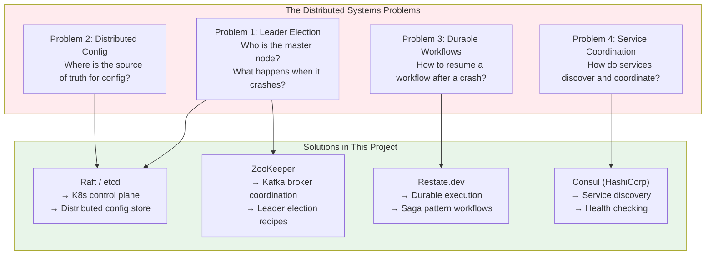
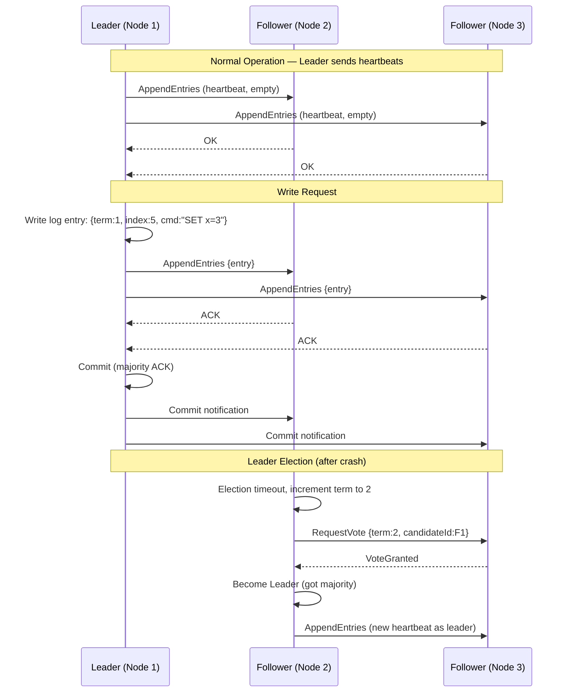
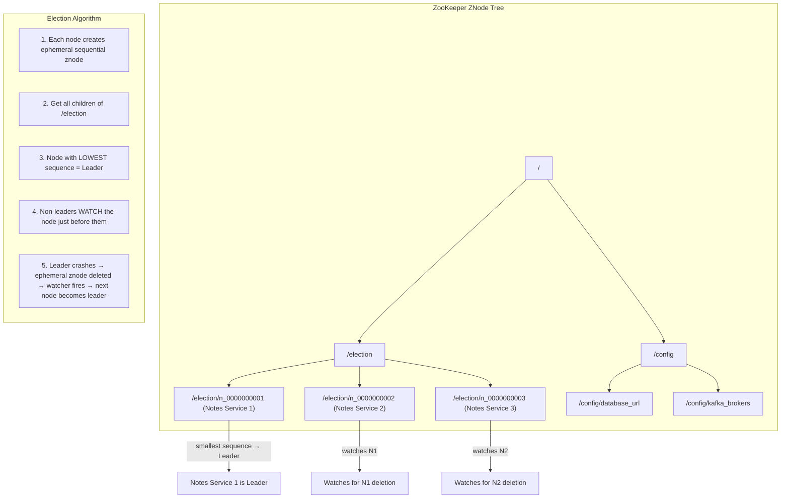
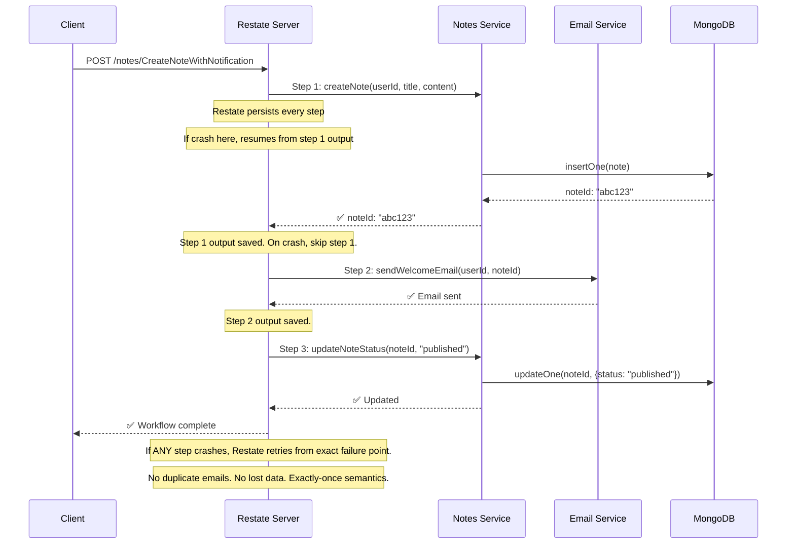
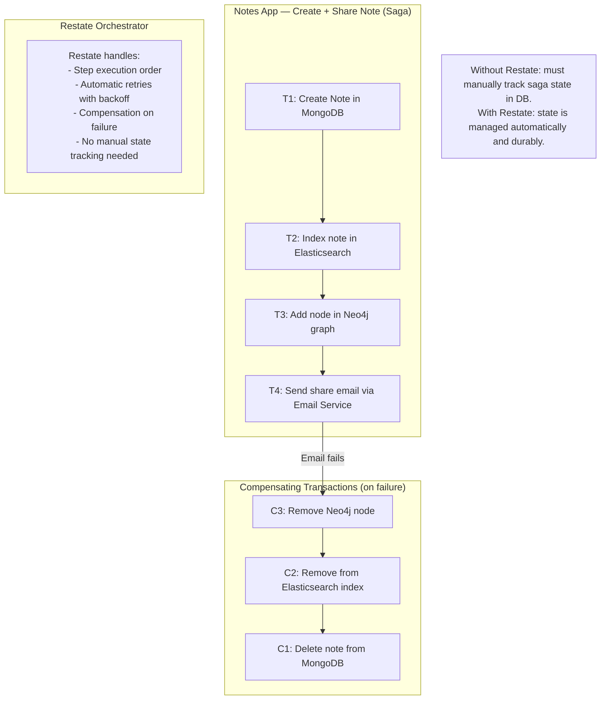

# 🌐 Distributed Systems — Consensus, Coordination, and Durable Execution

> How the Notes App handles distributed coordination, leader election, and fault-tolerant workflows.  
> Covers: Raft (etcd), ZooKeeper, and Restate.dev.

---

## Distributed Systems Overview

---

## Raft Consensus Algorithm

---

## ZooKeeper Leader Election Recipe

---

## Restate.dev — Durable Execution

---

## Saga Pattern — Distributed Transactions

