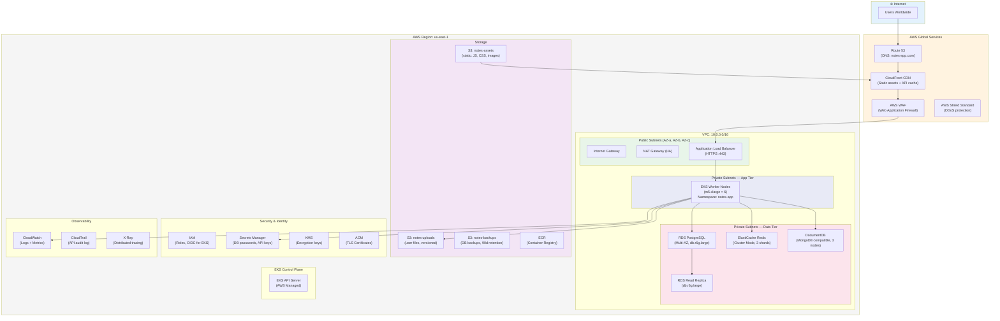
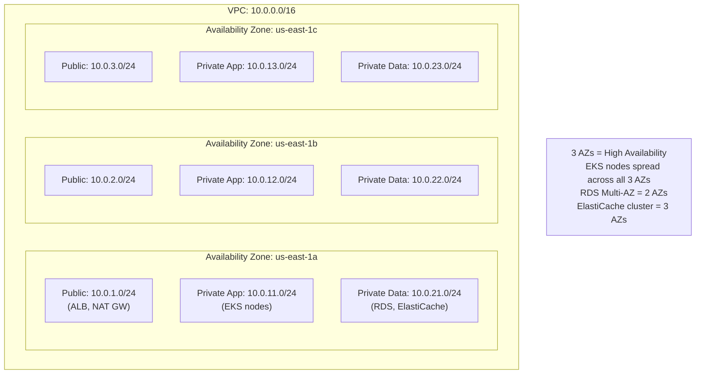
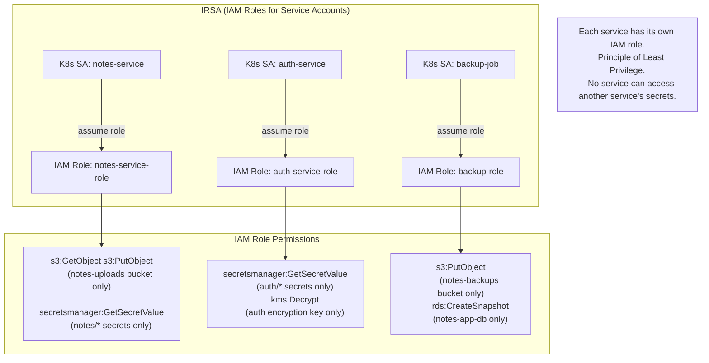
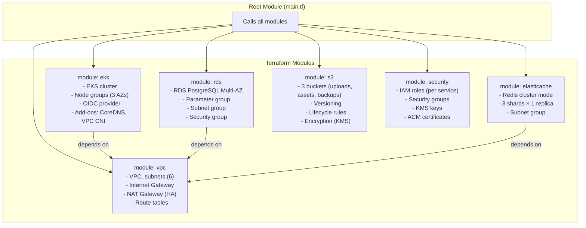

# ☁️ AWS Infrastructure — Production Architecture

> Full AWS topology for the Notes App — VPC, EKS, RDS, S3, CloudFront, and more.

---

## AWS Architecture Overview

---

## VPC Network Topology (CIDR Design)

---

## IAM — Least Privilege per Service

---

## Terraform Infrastructure — Module Structure

