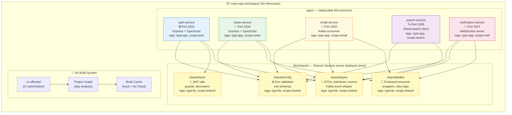
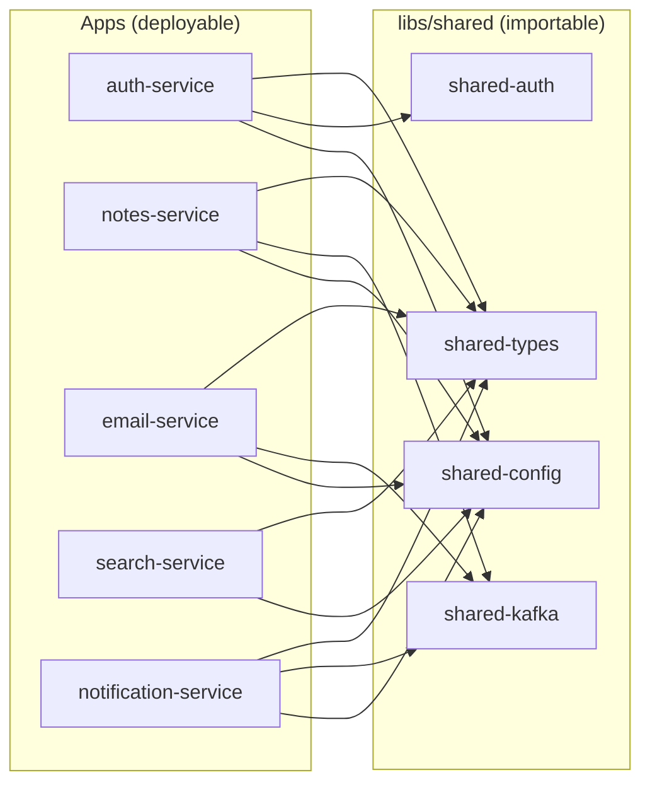
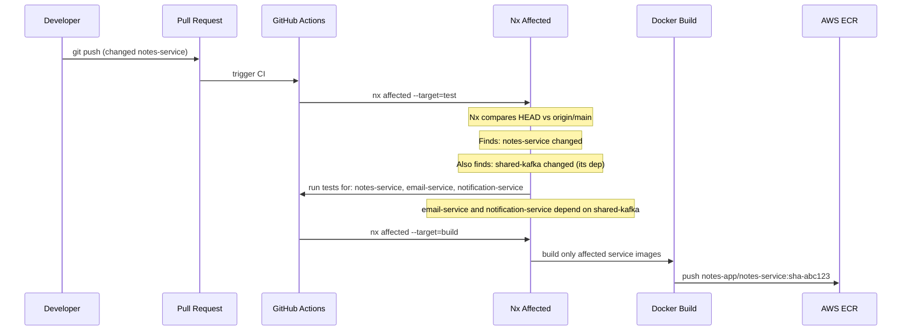
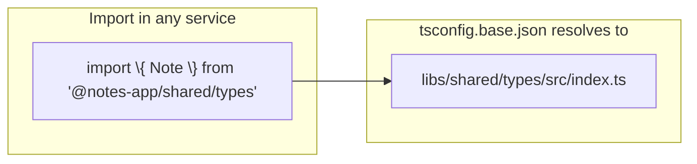
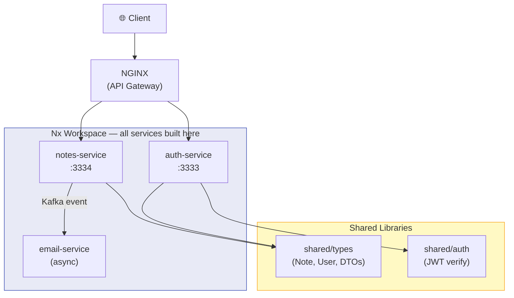

# 🏗️ Nx Monorepo — Notes App Workspace

> This diagram shows the Nx workspace layout for all Notes App backend microservices,  
> how services share code through libraries, and how the workspace integrates with CI/CD.

---

## Workspace Layout

---

## Nx Project Graph (Dependency View)

---

## CI/CD Integration with Nx Affected

---

## TypeScript Path Aliases

The `tsconfig.base.json` at workspace root maps:
- `@notes-app/shared/types` → `libs/shared/types/src/index.ts`
- `@notes-app/shared/auth` → `libs/shared/auth/src/index.ts`
- `@notes-app/shared/kafka` → `libs/shared/kafka/src/index.ts`
- `@notes-app/shared/config` → `libs/shared/config/src/index.ts`

---

## Connection to the Request Journey

---

**Related Task:** [`tasks/microservices/task-009-nx-monorepo-for-microservices.md`](../../tasks/microservices/task-009-nx-monorepo-for-microservices.md)  
**Starter Config:** [`implementation/microservices/task-009-nx-monorepo/`](../../implementation/microservices/task-009-nx-monorepo/)  
**Automation:** [`automation/ansible/roles/notes-app/`](../../automation/ansible/roles/notes-app/) (deploys all Nx-built services to K8s)
