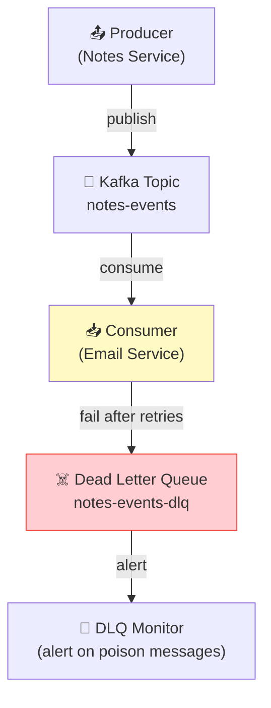

# Final Solution: task-002-dead-letter-queue

This directory will contain the reference solution for this task.

## Note

Try to complete the task yourself first before looking at this solution.

## Architecture Diagram

## Walkthrough

See the task guide in `tasks/messaging/task-002-dead-letter-queue.md` for a step-by-step explanation.
