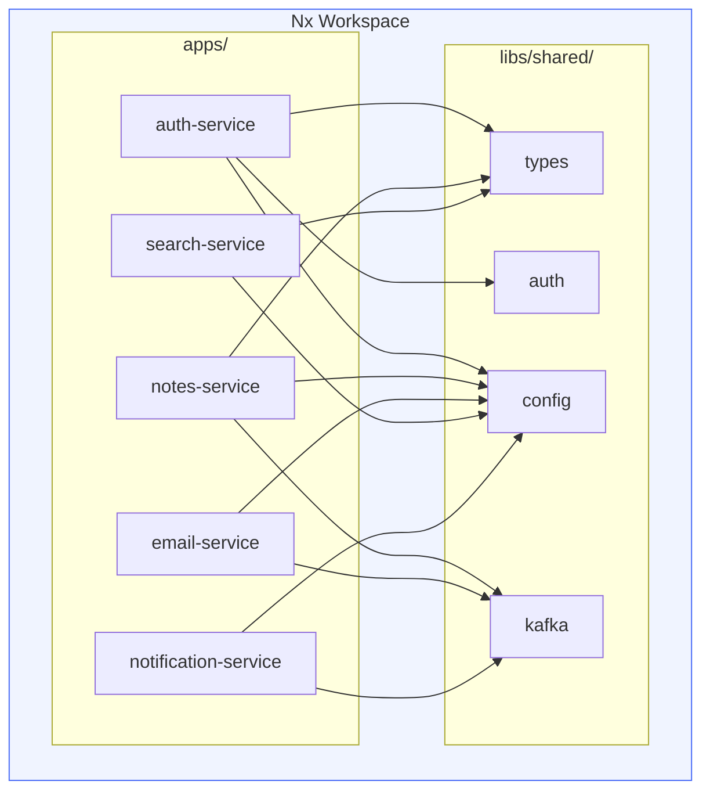

# Nx Monorepo — Notes App Microservices (Starter)

> **Task:** [`tasks/microservices/task-009-nx-monorepo-for-microservices.md`](../../../tasks/microservices/task-009-nx-monorepo-for-microservices.md)  
> **Diagram:** [`docs/diagrams/11-nx-monorepo.md`](../../../docs/diagrams/11-nx-monorepo.md)

This directory contains the starter configuration files for setting up an Nx workspace for the Notes App microservices.

## Quick Setup

```bash
# 1. Create workspace from scratch (follow the task)
npx create-nx-workspace@latest notes-app-workspace --preset=ts --nxCloud=false

# 2. Or use the config files here as reference
cd notes-app-workspace
cp /path/to/this/nx.json .
cp /path/to/this/tsconfig.base.json .
```

## What's In This Directory

| File | Purpose |
|------|---------|
| `nx.json` | Nx workspace configuration (targets, caching) |
| `tsconfig.base.json` | TypeScript base config with path aliases |
| `apps/auth-service/project.json` | Auth service Nx project config |
| `apps/notes-service/project.json` | Notes service Nx project config |
| `libs/shared/types/project.json` | Shared types library Nx config |
| `docker-compose.nx.yml` | Docker Compose that runs all Nx-built services |

## Architecture Diagram



## Deployment Reference

- **Build containers**: Each service has a Dockerfile; build from workspace root
- **ECR registry**: [`automation/terraform/modules/ecr/`](../../../automation/terraform/modules/ecr/)
- **K8s deployment**: [`automation/ansible/roles/notes-app/`](../../../automation/ansible/roles/notes-app/)
