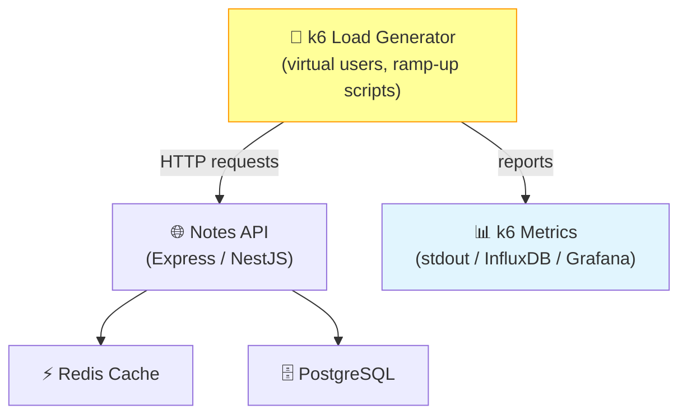

# Starter: task-002-load-testing-k6

This is the starter code for this task. The goal is to implement the solution from scratch.

## Instructions

1. Read the task guide in `tasks/system-design/task-002-load-testing-k6.md`
2. Implement the solution in this directory
3. Compare your solution with `../final-solution/`

## Architecture Diagram



## Getting Started

```bash
# Start required services
docker-compose up -d

# Install dependencies (if applicable)
# Go: go mod tidy
# Python: pip install -r requirements.txt
# Node: npm install
```
