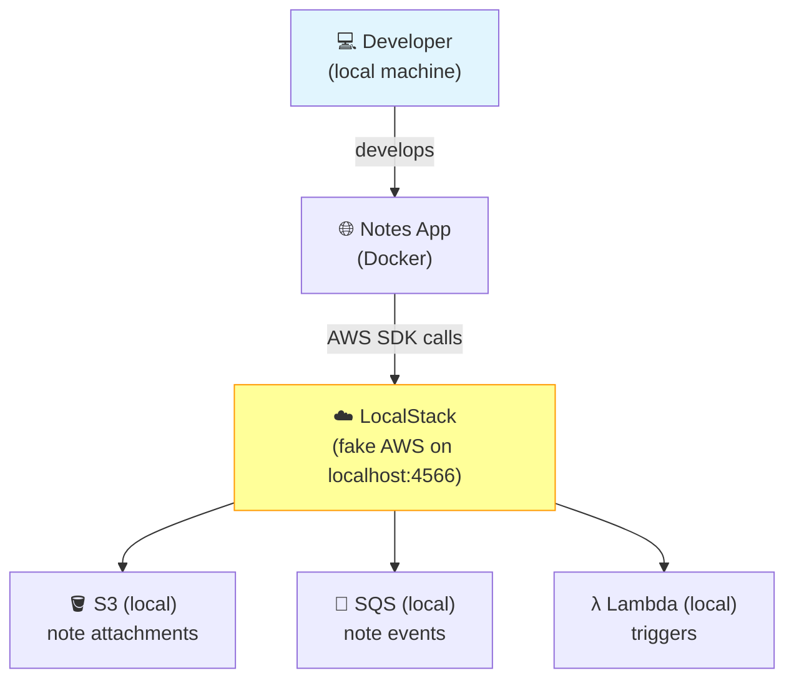

# Issue #148: Add localStack to the journey

**State:** Open  
**Created:** 2026-01-16T12:25:57Z  
**Updated:** 2026-01-16T12:25:57Z  
**URL:** https://github.com/FoushWare/request-journey-client-to-server/issues/148

**Labels:** None

---

## Description

Add [LocalStack](https://www.localstack.cloud/) to the learning journey.

LocalStack is a fully functional local AWS cloud stack that lets you develop and test your AWS applications entirely locally — without needing real AWS credentials or incurring any cost.

**Reference video**: https://www.youtube.com/watch?v=_PD4j5Ra3kY

---

## Why This Matters

- Develop and test AWS-based applications **without cost or cloud access**
- Speeds up development feedback loops dramatically
- Perfect for CI/CD pipelines that need AWS services (S3, SQS, Lambda, DynamoDB, etc.)
- Keeps learners from accidentally spending money on AWS during experiments

---

## Learning Objectives

- [ ] Understand what LocalStack is and how it emulates AWS
- [ ] Set up LocalStack with Docker Compose
- [ ] Use AWS CLI to interact with LocalStack
- [ ] Test S3, SQS, Lambda, and DynamoDB locally
- [ ] Integrate LocalStack into CI/CD pipelines for testing
- [ ] Know the limitations of LocalStack vs real AWS

---

## Tasks to Create

- `tasks/aws/task-012-localstack-setup.md`
- `tasks/aws/task-013-localstack-services.md`
- `tasks/aws/task-014-localstack-cicd-integration.md`

---

## Notes App Integration

LocalStack allows testing the Notes App's AWS integrations locally:
- Upload note attachments to local S3
- Queue note events in local SQS
- Test Lambda triggers locally

---

## Architecture Diagram

> Where LocalStack fits in the request journey (local development):

