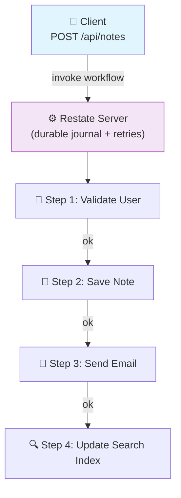

# Issue #151: Explore and Try Restate.dev (Durable Execution)

**State:** Open  
**Created:** 2026-03-20T21:48:41Z  
**Updated:** 2026-03-20T21:48:41Z  
**URL:** https://github.com/FoushWare/request-journey-client-to-server/issues/151

**Labels:** None

---

## Description

Explore and integrate [Restate](https://www.restate.dev/) — a **durable execution** framework for building reliable distributed workflows.

**Official site**: https://www.restate.dev/  
**What is durable execution?**: https://www.restate.dev/what-is-durable-execution  
**Reference video (Arabic, Ahmed Farghal)**: https://www.youtube.com/watch?v=4nLqYtOffHg&list=PLald6EODoOJW3alE1oPAkGF0bHZkPIeTK&index=8

---

## Why This Matters

In distributed systems, failures happen. A service might crash mid-workflow, leaving the system in an inconsistent state. Solving this is hard:
- Retries can cause duplicate processing
- Sagas get complex
- Manual checkpointing is error-prone

**Restate** solves this through **durable execution**: every step in your code is automatically checkpointed and can resume from where it left off, even across crashes and restarts.

It is to distributed systems what a database transaction is to a single database write.

---

## Learning Objectives

- [ ] Understand what durable execution means and why it's needed
- [ ] Compare durable execution to: retries, sagas, message queues
- [ ] Set up Restate server locally with Docker
- [ ] Build a simple durable workflow using the Restate SDK (TypeScript or Go)
- [ ] Handle failures and observe automatic recovery
- [ ] Apply Restate to the Notes App: durable note creation workflow
- [ ] Compare Restate to Temporal (another durable execution engine)

---

## Tasks to Create

- `tasks/distributed-systems/task-003-durable-execution-restate.md`
- `tasks/distributed-systems/task-004-restate-notes-app-workflow.md`

---

## Notes App Integration

The Notes App note-creation flow can be made durable with Restate:
1. Validate user
2. Create note in DB
3. Send notification email
4. Update search index

If any step fails, Restate retries only that step — not the whole flow.

---

## Architecture Diagram

> Where Restate durable execution fits in the Notes App request journey:

