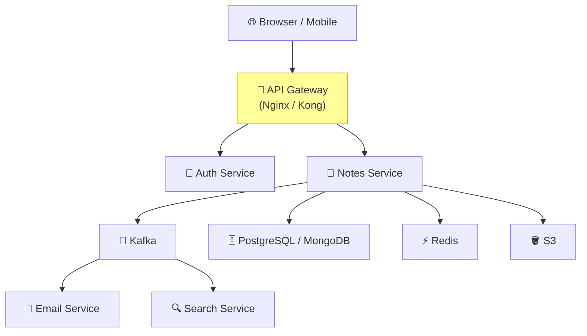

# Issue #153: Create Architecture Diagrams for the Whole Design

**State:** Open  
**Created:** 2026-03-20T22:53:29Z  
**Updated:** 2026-03-25T18:11:42Z  
**URL:** https://github.com/FoushWare/request-journey-client-to-server/issues/153

**Labels:** None

---

## Description

Create a comprehensive **architecture diagram** for the whole project design, plus detailed diagrams for each individual part.

The final project will end up as a **microservices-based application** and the diagrams should reflect that.

**Reference tool**: https://thomasthornton.cloud/draw-io-mcp-for-diagram-generation-why-its-worth-using/?ref=dailydev  
(draw.io MCP for AI-assisted diagram generation)

---

## Why This Matters

Architecture diagrams are essential for:
- **Learning**: Visual representation accelerates understanding
- **Communication**: Diagrams are the universal language of system design
- **Documentation**: Future learners can quickly understand the system
- **Interviews**: System design skills are critical for engineering interviews

---

## Diagrams to Create

### 1. High-Level System Diagram
Full request journey from client to response:
- Client → DNS → CDN → Load Balancer → API Gateway → Microservices → Databases → Response

### 2. Microservices Architecture Diagram
All services and their communication:
- Auth Service, Notes Service, Email Service, User Service
- Communication patterns: REST, gRPC, Kafka events

### 3. Database Topology Diagram
Data ownership per service:
- PostgreSQL (Auth), MongoDB (Notes), Redis (Cache), Neo4j (Graph)

### 4. CI/CD Pipeline Diagram
From code push to production:
- GitHub → Actions → Docker Build → Registry → Kubernetes

### 5. Observability Stack Diagram
Monitoring and logging flow:
- Services → Prometheus → Grafana
- Services → Filebeat → Elasticsearch → Kibana

### 6. Network Diagram
NGINX, Load Balancers, Kubernetes networking

---

## Learning Objectives

- [ ] Design the full-system architecture diagram using draw.io or Mermaid
- [ ] Create individual diagrams for each major subsystem
- [ ] Embed diagrams in relevant documentation files
- [ ] Use C4 Model conventions where applicable

---

## Tasks to Create

- `tasks/system-design/task-001-architecture-diagrams.md`

---

## Tools

- **draw.io** (diagrams.net) — for rich visual diagrams
- **Mermaid** — for code-based diagrams in markdown
- **PlantUML** — for UML-style diagrams

---

## Architecture Diagram

> The full Notes App architecture that needs to be diagrammed:

