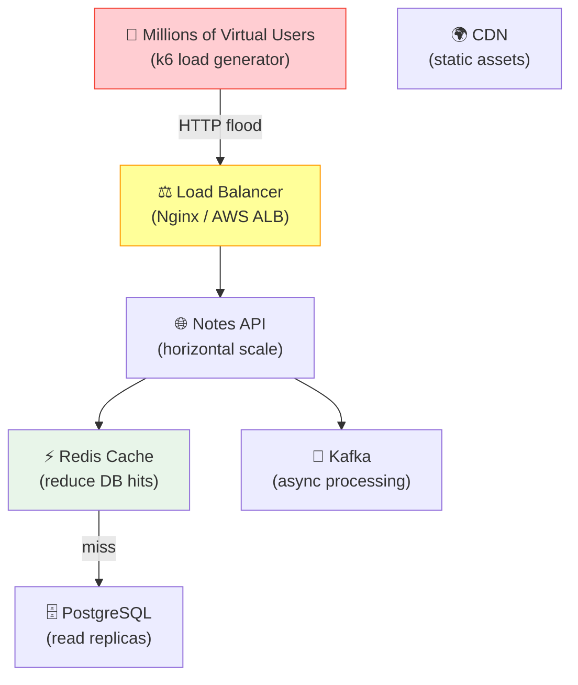

# Issue #154: Simulate Millions of Users and Apply System Design Solutions

**State:** Open  
**Created:** 2026-03-24T00:53:59Z  
**Updated:** 2026-03-24T00:53:59Z  
**URL:** https://github.com/FoushWare/request-journey-client-to-server/issues/154

**Labels:** None

---

## Description

Simulate **millions of concurrent users** hitting the Notes App, observe the bottlenecks, and apply **system design solutions** to solve them at each scale.

---

## Why This Matters

This is one of the most important real-world skills:
- Systems that work for 100 users often break at 10,000
- Each scale level introduces different bottlenecks
- Knowing how to go from 1K → 10K → 100K → 1M users is a career-defining skill
- This is the heart of system design interviews

---

## Scale Levels and Problems

| Scale | Users | Bottleneck | Solution |
|-------|-------|-----------|----------|
| Level 1 | < 1K | Single server | Vertical scaling |
| Level 2 | 1K–10K | Database reads | Read replicas + caching (Redis) |
| Level 3 | 10K–100K | Hot paths | Load balancing + CDN |
| Level 4 | 100K–1M | Database writes | Sharding + CQRS |
| Level 5 | 1M+ | Everything | Microservices + Event sourcing |

---

## Learning Objectives

- [ ] Use **k6** or **Locust** to simulate high user load
- [ ] Baseline test the Notes App (single server)
- [ ] Identify the first bottleneck under load
- [ ] Apply caching with Redis and re-test
- [ ] Apply horizontal scaling and re-test
- [ ] Apply database read replicas and re-test
- [ ] Observe with Prometheus/Grafana while load testing
- [ ] Understand database connection pooling
- [ ] Apply rate limiting and circuit breakers

---

## Tasks to Create

- `tasks/system-design/task-002-load-testing-k6.md`
- `tasks/system-design/task-003-scaling-solutions.md`
- `tasks/system-design/task-004-caching-strategy.md`

---

## Tools

- **k6** — JavaScript-based load testing tool
- **Locust** — Python-based load testing tool
- **Grafana + Prometheus** — observe the system under load
- **Redis** — caching layer
- **PostgreSQL read replicas** — scale database reads

---

## Architecture Diagram

> Scaling solutions applied at each layer as traffic grows:

