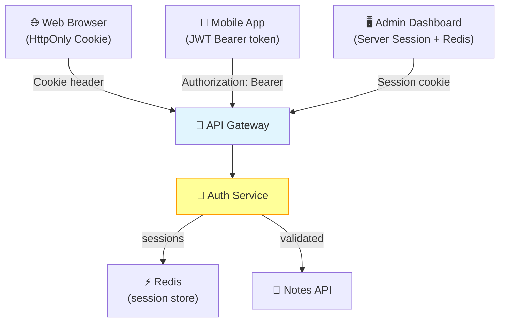

# Issue #155: Use Sessions, JWT Tokens, Cookies for Different Services as Study Cases

**State:** Open  
**Created:** 2026-03-24T00:56:16Z  
**Updated:** 2026-03-24T00:56:16Z  
**URL:** https://github.com/FoushWare/request-journey-client-to-server/issues/155

**Labels:** None

---

## Description

Use **different authentication mechanisms** — server-side sessions, JWT tokens, and cookies — across different microservices as deliberate study cases to understand the trade-offs of each approach.

---

## Why This Matters

Authentication is one of the most misunderstood topics in web development:
- Sessions vs JWTs is a debate every developer encounters
- Different microservices have different requirements
- Cookies have complex security considerations (SameSite, HttpOnly, Secure)
- Token-based auth has different scaling characteristics than session-based

---

## Auth Mechanisms Compared

| Mechanism | Storage | Stateful? | Best For |
|-----------|---------|-----------|----------|
| Server Sessions | Server memory/Redis | Yes | Monolithic apps, SSR |
| JWT (stateless) | Client (localStorage/cookie) | No | Microservices, mobile |
| Opaque tokens | Server DB | Yes | OAuth flows, revocation needed |
| Cookies | Client browser | Depends | Web browsers only |

---

## Learning Objectives

- [ ] Understand the difference between stateful and stateless authentication
- [ ] Implement **server-side sessions** with Redis session store
- [ ] Implement **JWT access + refresh token** pattern
- [ ] Implement **HttpOnly cookie** based authentication
- [ ] Understand CSRF, XSS, and how each mechanism is vulnerable
- [ ] Use different auth mechanisms in different Notes App services:
  - Auth Service: JWT
  - Admin Panel: Session-based
  - Mobile API: JWT with refresh tokens
  - Web frontend: HttpOnly cookies
- [ ] Implement token revocation
- [ ] Understand OAuth 2.0 flow conceptually

---

## Tasks to Create

- `tasks/security/task-011-sessions-vs-jwt.md`
- `tasks/security/task-012-jwt-refresh-tokens.md`
- `tasks/security/task-013-httponly-cookies-csrf.md`

---

## Notes App Integration

- The Notes App web frontend will use **HttpOnly cookies**
- The Notes App mobile API will use **JWT with refresh tokens**
- The Notes App admin dashboard will use **server sessions with Redis**

This creates a realistic multi-auth scenario within the same project.

---

## Architecture Diagram

> Where each authentication mechanism fits in the Notes App request journey:

