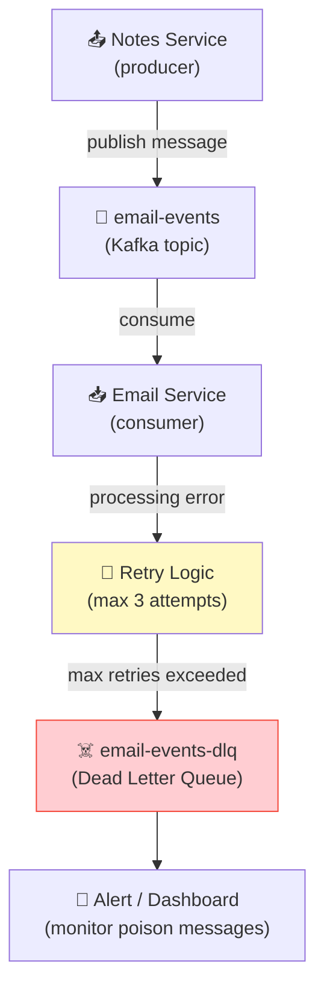

# Issue #156: Simulate the Dead Letter Queue (DLQ) Issue in Kafka

**State:** Open  
**Created:** 2026-03-24T23:22:24Z  
**Updated:** 2026-03-24T23:22:24Z  
**URL:** https://github.com/FoushWare/request-journey-client-to-server/issues/156

**Labels:** None

---

## Description

Simulate the **Dead Letter Queue (DLQ)** problem in Kafka — understand what it is, when messages end up there, and how to handle them properly.

---

## Why This Matters

In any message-based system, some messages cannot be processed:
- **Malformed messages** — bad JSON, missing fields
- **Poison pill messages** — a message that always causes a consumer to crash
- **Transient failures** — the downstream service is temporarily unavailable
- **Business logic failures** — a note references a user that no longer exists

Without a DLQ strategy, one bad message can block your entire consumer group — a common production disaster.

---

## Key Concepts

### Dead Letter Queue
A DLQ is a secondary topic where messages that cannot be processed are sent after N retry attempts.

### Poison Pill Problem
A single malformed message that blocks the consumer forever because Kafka guarantees ordering — you cannot skip it without explicit handling.

### Retry Patterns
1. **Synchronous retry** — retry immediately (can block the consumer)
2. **Async retry** — publish to a retry topic, process later
3. **Exponential backoff** — retry with increasing delays
4. **DLQ** — give up after N retries, send to DLQ for inspection

---

## Learning Objectives

- [ ] Set up Kafka locally with Docker Compose
- [ ] Create a producer and consumer for the Notes App
- [ ] Simulate a **poison pill message** and observe the consumer blocking
- [ ] Implement a DLQ strategy using a `notes-events-dlq` topic
- [ ] Implement retry logic with exponential backoff
- [ ] Build a DLQ monitor that alerts when messages land in the DLQ
- [ ] Implement a **replay mechanism** to reprocess DLQ messages after fixing the issue

---

## Tasks to Create

- `tasks/messaging/task-001-kafka-setup.md`
- `tasks/messaging/task-002-dead-letter-queue.md`
- `tasks/messaging/task-003-retry-patterns.md`

---

## Notes App Integration

The Email Service from issue #152 is a perfect candidate:
- Notes Service publishes to `email-events` topic
- Email Service consumes and sends emails
- Simulate the Email Service crashing on certain messages
- Observe messages moving to `email-events-dlq`
- Implement replay and monitor

---

## Architecture Diagram

> Where the Dead Letter Queue fits in the Kafka message flow:

