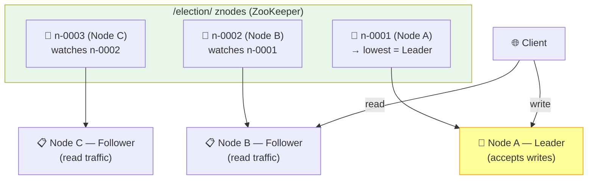

# Issue #158: Learn More About ZooKeeper for Distributed Systems (Leader Election)

**State:** Open  
**Created:** 2026-03-25T09:38:11Z  
**Updated:** 2026-03-25T09:38:11Z  
**URL:** https://github.com/FoushWare/request-journey-client-to-server/issues/158

**Labels:** None

---

## Description

Study **Apache ZooKeeper** — a centralized service for distributed coordination used for leader election, service discovery, and distributed configuration management.

---

## Why This Matters

ZooKeeper is at the core of many distributed systems:
- **Old Kafka** used ZooKeeper for broker coordination (replaced by KRaft in newer Kafka)
- **Hadoop** uses ZooKeeper for NameNode HA
- **HBase** uses ZooKeeper for region server coordination
- **Solr Cloud** uses ZooKeeper for cluster configuration

Even though newer systems replace ZooKeeper, understanding it gives you deep insight into:
- How distributed coordination works
- What problems leader election solves
- Why ZooKeeper is being phased out (and why KRaft/Raft is the future)

---

## Key Concepts

### ZooKeeper Data Model
- Tree of **znodes** (like a filesystem)
- Types: persistent, ephemeral, sequential
- Ephemeral nodes disappear when the client disconnects — perfect for leader election

### Leader Election with ZooKeeper
1. Each candidate creates an ephemeral sequential znode under `/election/`
2. Each candidate checks its own sequence number. If it holds the lowest number, it is the leader.
3. Otherwise, each candidate watches **only the immediately preceding znode** (not the lowest)
4. When the watched znode disappears (the node ahead died or left), the watcher re-runs the election check
5. This avoids the **herd effect** — only one node wakes up per event, not all of them

### Watchers
- Clients register watchers on znodes
- ZooKeeper notifies them when the znode changes
- One-time triggers (must be re-registered after firing)

### ZAB Protocol
- ZooKeeper Atomic Broadcast — ZooKeeper's own consensus protocol
- Similar to Raft but predates it
- Guarantees total ordering of updates

---

## Learning Objectives

- [ ] Understand ZooKeeper's role in distributed systems
- [ ] Set up ZooKeeper with Docker
- [ ] Explore the znode tree using the ZooKeeper CLI
- [ ] Implement a leader election example with ephemeral sequential znodes
- [ ] Understand the difference between ZooKeeper and etcd
- [ ] Understand why Kafka replaced ZooKeeper with KRaft
- [ ] Compare ZooKeeper (ZAB) vs Raft vs Paxos conceptually

---

## Tasks to Create

- `tasks/distributed-systems/task-005-zookeeper-fundamentals.md`
- `tasks/distributed-systems/task-006-zookeeper-leader-election.md`

---

## Notes App Integration

Simulate ZooKeeper-based coordination for a multi-instance Notes API:
- 3 instances of the Notes API run concurrently
- Use ZooKeeper to elect a "primary" node
- Primary handles write traffic; secondaries handle reads
- Kill the primary and watch ZooKeeper elect a new one

---

## Architecture Diagram

> Where ZooKeeper leader election fits in the Notes App request journey:

