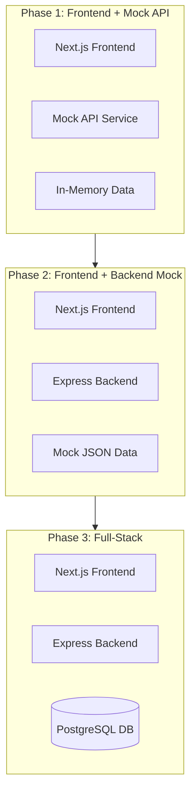

# Foundation Phase Plan

## Overview

The Foundation Phase establishes the baseline Notes App through a progressive 3-step approach. This allows learners to understand each layer of the application independently before combining them into a full-stack solution.

## The Three Phases



## Phase 1: Frontend with Mock API

**Branch**: `feat/layer-00-foundation-phase-1-mock-frontend`

### What You'll Learn
- React/Next.js component architecture
- Mock API patterns for rapid prototyping
- State management without backend
- UI/UX fundamentals

### Implementation
- Complete Next.js frontend with all UI components
- Mock service layer simulating API calls
- In-memory data storage
- No backend server required

### Key Files
- `tasks/foundation/task-001-frontend-mock-api.md` - Task guide
- `implementation/foundation/task-001-mock-frontend/` - Implementation

## Phase 2: Backend with Mock Data

**Branch**: `feat/layer-00-foundation-phase-2-backend-mock`

### What You'll Learn
- Express.js REST API design
- HTTP methods and status codes
- Request/response patterns
- JWT authentication simulation
- Frontend-backend integration

### Implementation
- Express.js backend with all routes
- Fixed/mock JSON responses
- Simulated JWT authentication
- Frontend updated to call real API endpoints
- Data resets on server restart (no database)

### Key Files
- `tasks/foundation/task-002-backend-mock-data.md` - Task guide
- `implementation/foundation/task-002-backend-mock/` - Implementation

## Phase 3: Full-Stack with Database

**Branch**: `feat/layer-00-foundation-phase-3-fullstack`

### What You'll Learn
- PostgreSQL database design
- SQL queries and migrations
- Real authentication with bcrypt
- Data persistence
- Connection pooling and error handling

### Implementation
- PostgreSQL database setup
- Database schema and migrations
- Replace mock data with real queries
- Complete authentication flow (register, login, JWT)
- Data persists across restarts

### Key Files
- `tasks/foundation/task-003-fullstack-database.md` - Task guide
- `implementation/foundation/task-003-fullstack/` - Implementation

## Branch Strategy

| Phase | Branch Name | PR Target |
|-------|-------------|-----------|
| 1 | `feat/layer-00-foundation-phase-1-mock-frontend` | `develop` |
| 2 | `feat/layer-00-foundation-phase-2-backend-mock` | `develop` |
| 3 | `feat/layer-00-foundation-phase-3-fullstack` | `develop` |

## Directory Structure

```
tasks/
└── foundation/
    ├── README.md
    ├── task-001-frontend-mock-api.md
    ├── task-002-backend-mock-data.md
    └── task-003-fullstack-database.md

implementation/
└── foundation/
    ├── task-001-mock-frontend/
    │   └── frontend/
    ├── task-002-backend-mock/
    │   ├── frontend/
    │   └── backend/
    └── task-003-fullstack/
        ├── frontend/
        ├── backend/
        └── database/
```

## Success Criteria

Each phase must:
- ✅ Be independently runnable
- ✅ Include comprehensive README with setup instructions
- ✅ Have detailed task file with learning objectives
- ✅ Include Mermaid diagrams
- ✅ Pass manual verification steps
- ✅ Be submitted as a PR to `develop`

## Estimated Timeline

- **Phase 1**: 2-3 hours
- **Phase 2**: 2-3 hours
- **Phase 3**: 3-4 hours
- **Total**: 7-10 hours

## Prerequisites

- Node.js 18+ installed
- npm or yarn package manager
- Basic knowledge of JavaScript/TypeScript
- For Phase 3: PostgreSQL installed

## Learning Path

1. Start with **Phase 1** - Build the complete UI without backend
2. Move to **Phase 2** - Add backend with mock data
3. Complete with **Phase 3** - Integrate real database

Each phase builds on the previous one, so complete them in order.

## Notes for Learners

- Each phase teaches specific concepts in isolation
- You can study any phase independently to understand that layer
- The progression helps you understand how full-stack applications evolve
- All code is production-ready and follows best practices
