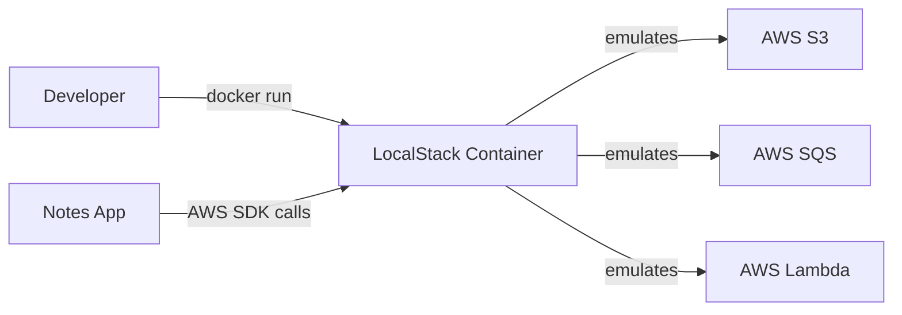

# Task: LocalStack Setup and Integration

**Related Issue:** #148  
**Category:** AWS  
**Prerequisites:** Docker, basic AWS concepts  
**Estimated Time:** 3–4 hours  
**Notes App Context:** Test Notes App's AWS integrations without real AWS costs

---

## Learning Objectives

- Understand what LocalStack is and how it emulates AWS
- Set up LocalStack with Docker Compose
- Use AWS CLI to interact with LocalStack
- Test S3, SQS, DynamoDB, and Lambda locally
- Integrate LocalStack into CI/CD pipelines

---

## Theory Section

### What is LocalStack?

LocalStack is a **fully functional local AWS cloud stack** that runs inside Docker. It emulates the most common AWS services:
- S3 — Object storage
- SQS — Message queue
- SNS — Notifications
- DynamoDB — NoSQL database
- Lambda — Serverless functions
- API Gateway
- IAM
- CloudWatch
- Secrets Manager
- And more...

### Why LocalStack?

| Without LocalStack | With LocalStack |
|-------------------|----------------|
| Need AWS account | No account needed |
| Real costs | Completely free |
| Slow feedback (internet) | Fast local feedback |
| Risk of misconfiguration costs | Safe to experiment |
| Hard to reset state | Restart container = clean state |

---

## Step-by-Step Instructions

### Step 1: Add LocalStack to Docker Compose

```yaml
localstack:
  image: localstack/localstack:latest
  ports:
    - "4566:4566"      # Main endpoint
    - "4510-4559:4510-4559"  # Service-specific ports
  environment:
    - SERVICES=s3,sqs,lambda,dynamodb,secretsmanager
    - DEBUG=0
    - DOCKER_HOST=unix:///var/run/docker.sock
  volumes:
    - "/var/run/docker.sock:/var/run/docker.sock"
    - "./localstack-init:/docker-entrypoint-initaws.d"  # Auto-init scripts
```

### Step 2: Configure AWS CLI for LocalStack

```bash
# Configure a local profile for LocalStack
aws configure --profile localstack
# AWS Access Key ID: test
# AWS Secret Access Key: test
# Default region: us-east-1

# Or set environment variables
export AWS_DEFAULT_REGION=us-east-1
export AWS_ACCESS_KEY_ID=test
export AWS_SECRET_ACCESS_KEY=test
export AWS_ENDPOINT_URL=http://localhost:4566
```

### Step 3: Test S3 Locally

```bash
# Create a bucket
aws --endpoint-url=http://localhost:4566 s3 mb s3://notes-app-uploads

# Upload a file
aws --endpoint-url=http://localhost:4566 s3 cp test.txt s3://notes-app-uploads/

# List files
aws --endpoint-url=http://localhost:4566 s3 ls s3://notes-app-uploads/
```

### Step 4: Test SQS Locally

```bash
# Create a queue
aws --endpoint-url=http://localhost:4566 sqs create-queue \
  --queue-name notes-events

# Send a message
aws --endpoint-url=http://localhost:4566 sqs send-message \
  --queue-url http://localhost:4566/000000000000/notes-events \
  --message-body '{"type": "note.created", "userId": "user123"}'

# Receive messages
aws --endpoint-url=http://localhost:4566 sqs receive-message \
  --queue-url http://localhost:4566/000000000000/notes-events
```

### Step 5: Use LocalStack in CI/CD

Add LocalStack to your GitHub Actions workflow to test AWS integrations without real AWS:

```yaml
services:
  localstack:
    image: localstack/localstack:latest
    ports:
      - "4566:4566"
    env:
      SERVICES: s3,sqs,lambda
```

### Step 6: Auto-Initialize Resources

Create `localstack-init/init.sh` to auto-create resources on LocalStack startup:

```bash
#!/bin/bash
aws --endpoint-url=http://localhost:4566 s3 mb s3://notes-app-uploads
aws --endpoint-url=http://localhost:4566 sqs create-queue --queue-name notes-events
echo "LocalStack initialized successfully"
```

---

## Verification

1. LocalStack running — `curl http://localhost:4566/_localstack/health`
2. S3 bucket created and file upload works
3. SQS queue created and messages sent/received
4. Notes App uses LocalStack endpoint for file uploads
5. CI pipeline uses LocalStack for integration tests

---

## Task Checklist

- [ ] LocalStack added to docker-compose.yml
- [ ] AWS CLI configured for LocalStack
- [ ] S3 bucket tested locally
- [ ] SQS queue tested locally
- [ ] Notes App configured to use LocalStack for uploads
- [ ] Auto-init script created
- [ ] CI/CD pipeline uses LocalStack for tests

---

**Task Status:** [ ] Not Started | [ ] In Progress | [ ] Completed

---

## Diagram



---

## Automation Reference

> The steps above are **manual/raw** — they teach you the concept by doing it yourself.  
> The `automation/` directory contains the production-grade IaC equivalent:

| What | Where | Description |
|------|-------|-------------|
| Docker Role | [`automation/ansible/roles/docker/`](../../automation/ansible/roles/docker/) | Installs and configures Docker used to run LocalStack |
| S3 Module | [`automation/terraform/modules/s3/`](../../automation/terraform/modules/s3/) | Real S3 bucket equivalent of the LocalStack-emulated bucket |
| IAM Module | [`automation/terraform/modules/iam/`](../../automation/terraform/modules/iam/) | IAM roles/policies mirroring the permissions tested with LocalStack |
