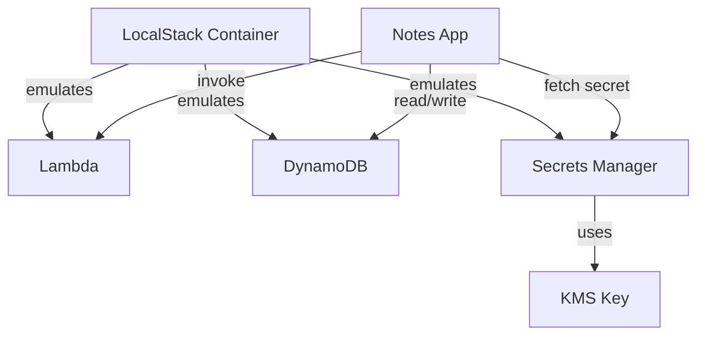

# Task: LocalStack Services Deep Dive

**Related Issue:** #148  
**Category:** AWS  
**Prerequisites:** task-012-localstack-setup  
**Estimated Time:** 3 hours  
**Notes App Context:** Test Lambda triggers and DynamoDB locally for Notes App features

---

## Learning Objectives

- Test Lambda functions locally with LocalStack
- Use DynamoDB locally for session storage
- Test Secrets Manager locally for configuration
- Understand LocalStack limitations vs real AWS

---

## Step-by-Step Instructions

### Step 1: Deploy and Test Lambda Locally

```bash
# Create a simple Lambda function
cat > handler.py << 'EOF'
def handler(event, context):
    print(f"Processing note event: {event}")
    return {"statusCode": 200, "body": "processed"}
EOF

# Package it
zip function.zip handler.py

# Deploy to LocalStack
aws --endpoint-url=http://localhost:4566 lambda create-function \
  --function-name process-note-event \
  --runtime python3.11 \
  --role arn:aws:iam::000000000000:role/lambda-role \
  --handler handler.handler \
  --zip-file fileb://function.zip

# Invoke it
aws --endpoint-url=http://localhost:4566 lambda invoke \
  --function-name process-note-event \
  --payload '{"noteId": "123", "userId": "user1"}' \
  output.json
cat output.json
```

### Step 2: DynamoDB for Session Storage

```bash
# Create DynamoDB table for sessions
aws --endpoint-url=http://localhost:4566 dynamodb create-table \
  --table-name Sessions \
  --attribute-definitions AttributeName=sessionId,AttributeType=S \
  --key-schema AttributeName=sessionId,KeyType=HASH \
  --billing-mode PAY_PER_REQUEST

# Write a session
aws --endpoint-url=http://localhost:4566 dynamodb put-item \
  --table-name Sessions \
  --item '{"sessionId": {"S": "abc123"}, "userId": {"S": "user1"}, "ttl": {"N": "1234567890"}}'
```

### Step 3: Secrets Manager Locally

```bash
# Store a database password
aws --endpoint-url=http://localhost:4566 secretsmanager create-secret \
  --name notes-app/db-password \
  --secret-string "supersecretpassword"

# Retrieve it from application code
aws --endpoint-url=http://localhost:4566 secretsmanager get-secret-value \
  --secret-id notes-app/db-password
```

### Step 4: LocalStack Limitations

| Feature | LocalStack Free | LocalStack Pro | Real AWS |
|---------|----------------|----------------|----------|
| S3 | ✅ Full | ✅ Full | ✅ Full |
| SQS | ✅ Full | ✅ Full | ✅ Full |
| Lambda | ✅ Basic | ✅ Full | ✅ Full |
| RDS | ❌ | ✅ | ✅ Full |
| EKS | ❌ | ✅ | ✅ Full |

Free tier covers most learning use cases.

---

## Task Checklist

- [ ] Lambda function deployed and invoked locally
- [ ] DynamoDB table created and used for sessions
- [ ] Secrets Manager used for database credentials
- [ ] LocalStack limitations documented

---

**Task Status:** [ ] Not Started | [ ] In Progress | [ ] Completed

---

## Diagram



---

## Automation Reference

> The steps above are **manual/raw** — they teach you the concept by doing it yourself.  
> The `automation/` directory contains the production-grade IaC equivalent:

| What | Where | Description |
|------|-------|-------------|
| Docker Role | [`automation/ansible/roles/docker/`](../../automation/ansible/roles/docker/) | Installs Docker used to run the LocalStack container |
| IAM Module | [`automation/terraform/modules/iam/`](../../automation/terraform/modules/iam/) | IAM execution roles for Lambda and access policies for DynamoDB |
| KMS Module | [`automation/terraform/modules/kms/`](../../automation/terraform/modules/kms/) | KMS customer-managed key backing Secrets Manager in production |
