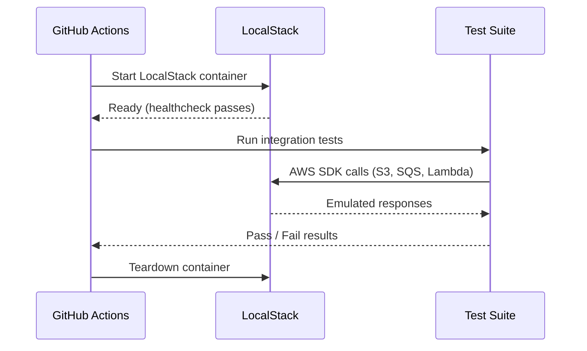

# Task: LocalStack in CI/CD Integration

**Related Issue:** #148  
**Category:** AWS  
**Prerequisites:** task-012-localstack-setup, task-013-localstack-services  
**Estimated Time:** 2 hours  
**Notes App Context:** Run integration tests against LocalStack in GitHub Actions

---

## Learning Objectives

- Integrate LocalStack into GitHub Actions
- Write integration tests that use AWS services locally
- Ensure all AWS integrations are tested before deployment

---

## Step-by-Step Instructions

### Step 1: Update GitHub Actions Workflow

```yaml
name: Integration Tests

on: [push, pull_request]

jobs:
  integration-test:
    runs-on: ubuntu-latest
    
    services:
      localstack:
        image: localstack/localstack:latest
        ports:
          - 4566:4566
        env:
          SERVICES: s3,sqs,lambda,dynamodb
        options: >-
          --health-cmd "curl -f http://localhost:4566/_localstack/health"
          --health-interval 10s
          --health-timeout 5s
          --health-retries 5
    
    steps:
      - uses: actions/checkout@v4
      
      - name: Wait for LocalStack
        run: |
          until curl -sf http://localhost:4566/_localstack/health; do
            echo "Waiting for LocalStack..."
            sleep 2
          done
      
      - name: Create AWS resources
        run: |
          aws --endpoint-url=http://localhost:4566 s3 mb s3://notes-app-uploads
          aws --endpoint-url=http://localhost:4566 sqs create-queue --queue-name notes-events
        env:
          AWS_DEFAULT_REGION: us-east-1
          AWS_ACCESS_KEY_ID: test
          AWS_SECRET_ACCESS_KEY: test
      
      - name: Run integration tests
        run: npm run test:integration
        env:
          AWS_ENDPOINT_URL: http://localhost:4566
          AWS_DEFAULT_REGION: us-east-1
          AWS_ACCESS_KEY_ID: test
          AWS_SECRET_ACCESS_KEY: test
```

### Step 2: Write Integration Tests

```typescript
// tests/integration/s3.test.ts
import { S3Client, PutObjectCommand, GetObjectCommand } from '@aws-sdk/client-s3';

const s3 = new S3Client({
  region: 'us-east-1',
  endpoint: process.env.AWS_ENDPOINT_URL || 'http://localhost:4566',
  forcePathStyle: true, // Required for LocalStack
  credentials: {
    accessKeyId: 'test',
    secretAccessKey: 'test'
  }
});

test('should upload and retrieve a note attachment', async () => {
  await s3.send(new PutObjectCommand({
    Bucket: 'notes-app-uploads',
    Key: 'test-attachment.txt',
    Body: 'Test content'
  }));
  
  const response = await s3.send(new GetObjectCommand({
    Bucket: 'notes-app-uploads',
    Key: 'test-attachment.txt'
  }));
  
  const body = await response.Body?.transformToString();
  expect(body).toBe('Test content');
});
```

---

## Task Checklist

- [ ] LocalStack added as a service in GitHub Actions
- [ ] AWS resources auto-created in CI pipeline
- [ ] Integration tests written using LocalStack
- [ ] Tests pass in CI

---

**Task Status:** [ ] Not Started | [ ] In Progress | [ ] Completed

---

## Diagram



---

## Automation Reference

> The steps above are **manual/raw** — they teach you the concept by doing it yourself.  
> The `automation/` directory contains the production-grade IaC equivalent:

| What | Where | Description |
|------|-------|-------------|
| Docker Role | [`automation/ansible/roles/docker/`](../../automation/ansible/roles/docker/) | Installs Docker on CI runners or self-hosted agents |
| ECR Module | [`automation/terraform/modules/ecr/`](../../automation/terraform/modules/ecr/) | Container registry for pushing images built in the CI pipeline |
| IAM Module | [`automation/terraform/modules/iam/`](../../automation/terraform/modules/iam/) | IAM credentials used by CI to push to ECR and access AWS resources |
