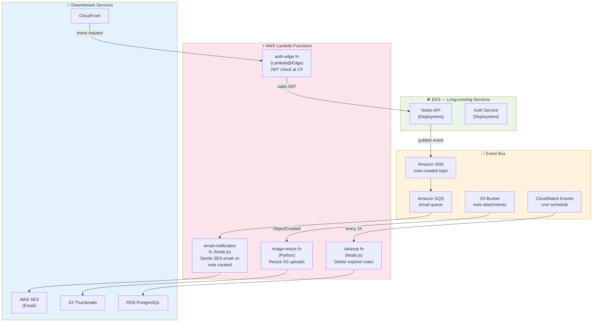

# Task: Serverless Deployment for Microservices (Lambda / Cloud Functions / Azure Functions)

**Related Issue:** [#168](https://github.com/FoushWare/request-journey-client-to-server/issues/168)  
**Category:** AWS / Serverless  
**Prerequisites:** tasks/aws/task-001–task-015, tasks/microservices/ (service architecture), tasks/messaging/ (Kafka/SQS)  
**Estimated Time:** 4–6 hours  
**Languages:** Node.js / Python (Lambda), HCL (Terraform), YAML (SAM/Serverless Framework)  
**Notes App Context:** Deploy event-driven parts of the Notes App (email notifications, scheduled cleanup, image processing) as serverless functions, complementing the EKS-hosted microservices.

---

## Learning Objectives

By the end of this task, you will be able to:

- Explain the FaaS model and distinguish it from VMs and containers
- Deploy a Node.js Lambda function triggered by SNS/SQS
- Configure API Gateway to expose a Lambda as an HTTP endpoint
- Handle cold starts and understand provisioned concurrency
- Compare AWS Lambda, GCP Cloud Functions, and Azure Functions
- Integrate serverless functions with the existing EKS microservices via event bridges
- Know when serverless is a better fit than a long-running container

---

## Theory Section

### 1. FaaS vs. Containers vs. VMs

```
Infrastructure Model Spectrum:

VMs (EC2)                    Containers (EKS)           Serverless (Lambda)
┌───────────────────┐        ┌───────────────────┐      ┌───────────────────┐
│  OS + Runtime     │        │  Runtime only      │      │  Code only        │
│  Always running   │        │  Always running    │      │  Runs on demand   │
│  You manage OS    │        │  You manage pods   │      │  Cloud manages all│
│  Full control     │        │  Cluster mgmt      │      │  Zero ops         │
│  Fixed cost       │        │  Fixed node cost   │      │  Pay per invocation│
└───────────────────┘        └───────────────────┘      └───────────────────┘
   Most control                 Middle ground              Least control
   Most ops overhead            Some overhead              Zero overhead
```

### 2. AWS Lambda Architecture

```
Trigger Sources → Lambda → Downstream
┌───────────────────────────────────────────────────────────────┐
│  Triggers:                  Lambda Function:     Downstream:  │
│  ┌──────────┐               ┌─────────────┐     ┌──────────┐  │
│  │ API GW   │──────────────▶│   handler   │────▶│   DynamoDB│  │
│  │ SNS/SQS  │               │  (Node.js / │     │   RDS    │  │
│  │ S3 Event │               │   Python /  │     │   SES    │  │
│  │ CW Event │               │   Go)       │     │   S3     │  │
│  │ Kafka    │               └─────────────┘     │   SNS    │  │
│  │ DynamoDB │                                   └──────────┘  │
│  │ Cognito  │                                                  │
│  └──────────┘                                                  │
└───────────────────────────────────────────────────────────────┘
```

### 3. Cold Start vs. Warm Start

| State | What happens | Latency |
|-------|-------------|---------|
| **Cold Start** | Container initialized, runtime bootstrapped, code loaded | 100ms–5s |
| **Warm Start** | Existing container reused | 1–10ms |
| **Provisioned Concurrency** | Pre-warmed instances always ready | ~1ms |

**Mitigation strategies:**
- Use provisioned concurrency for latency-sensitive functions
- Keep functions small (faster bootstrap)
- Use lighter runtimes (Node.js/Python over JVM)
- Keep-warm scheduled pings (anti-pattern — prefer provisioned concurrency)

---

## Diagram



---

## Step-by-Step Instructions

### Step 1: Create the Email Notification Lambda (Node.js)

```javascript
// functions/email-notification/handler.js
const AWS = require('@aws-sdk/client-ses');
const ses = new AWS.SESClient({ region: process.env.AWS_REGION });

exports.handler = async (event) => {
  for (const record of event.Records) {
    const message = JSON.parse(record.body);
    const { userEmail, noteTitle } = message;

    await ses.send(new AWS.SendEmailCommand({
      Source: 'noreply@notes-app.com',
      Destination: { ToAddresses: [userEmail] },
      Message: {
        Subject: { Data: `New note created: ${noteTitle}` },
        Body: {
          Text: { Data: `Your note "${noteTitle}" was created successfully.` }
        }
      }
    }));
  }
  return { statusCode: 200 };
};
```

### Step 2: Deploy with AWS SAM

```yaml
# template.yaml
AWSTemplateFormatVersion: '2010-09-09'
Transform: AWS::Serverless-2016-10-31

Resources:
  EmailNotificationFunction:
    Type: AWS::Serverless::Function
    Properties:
      Handler: handler.handler
      Runtime: nodejs20.x
      CodeUri: functions/email-notification/
      Environment:
        Variables:
          AWS_REGION: !Ref AWS::Region
      Events:
        SQSTrigger:
          Type: SQS
          Properties:
            Queue: !GetAtt EmailQueue.Arn
            BatchSize: 10

  EmailQueue:
    Type: AWS::SQS::Queue
    Properties:
      QueueName: email-queue
      VisibilityTimeout: 30
```

```bash
# Deploy
sam build
sam deploy --guided
```

### Step 3: Deploy with Terraform (Alternative)

```hcl
# terraform/lambda.tf
resource "aws_lambda_function" "email_notification" {
  function_name = "email-notification"
  handler       = "handler.handler"
  runtime       = "nodejs20.x"
  role          = aws_iam_role.lambda_exec.arn
  filename      = "functions/email-notification.zip"

  environment {
    variables = {
      SES_FROM_EMAIL = "noreply@notes-app.com"
    }
  }
}

resource "aws_lambda_event_source_mapping" "sqs_trigger" {
  event_source_arn = aws_sqs_queue.email_queue.arn
  function_name    = aws_lambda_function.email_notification.arn
  batch_size       = 10
}
```

### Step 4: Test Locally with LocalStack

```bash
# Start LocalStack
docker-compose up localstack

# Create Lambda
awslocal lambda create-function \
  --function-name email-notification \
  --runtime nodejs20.x \
  --role arn:aws:iam::000000000000:role/lambda-role \
  --handler handler.handler \
  --zip-file fileb://functions/email-notification.zip

# Invoke manually
awslocal lambda invoke \
  --function-name email-notification \
  --payload '{"Records":[{"body":"{\"userEmail\":\"test@test.com\",\"noteTitle\":\"My Note\"}"}]}' \
  output.json

cat output.json
```

---

## Multi-Cloud Comparison

### GCP Cloud Functions

```bash
gcloud functions deploy email-notification \
  --gen2 \
  --runtime nodejs20 \
  --region us-central1 \
  --source ./functions/email-notification \
  --entry-point handler \
  --trigger-topic note-created-topic
```

### Azure Functions

```bash
func init email-notification --worker-runtime node
func new --name EmailNotification --template "Azure Service Bus Queue trigger"
func azure functionapp publish notes-app-functions
```

---

## FaaS Provider Comparison

| Feature | AWS Lambda | GCP Cloud Functions | Azure Functions |
|---------|-----------|---------------------|-----------------|
| Max execution time | 15 min | 60 min (gen2) | 10 min (consumption) |
| Max memory | 10 GB | 32 GB | 14 GB |
| Triggers | 200+ AWS services | GCP services + HTTP | Azure services + HTTP |
| Cold start (Node.js) | ~100–500ms | ~100–600ms | ~100–800ms |
| Provisioned concurrency | ✅ | ✅ | ✅ Premium plan |
| Free tier | 1M requests/mo | 2M invocations/mo | 1M requests/mo |
| Local dev | LocalStack / SAM | Functions Framework | Azure Functions Core Tools |
| Terraform support | ✅ `aws_lambda_function` | ✅ `google_cloudfunctions_function` | ✅ `azurerm_function_app` |

---

## Verification Checklist

- [ ] Email Lambda deployed and invocable
- [ ] SQS queue triggers Lambda on message
- [ ] Notes API publishes to SNS → SQS → Lambda → SES email received
- [ ] Tested locally using LocalStack
- [ ] Lambda logs visible in CloudWatch
- [ ] Cleanup Lambda scheduled with CloudWatch Events
- [ ] Understood cold-start mitigation strategies
- [ ] Read GCP Cloud Functions and Azure Functions equivalents

---

## Automation Reference

| What | Where | Description |
|------|-------|-------------|
| Lambda + SQS (Terraform) | [`automation/terraform/modules/iam/`](../../automation/terraform/modules/iam/) | IAM roles for Lambda execution with SQS and SES permissions |
| S3 bucket | [`automation/terraform/modules/s3/`](../../automation/terraform/modules/s3/) | S3 bucket for Lambda deployment packages and attachment storage |
| KMS encryption | [`automation/terraform/modules/kms/`](../../automation/terraform/modules/kms/) | KMS key for encrypting Lambda environment variables and SQS messages |
| LocalStack (CI test) | [`automation/ansible/roles/notes-app/`](../../automation/ansible/roles/notes-app/) | Ansible role starts LocalStack and runs Lambda smoke tests in CI |

> 💡 For production Lambda deployments, use AWS SAM (`sam deploy`) or Terraform (`aws_lambda_function` resource). The `automation/terraform/` modules already provision the supporting infrastructure (IAM, S3, KMS, SQS) — add a `lambda.tf` to wire them together.

---

## Task Checklist

- [ ] Read the FaaS theory section
- [ ] Understand cold starts and warm starts
- [ ] Viewed the serverless + EKS integration diagram
- [ ] Deployed email-notification Lambda locally (LocalStack)
- [ ] Deployed to AWS using SAM or Terraform
- [ ] Tested end-to-end: Notes API → SNS → SQS → Lambda → SES
- [ ] Compared with GCP Cloud Functions and Azure Functions
- [ ] Documented learnings

---

**Task Status:** [ ] Not Started | [ ] In Progress | [ ] Completed  
**Date Started:** ___  
**Date Completed:** ___
