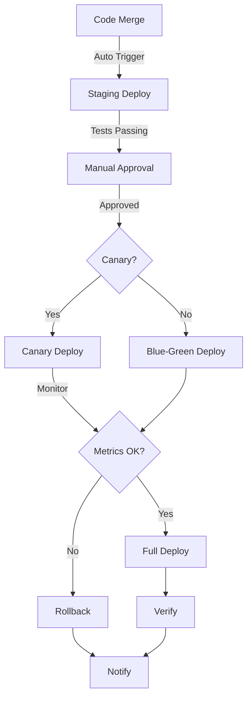

# Task: Automated Deployment Pipeline
**Issue:** #43 | **Category:** CI/CD | **Priority:** High | **Effort:** 8h

---

## 📋 Objective

Configure automated deployment pipeline to deploy validated code changes to staging and production environments.

---

## 📝 Description

Implement continuous deployment with approval gates and rollback capabilities:
- Staging deployment automation
- Production deployment approval workflow
- Canary deployments
- Automatic rollback on failures
- Deployment verification
- Notification system

---

## ✅ Acceptance Criteria

- [ ] Staging deployment automated
- [ ] Production deployment requires approval
- [ ] Canary deployment configured
- [ ] Rollback works reliably
- [ ] Deployment verified post-deployment
- [ ] Zero downtime deployments
- [ ] Notifications working
- [ ] Deployment logs captured
- [ ] Team trained on deployment process
- [ ] Rollback time < 5 minutes

---

## 🔧 Sub-Tasks

### 1. Staging Deployment Automation
- [ ] Configure staging deployment trigger
- [ ] Deploy to staging on merged PRs
- [ ] Verify staging deployment
- [ ] Run smoke tests
- [ ] Update DNS records
- [ ] Document staging deployment

### 2. Production Deployment Workflow
- [ ] Create manual approval workflow
- [ ] Require team approval for production
- [ ] Record approval details
- [ ] Deploy to production
- [ ] Verify production deployment
- [ ] Document approval process

### 3. Canary Deployment Strategy
- [ ] Route small percentage to new version
- [ ] Monitor metrics during canary
- [ ] Gradually increase traffic
- [ ] Roll forward or back based on metrics
- [ ] Document canary strategy
- [ ] Create canary runbooks

### 4. Blue-Green Deployments
- [ ] Configure blue environment
- [ ] Configure green environment
- [ ] Switch traffic between versions
- [ ] Validate in new environment
- [ ] Quick rollback capability
- [ ] Document blue-green process

### 5. Kubernetes Rolling Updates
- [ ] Configure rolling update strategy
- [ ] Set maxSurge and maxUnavailable
- [ ] Configure health checks
- [ ] Monitor rolling update progress
- [ ] Enable automatic rollback
- [ ] Document rolling updates

### 6. Database Migration Management
- [ ] Plan migration strategy
- [ ] Run migrations before deployment
- [ ] Verify migration success
- [ ] Rollback migrations if needed
- [ ] Test migration procedures
- [ ] Document migration process

### 7. Configuration Updates
- [ ] Update ConfigMaps before deployment
- [ ] Update Secrets if needed
- [ ] Verify configuration changes
- [ ] Create configuration backup
- [ ] Test configuration rollback
- [ ] Document config management

### 8. Post-Deployment Verification
- [ ] Run health checks
- [ ] Verify endpoints responding
- [ ] Check error rates
- [ ] Verify log collection
- [ ] Validate metrics
- [ ] Create verification report

### 9. Deployment Monitoring
- [ ] Monitor deployment progress
- [ ] Watch error rates
- [ ] Monitor resource usage
- [ ] Track deployment time
- [ ] Create deployment dashboard
- [ ] Set up deployment alerts

### 10. Rollback & Recovery
- [ ] Enable automatic rollback
- [ ] Test rollback procedures
- [ ] Verify rollback safety
- [ ] Document rollback process
- [ ] Create rollback runbooks
- [ ] Train team on rollback

---

## 📚 Learning Resources

- **GitHub Actions Deployment:** https://docs.github.com/en/actions/deployment
- **Kubernetes Rolling Updates:** https://kubernetes.io/docs/tutorials/kubernetes-basics/update/
- **Canary Deployments:** https://martinfowler.com/bliki/CanaryRelease.html
- **Blue-Green Deployments:** https://martinfowler.com/bliki/BlueGreenDeployment.html
- **Database Migrations:** https://en.wikipedia.org/wiki/Schema_migration

---

## 💻 Code Example: Deployment Workflow

```yaml
name: Deploy to Production
on:
  workflow_dispatch:
    inputs:
      version:
        description: 'Version to deploy'
        required: true
      environment:
        description: 'Deployment environment'
        required: true
        type: choice
        options:
        - staging
        - production

jobs:
  deploy:
    runs-on: ubuntu-latest
    environment: ${{ github.event.inputs.environment }}
    timeout-minutes: 60
    
    steps:
    - name: Checkout code
      uses: actions/checkout@v3
      with:
        ref: v${{ github.event.inputs.version }}
    
    - name: Configure AWS credentials
      uses: aws-actions/configure-aws-credentials@v2
      with:
        aws-access-key-id: ${{ secrets.AWS_ACCESS_KEY_ID }}
        aws-secret-access-key: ${{ secrets.AWS_SECRET_ACCESS_KEY }}
        aws-region: us-east-1
    
    - name: Update kubeconfig
      run: |
        aws eks update-kubeconfig \
          --name production-cluster \
          --region us-east-1
    
    - name: Pre-deployment checks
      run: |
        echo "Running pre-deployment checks..."
        kubectl cluster-info
        kubectl get nodes
        kubectl get pods -A
    
    - name: Backup database
      run: |
        kubectl exec -n default postgres-0 -- \
          pg_dump -U postgres production_db > backup.sql
    
    - name: Run database migrations
      run: |
        kubectl run migrate-job \
          --image=backend-api:${{ github.event.inputs.version }} \
          --override='{"spec":{"serviceAccount":"backend-api"}}' \
          -- npm run migrate
    
    - name: Update image in Kubernetes
      run: |
        kubectl set image deployment/backend-api \
          backend-api=backend-api:${{ github.event.inputs.version }} \
          -n default \
          --record
    
    - name: Wait for rollout
      run: |
        kubectl rollout status deployment/backend-api \
          -n default \
          --timeout=5m
    
    - name: Run health checks
      run: |
        kubectl run health-check \
          --image=curlimages/curl:latest \
          --override='{}' \
          --restart=Never \
          -- curl -f http://backend-api/health
    
    - name: Run smoke tests
      run: |
        kubectl run smoke-test \
          --image=backend-api:${{ github.event.inputs.version }} \
          --override='{"spec":{"serviceAccount":"backend-api"}}' \
          -- npm run test:smoke
    
    - name: Validate deployment
      run: |
        READY_REPLICAS=$(kubectl get deployment backend-api -o jsonpath='{.status.readyReplicas}')
        DESIRED_REPLICAS=$(kubectl get deployment backend-api -o jsonpath='{.spec.replicas}')
        
        if [ "$READY_REPLICAS" -eq "$DESIRED_REPLICAS" ]; then
          echo "Deployment successful"
          exit 0
        else
          echo "Deployment failed"
          exit 1
        fi
    
    - name: Monitor metrics
      run: |
        echo "Monitoring deployment metrics for 5 minutes..."
        for i in {1..30}; do
          ERROR_RATE=$(kubectl logs deployment/backend-api -n default --tail=100 | grep ERROR | wc -l)
          echo "Error count at interval $i: $ERROR_RATE"
          sleep 10
        done
    
    - name: Rollback on failure
      if: failure()
      run: |
        echo "Deployment failed, rolling back..."
        kubectl rollout undo deployment/backend-api -n default
        kubectl rollout status deployment/backend-api -n default --timeout=5m
    
    - name: Notify Slack
      uses: slackapi/slack-github-action@v1
      with:
        webhook-url: ${{ secrets.SLACK_WEBHOOK }}
        payload: |
          {
            "text": "Deployment ${{ job.status }}",
            "blocks": [
              {
                "type": "section",
                "text": {
                  "type": "mrkdwn",
                  "text": "*Deployment ${{ job.status }}*\nVersion: ${{ github.event.inputs.version }}\nEnvironment: ${{ github.event.inputs.environment }}"
                }
              }
            ]
          }
    
    - name: Create deployment record
      run: |
        cat > deployment-record.md << EOF
        # Deployment Record
        
        **Version:** ${{ github.event.inputs.version }}
        **Environment:** ${{ github.event.inputs.environment }}
        **Timestamp:** $(date)
        **Deployed by:** ${{ github.actor }}
        **Commit:** ${{ github.sha }}
        **Status:** ${{ job.status }}
        
        ## Pre-deployment
        - Cluster health: ✓
        - Database backup: ✓
        - Migrations: ✓
        
        ## Deployment
        - Image update: ✓
        - Rollout status: ✓
        - Health checks: ✓
        
        ## Post-deployment
        - Smoke tests: ✓
        - Metric validation: ✓
        EOF
        
        cat deployment-record.md
    
    - name: Archive logs
      if: always()
      uses: actions/upload-artifact@v3
      with:
        name: deployment-logs
        path: deployment-record.md
```

---

## 📊 Deployment Pipeline Flow



---

## 🔒 Security Considerations

- **Approval Gates:** Require manual approval for production
- **Audit Trail:** Log all deployment actions
- **Secrets:** Use encrypted credentials
- **RBAC:** Control who can deploy
- **Network Isolation:** Restrict deployment traffic
- **Backup Verification:** Ensure backup before deploying

---

## ✨ Success Metrics

- Zero downtime deployments
- Deployment time < 10 minutes
- Rollback time < 5 minutes
- Success rate > 99%
- Team confident with deployment process
- Recovery runbooks effective

---

## 📖 Related Tasks

- [Build Pipeline](ci-cd-001.md) - CI configuration
- [Testing Strategy](ci-cd-003.md) - Test automation
- [Monitoring](k8s-008.md) - Deployment monitoring

---

**Created:** January 17, 2026 | **Last Updated:** January 17, 2026
