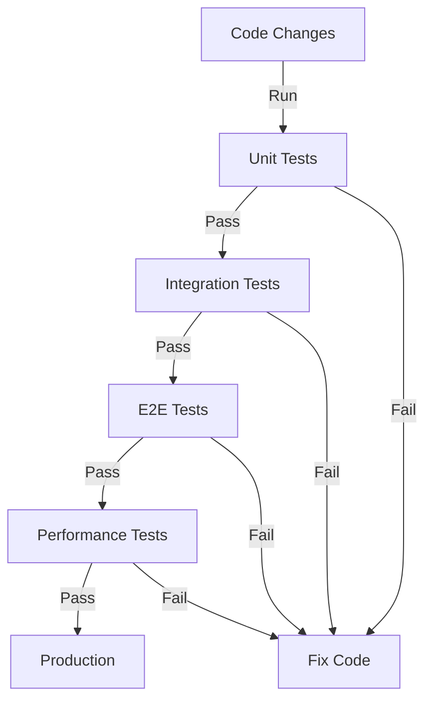

# Task: Automated Testing Strategy & Implementation
**Issue:** #44 | **Category:** CI/CD | **Priority:** High | **Effort:** 7h

---

## 📋 Objective

Design and implement comprehensive automated testing including unit, integration, and end-to-end tests.

---

## 📝 Description

Create testing framework covering all test levels:
- Unit testing with Jest
- Integration testing
- End-to-end testing with Cypress
- API testing with Postman/Newman
- Performance testing
- Test coverage tracking

---

## ✅ Acceptance Criteria

- [ ] Unit test framework configured
- [ ] Integration tests working
- [ ] E2E tests automated
- [ ] API tests created
- [ ] Test coverage > 80%
- [ ] Performance tests baseline
- [ ] Tests run in CI pipeline
- [ ] Test reports generated
- [ ] Team trained on testing
- [ ] Testing documentation complete

---

## 🔧 Sub-Tasks

### 1. Jest Configuration
- [ ] Install Jest framework
- [ ] Configure test environment
- [ ] Set up coverage thresholds
- [ ] Create test utilities
- [ ] Configure mocking
- [ ] Document Jest setup

### 2. Unit Tests - Backend
- [ ] Test API endpoints
- [ ] Test database operations
- [ ] Test authentication logic
- [ ] Test error handling
- [ ] Achieve 80%+ coverage
- [ ] Create test fixtures

### 3. Unit Tests - Frontend
- [ ] Test React components
- [ ] Test state management
- [ ] Test custom hooks
- [ ] Test utility functions
- [ ] Achieve 75%+ coverage
- [ ] Create component snapshots

### 4. Integration Tests
- [ ] Test service interactions
- [ ] Test database operations
- [ ] Test API flows
- [ ] Test data persistence
- [ ] Create integration test suite
- [ ] Document test scenarios

### 5. End-to-End Testing
- [ ] Install Cypress/Playwright
- [ ] Create user journey tests
- [ ] Test critical flows
- [ ] Test error scenarios
- [ ] Validate UI interactions
- [ ] Create E2E test suite

### 6. API Testing
- [ ] Create Postman collections
- [ ] Test all endpoints
- [ ] Validate responses
- [ ] Test error cases
- [ ] Create automated API tests
- [ ] Document API test coverage

### 7. Performance Testing
- [ ] Set performance baselines
- [ ] Test API response times
- [ ] Test page load times
- [ ] Benchmark database queries
- [ ] Test concurrent users
- [ ] Create performance report

### 8. Test Data & Fixtures
- [ ] Create test databases
- [ ] Generate test data
- [ ] Create database fixtures
- [ ] Create API fixtures
- [ ] Document fixture usage
- [ ] Maintain test data

### 9. Test Reporting
- [ ] Generate coverage reports
- [ ] Create test dashboards
- [ ] Track test metrics
- [ ] Document test results
- [ ] Set up trend analysis
- [ ] Create quality gates

### 10. Test Maintenance
- [ ] Update tests with code
- [ ] Remove flaky tests
- [ ] Refactor test code
- [ ] Document test patterns
- [ ] Create testing guidelines
- [ ] Schedule test reviews

---

## 📚 Learning Resources

- **Jest:** https://jestjs.io/
- **Cypress:** https://www.cypress.io/
- **Testing Library:** https://testing-library.com/
- **Postman:** https://www.postman.com/
- **Testing Best Practices:** https://testingjavascript.com/

---

## 💻 Code Example: Jest Unit Tests

```javascript
// __tests__/auth.test.js
import request from 'supertest';
import app from '../src/app';
import db from '../src/db';

describe('Authentication', () => {
  beforeAll(async () => {
    await db.initialize();
  });
  
  afterAll(async () => {
    await db.cleanup();
  });
  
  describe('POST /auth/login', () => {
    it('should return 200 with valid credentials', async () => {
      const response = await request(app)
        .post('/auth/login')
        .send({
          email: 'test@example.com',
          password: 'password123'
        });
      
      expect(response.status).toBe(200);
      expect(response.body).toHaveProperty('token');
      expect(response.body.token).toMatch(/^Bearer /);
    });
    
    it('should return 401 with invalid credentials', async () => {
      const response = await request(app)
        .post('/auth/login')
        .send({
          email: 'test@example.com',
          password: 'wrongpassword'
        });
      
      expect(response.status).toBe(401);
      expect(response.body).toHaveProperty('error');
    });
    
    it('should return 400 with missing email', async () => {
      const response = await request(app)
        .post('/auth/login')
        .send({
          password: 'password123'
        });
      
      expect(response.status).toBe(400);
    });
  });
  
  describe('POST /auth/register', () => {
    it('should create new user', async () => {
      const response = await request(app)
        .post('/auth/register')
        .send({
          email: 'newuser@example.com',
          password: 'password123',
          name: 'New User'
        });
      
      expect(response.status).toBe(201);
      expect(response.body).toHaveProperty('userId');
    });
    
    it('should reject duplicate email', async () => {
      const response = await request(app)
        .post('/auth/register')
        .send({
          email: 'test@example.com', // Already exists
          password: 'password123',
          name: 'Test User'
        });
      
      expect(response.status).toBe(409);
    });
  });
});
```

---

## 💻 Cypress E2E Test Example

```javascript
// cypress/e2e/login.cy.js
describe('Login Flow', () => {
  beforeEach(() => {
    cy.visit('http://localhost:3000/login');
  });
  
  it('should successfully login', () => {
    cy.get('input[name="email"]').type('user@example.com');
    cy.get('input[name="password"]').type('password123');
    cy.get('button[type="submit"]').click();
    
    cy.url().should('include', '/dashboard');
    cy.get('[data-cy="welcome-message"]').should('contain', 'Welcome');
  });
  
  it('should display error for invalid credentials', () => {
    cy.get('input[name="email"]').type('user@example.com');
    cy.get('input[name="password"]').type('wrongpassword');
    cy.get('button[type="submit"]').click();
    
    cy.get('[data-cy="error-message"]')
      .should('be.visible')
      .should('contain', 'Invalid credentials');
  });
  
  it('should clear form on reset', () => {
    cy.get('input[name="email"]').type('user@example.com');
    cy.get('input[name="password"]').type('password123');
    cy.get('button[data-cy="reset-button"]').click();
    
    cy.get('input[name="email"]').should('have.value', '');
    cy.get('input[name="password"]').should('have.value', '');
  });
});
```

---

## 📊 Test Coverage Strategy



---

## 🔒 Security Testing

```yaml
# Security test cases
- Test: SQL Injection Prevention
  Input: "'; DROP TABLE users; --"
  Expected: Safely escaped or rejected

- Test: XSS Prevention
  Input: "<script>alert('xss')</script>"
  Expected: HTML escaped or sanitized

- Test: CSRF Protection
  Input: Cross-site request without token
  Expected: Rejected with 403 Forbidden

- Test: Rate Limiting
  Input: 1000 requests in 1 second
  Expected: 429 Too Many Requests
```

---

## ✨ Success Metrics

- Code coverage > 80%
- All tests passing
- Test execution time < 10 minutes
- E2E test coverage > 80% of critical flows
- Zero flaky tests
- Team confident with testing

---

## 📖 Related Tasks

- [Build Pipeline](ci-cd-001.md) - CI configuration
- [Deployment Pipeline](ci-cd-003.md) - CD configuration

---

**Created:** January 17, 2026 | **Last Updated:** January 17, 2026
