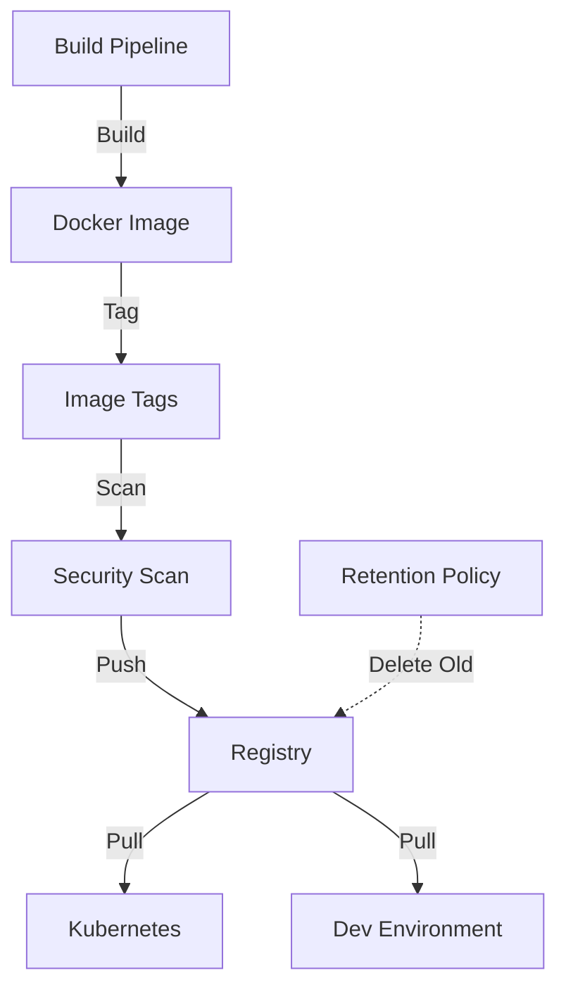

# Task: Container Registry & Image Management
**Issue:** #46 | **Category:** CI/CD | **Priority:** High | **Effort:** 5h

---

## 📋 Objective

Set up and manage Docker container registry for storing and distributing application images.

---

## 📝 Description

Configure container image storage and management:
- Container registry setup (ECR/Docker Hub)
- Image tagging and versioning
- Image scanning and validation
- Image retention policies
- Registry authentication
- Access control

---

## ✅ Acceptance Criteria

- [ ] Container registry set up
- [ ] Images properly tagged
- [ ] Image scanning enabled
- [ ] Retention policies implemented
- [ ] Authentication working
- [ ] Access controls enforced
- [ ] Documentation complete
- [ ] Team trained
- [ ] Images < 200MB
- [ ] Scan results < 5 critical

---

## 🔧 Sub-Tasks

### 1. Registry Setup
- [ ] Set up AWS ECR or Docker Hub
- [ ] Configure repositories
- [ ] Set retention policies
- [ ] Enable image scanning
- [ ] Configure access logging
- [ ] Document setup

### 2. Image Tagging Strategy
- [ ] Define tagging convention
- [ ] Tag with commit hash
- [ ] Tag with semantic version
- [ ] Tag with latest
- [ ] Document tagging rules
- [ ] Create tagging scripts

### 3. Image Optimization
- [ ] Reduce image size
- [ ] Use multi-stage builds
- [ ] Remove unnecessary layers
- [ ] Optimize caching
- [ ] Use Alpine images
- [ ] Benchmark sizes

### 4. Security Scanning
- [ ] Enable Trivy scanning
- [ ] Scan for vulnerabilities
- [ ] Fail on critical issues
- [ ] Track scan results
- [ ] Update base images
- [ ] Create scanning policy

### 5. Access Control
- [ ] Configure IAM roles
- [ ] Set repository permissions
- [ ] Create service accounts
- [ ] Document access model
- [ ] Test access controls
- [ ] Audit permissions

### 6. Authentication
- [ ] Configure registry credentials
- [ ] Use token authentication
- [ ] Implement secret management
- [ ] Test authentication
- [ ] Document credentials
- [ ] Rotate credentials

### 7. Image Lifecycle
- [ ] Implement retention policy
- [ ] Archive old images
- [ ] Delete unused images
- [ ] Monitor storage costs
- [ ] Document policy
- [ ] Automate cleanup

### 8. Image Distribution
- [ ] Configure image pull
- [ ] Test image pull reliability
- [ ] Optimize pull performance
- [ ] Document distribution
- [ ] Monitor pull metrics
- [ ] Create distribution guide

### 9. Registry Monitoring
- [ ] Monitor storage usage
- [ ] Track image pulls
- [ ] Monitor scanning results
- [ ] Alert on issues
- [ ] Create dashboards
- [ ] Document metrics

### 10. Disaster Recovery
- [ ] Backup image metadata
- [ ] Plan recovery procedure
- [ ] Test recovery process
- [ ] Document recovery steps
- [ ] Create runbooks
- [ ] Schedule drills

---

## 📚 Learning Resources

- **AWS ECR:** https://docs.aws.amazon.com/ecr/
- **Docker Registry:** https://docs.docker.com/registry/
- **Trivy:** https://github.com/aquasecurity/trivy
- **Image Best Practices:** https://docs.docker.com/develop/dev-best-practices/

---

## 💻 Code Example: Image Tagging Script

```bash
#!/bin/bash
# image-tag.sh

IMAGE_NAME=$1
VERSION=$2
REGISTRY=${3:-123456789.dkr.ecr.us-east-1.amazonaws.com}

if [ -z "$IMAGE_NAME" ] || [ -z "$VERSION" ]; then
  echo "Usage: $0 <image-name> <version> [registry]"
  exit 1
fi

COMMIT_HASH=$(git rev-parse --short HEAD)
TIMESTAMP=$(date +%Y%m%d-%H%M%S)

echo "Building image: $IMAGE_NAME"
docker build -t $IMAGE_NAME .

echo "Tagging image..."
docker tag $IMAGE_NAME:latest $REGISTRY/$IMAGE_NAME:latest
docker tag $IMAGE_NAME:latest $REGISTRY/$IMAGE_NAME:$VERSION
docker tag $IMAGE_NAME:latest $REGISTRY/$IMAGE_NAME:$COMMIT_HASH
docker tag $IMAGE_NAME:latest $REGISTRY/$IMAGE_NAME:$TIMESTAMP

echo "Pushing images..."
docker push $REGISTRY/$IMAGE_NAME:latest
docker push $REGISTRY/$IMAGE_NAME:$VERSION
docker push $REGISTRY/$IMAGE_NAME:$COMMIT_HASH
docker push $REGISTRY/$IMAGE_NAME:$TIMESTAMP

echo "Image management complete!"
docker images | grep $IMAGE_NAME
```

---

## 💻 Trivy Scanning

```bash
#!/bin/bash
# scan-image.sh

IMAGE=$1
REGISTRY=${2:-123456789.dkr.ecr.us-east-1.amazonaws.com}

if [ -z "$IMAGE" ]; then
  echo "Usage: $0 <image-name:tag> [registry]"
  exit 1
fi

FULL_IMAGE="$REGISTRY/$IMAGE"

echo "Scanning image: $FULL_IMAGE"

# Scan for vulnerabilities
trivy image \
  --severity CRITICAL,HIGH \
  --format json \
  --output scan-results.json \
  $FULL_IMAGE

# Check results
CRITICAL=$(jq '[.Results[]?.Vulnerabilities[]? | select(.Severity=="CRITICAL")] | length' scan-results.json)
HIGH=$(jq '[.Results[]?.Vulnerabilities[]? | select(.Severity=="HIGH")] | length' scan-results.json)

echo "Vulnerability Summary:"
echo "Critical: $CRITICAL"
echo "High: $HIGH"

if [ $CRITICAL -gt 0 ]; then
  echo "ERROR: Found critical vulnerabilities!"
  exit 1
fi

if [ $HIGH -gt 3 ]; then
  echo "WARNING: Found multiple high severity vulnerabilities"
  exit 1
fi

echo "Scan passed!"
```

---

## 📊 Registry Architecture



---

## 🔒 Security Considerations

- **Image Scanning:** Scan all images for vulnerabilities
- **Registry Access:** Control who can pull/push images
- **Credentials:** Use short-lived tokens
- **Encryption:** Encrypt images in transit and at rest
- **Signing:** Sign images for verification
- **Audit:** Log all registry operations

---

## ✨ Success Metrics

- All images scanned before push
- Image size < 200MB
- Critical vulnerabilities: 0
- High vulnerabilities: < 3
- Pull success rate > 99%
- Registry uptime > 99.9%

---

## 📖 Related Tasks

- [Build Pipeline](ci-cd-001.md) - Image building
- [Deployment](ci-cd-003.md) - Image deployment

---

**Created:** January 17, 2026 | **Last Updated:** January 17, 2026
