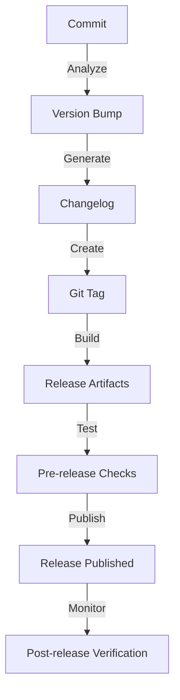

# Task: Release Management & Versioning
**Issue:** #51 | **Category:** CI/CD | **Priority:** High | **Effort:** 5h

---

## 📋 Objective

Implement structured release management and semantic versioning for all releases.

---

## 📝 Description

Configure release process with versioning and changelogs:
- Semantic versioning implementation
- Automated changelog generation
- Release tagging strategy
- Release notes documentation
- Pre-release testing
- Post-release verification

---

## ✅ Acceptance Criteria

- [ ] Semantic versioning implemented
- [ ] Changelog auto-generated
- [ ] Release tags created
- [ ] Release notes documented
- [ ] Pre-release testing complete
- [ ] Post-release verification passing
- [ ] Documentation updated
- [ ] Team trained
- [ ] Release process documented
- [ ] Rollback procedures ready

---

## 🔧 Sub-Tasks

### 1. Semantic Versioning
- [ ] Implement semver
- [ ] Define version schema
- [ ] Document versioning rules
- [ ] Create version bumping script
- [ ] Test versioning
- [ ] Document procedures

### 2. Changelog Management
- [ ] Set up conventional commits
- [ ] Implement semantic-release
- [ ] Auto-generate changelog
- [ ] Document changelog format
- [ ] Validate changelog
- [ ] Create changelog guide

### 3. Release Tagging
- [ ] Create git tags
- [ ] Implement tag strategy
- [ ] Tag Docker images
- [ ] Document tagging rules
- [ ] Test tag creation
- [ ] Create tag guide

### 4. Release Notes
- [ ] Generate release notes
- [ ] Document changes
- [ ] Document new features
- [ ] Document bug fixes
- [ ] Document breaking changes
- [ ] Create release notes template

### 5. Pre-release Testing
- [ ] Test release candidate
- [ ] Verify all features
- [ ] Test migrations
- [ ] Verify backwards compatibility
- [ ] Test documentation
- [ ] Create test checklist

### 6. Release Announcement
- [ ] Create release announcement
- [ ] Announce in Slack
- [ ] Announce to stakeholders
- [ ] Update website
- [ ] Create blog post
- [ ] Document announcement

### 7. Post-release Verification
- [ ] Monitor error rates
- [ ] Verify all systems
- [ ] Monitor performance
- [ ] Validate data integrity
- [ ] Create verification report
- [ ] Document findings

### 8. Version Control
- [ ] Maintain version file
- [ ] Update package.json
- [ ] Update helm charts
- [ ] Update documentation
- [ ] Update version constants
- [ ] Document version tracking

### 9. Release Documentation
- [ ] Document release process
- [ ] Document rollback
- [ ] Create deployment guide
- [ ] Create troubleshooting guide
- [ ] Create runbooks
- [ ] Document best practices

### 10. Team Training
- [ ] Train on release process
- [ ] Train on versioning
- [ ] Train on rollback
- [ ] Create training materials
- [ ] Schedule training
- [ ] Document learning

---

## 📚 Learning Resources

- **Semantic Versioning:** https://semver.org/
- **Conventional Commits:** https://www.conventionalcommits.org/
- **semantic-release:** https://semantic-release.gitbook.io/
- **GitHub Releases:** https://docs.github.com/en/repositories/releasing-projects-on-github

---

## 💻 Code Example: Release Script

```bash
#!/bin/bash
# release.sh

set -e

VERSION=$1
if [ -z "$VERSION" ]; then
  echo "Usage: $0 <version>"
  exit 1
fi

echo "Creating release v$VERSION..."

# Update version files
sed -i "s/\"version\": \".*\"/\"version\": \"$VERSION\"/" package.json
sed -i "s/version = .*/version = '$VERSION'/" setup.py

# Commit version update
git add package.json setup.py
git commit -m "chore: bump version to $VERSION"

# Create tag
git tag -a "v$VERSION" -m "Release version $VERSION"

# Generate changelog
npm run release -- --release-as "$VERSION"

# Push tag
git push origin "v$VERSION"

echo "Release v$VERSION created successfully!"
```

---

## 📊 Release Process



---

## ✨ Success Metrics

- Releases on schedule
- Zero release failures
- Changelog accurate
- Documentation complete
- Team trained
- Quick rollback if needed

---

## 📖 Related Tasks

- [CI/CD Pipeline](ci-cd-001.md) - Automation
- [Deployment](ci-cd-003.md) - Release deployment

---

**Created:** January 17, 2026 | **Last Updated:** January 17, 2026
