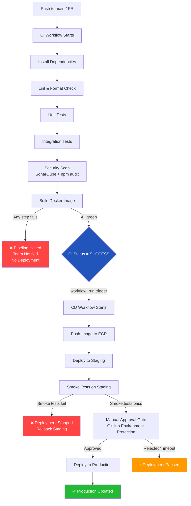

# Task: CI/CD - Pipeline Gating: CI Must Pass Before CD Deploys

**Related Issue:** [#163](https://github.com/FoushWare/request-journey-client-to-server/issues/163)  
**Category:** CI/CD  
**Prerequisites:** task-001 (Jenkins setup), task-002 (Jenkins backend pipeline), task-005 (GitHub Actions backend), task-007-add-automated-testing (automated testing), task-013-integrate-sonarqube-in-pipelines (SonarQube quality gates)  
**Estimated Time:** 2–3 hours  
**Languages:** YAML (GitHub Actions), Groovy (Jenkinsfile)  
**Notes App Context:** Wire the existing CI and CD workflows together so that the Notes App is only deployed when all tests pass, security scans are clean, and the Docker image builds successfully — mirroring how real companies prevent broken code from reaching production.

---

## Learning Objectives

By the end of this task, you will be able to:

- Explain the difference between CI and CD and why they must be sequenced
- Use `needs:` to chain jobs within a single GitHub Actions workflow
- Use `workflow_run` to trigger a CD workflow only after a CI workflow succeeds
- Configure GitHub branch protection rules as hard CI gates
- Implement environment-based progression: staging → production
- Add failure notifications so the team knows when a gate blocks a deployment
- Deliberately break a test to verify the CD stage does not run

---

## Theory Section

### Why CI Must Gate CD

A **CI/CD pipeline** has two distinct phases:

| Phase | Purpose | What it does |
|-------|---------|-------------|
| **CI** (Continuous Integration) | Validate | Build, test, lint, security scan |
| **CD** (Continuous Delivery/Deployment) | Ship | Push image, deploy, smoke test |

Without gating, a deployment can proceed even when:
- Unit tests fail (broken functionality ships)
- A security scan finds a critical CVE (vulnerability ships)
- The Docker image fails to build (an unusable artifact deploys)

**Gating** means: CD only starts if CI succeeds completely.

### GitHub Actions Dependency Mechanisms

#### 1. `needs:` — Job-level gating within one workflow

```yaml
jobs:
  test:
    runs-on: ubuntu-latest
    steps: [...]

  deploy:
    needs: test          # deploy only runs if "test" succeeds
    runs-on: ubuntu-latest
    steps: [...]
```

If `test` fails, `deploy` is skipped automatically.

#### 2. `workflow_run` — Workflow-level gating across separate files

```yaml
# .github/workflows/cd.yml
on:
  workflow_run:
    workflows: ["CI"]      # name of the CI workflow
    types: [completed]
    branches: [main]

jobs:
  deploy:
    if: ${{ github.event.workflow_run.conclusion == 'success' }}
    runs-on: ubuntu-latest
    steps: [...]
```

This triggers the CD workflow only when the CI workflow completes **and** its conclusion is `success`.

#### 3. Branch Protection Rules — Repository-level gating

In GitHub Settings → Branches → Branch protection rules:
- Enable "Require status checks to pass before merging"
- Add the required CI checks (test, lint, security)
- Enable "Require branches to be up to date before merging"

This prevents PRs from being merged unless CI is green, even if a developer clicks "Merge" manually.

### Environment-Based Progression

```
push to main
     │
     ▼
  CI workflow
  (test + lint + security + build)
     │
     ├── FAIL → ❌ stop, notify team, no deployment
     │
     └── PASS ──▶  Deploy to STAGING
                        │
                        ├── Smoke tests fail → ❌ stop
                        │
                        └── Smoke tests pass ──▶ Manual approval gate
                                                      │
                                                      └── APPROVED ──▶ Deploy to PRODUCTION
```

### Quality Gate Checklist

Before any deployment, all of these must be green:
- [ ] Unit tests pass
- [ ] Integration tests pass
- [ ] Linting passes (ESLint, Prettier)
- [ ] SonarQube quality gate passes (no critical/blocker issues)
- [ ] `npm audit` or `trivy` shows no critical CVEs
- [ ] Docker image builds successfully

---

## Diagram



---

## Step-by-Step Instructions

### Step 1: Structure Your Workflows

Separate concerns into two workflow files:

```
.github/workflows/
├── ci.yml          # Tests, lint, security, build
└── cd.yml          # Deploy (triggered by ci.yml success)
```

### Step 2: Build the CI Workflow with Job Chaining

```yaml
# .github/workflows/ci.yml
name: CI

on:
  push:
    branches: [main, develop]
  pull_request:
    branches: [main]

jobs:
  lint:
    name: Lint & Format
    runs-on: ubuntu-latest
    steps:
      - uses: actions/checkout@v4
      - uses: actions/setup-node@v4
        with: { node-version: '20' }
      - run: npm ci
      - run: npm run lint

  test:
    name: Unit & Integration Tests
    needs: lint                    # ← gate: only runs if lint passes
    runs-on: ubuntu-latest
    steps:
      - uses: actions/checkout@v4
      - uses: actions/setup-node@v4
        with: { node-version: '20' }
      - run: npm ci
      - run: npm test

  security:
    name: Security Scan
    needs: lint                    # ← gate: parallel with test, after lint
    runs-on: ubuntu-latest
    steps:
      - uses: actions/checkout@v4
      - run: npm audit --audit-level=critical
      - name: SonarQube Scan
        uses: SonarSource/sonarqube-scan-action@master
        env:
          SONAR_TOKEN: ${{ secrets.SONAR_TOKEN }}
          SONAR_HOST_URL: ${{ secrets.SONAR_HOST_URL }}

  build:
    name: Build Docker Image
    needs: [test, security]        # ← gate: both test AND security must pass
    runs-on: ubuntu-latest
    steps:
      - uses: actions/checkout@v4
      - name: Build image
        run: docker build -t notes-api:${{ github.sha }} .
      - name: Save image digest
        run: echo "${{ github.sha }}" > image-digest.txt
      - uses: actions/upload-artifact@v4
        with:
          name: image-digest
          path: image-digest.txt
```

### Step 3: Build the CD Workflow Gated by CI

```yaml
# .github/workflows/cd.yml
name: CD

on:
  workflow_run:
    workflows: ["CI"]              # ← must match the `name:` of ci.yml exactly
    types: [completed]
    branches: [main]

jobs:
  deploy-staging:
    name: Deploy to Staging
    # Only run if CI succeeded
    if: ${{ github.event.workflow_run.conclusion == 'success' }}
    runs-on: ubuntu-latest
    environment: staging
    steps:
      - uses: actions/checkout@v4
      - name: Configure AWS credentials
        uses: aws-actions/configure-aws-credentials@v4
        with:
          aws-access-key-id: ${{ secrets.AWS_ACCESS_KEY_ID }}
          aws-secret-access-key: ${{ secrets.AWS_SECRET_ACCESS_KEY }}
          aws-region: us-east-1
      - name: Login to ECR
        run: aws ecr get-login-password | docker login --username AWS --password-stdin ${{ secrets.ECR_REGISTRY }}
      - name: Build and push image
        run: |
          docker build -t ${{ secrets.ECR_REGISTRY }}/notes-api:${{ github.sha }} .
          docker push ${{ secrets.ECR_REGISTRY }}/notes-api:${{ github.sha }}
      - name: Deploy to staging
        run: |
          kubectl set image deployment/notes-api \
            notes-api=${{ secrets.ECR_REGISTRY }}/notes-api:${{ github.sha }} \
            --namespace=staging

  smoke-test:
    name: Smoke Tests on Staging
    needs: deploy-staging
    runs-on: ubuntu-latest
    steps:
      - name: Wait for rollout
        run: sleep 30
      - name: Smoke test
        run: |
          curl -f https://staging.notes-app.example.com/health || exit 1

  deploy-production:
    name: Deploy to Production
    needs: smoke-test
    runs-on: ubuntu-latest
    environment:
      name: production             # ← requires manual approval in GitHub Environments
    steps:
      - name: Deploy to production
        run: |
          kubectl set image deployment/notes-api \
            notes-api=${{ secrets.ECR_REGISTRY }}/notes-api:${{ github.sha }} \
            --namespace=production
```

### Step 4: Configure GitHub Environment Protection Rules

1. Go to **Settings → Environments → production**
2. Enable **"Required reviewers"** — add yourself or the team
3. Enable **"Prevent self-review"** if applicable
4. Set a **deployment wait timer** (e.g., 5 minutes) for final review

### Step 5: Set Up Branch Protection Rules

1. Go to **Settings → Branches → Add rule**
2. Branch name pattern: `main`
3. Enable:
   - ✅ Require status checks to pass before merging
   - Search and add: `lint`, `test`, `security`, `build`
   - ✅ Require branches to be up to date before merging
   - ✅ Require pull request reviews before merging

### Step 6: Verify the Gate Works

Intentionally break a test to confirm CD is blocked:

```bash
# Add a failing test temporarily
echo "test('should fail', () => { expect(true).toBe(false); });" \
  >> src/__tests__/gate-test.spec.ts

git add . && git commit -m "test: intentional failure to verify CI gate"
git push origin main
```

Expected result:
- CI workflow: `test` job fails → `build` job is skipped
- CD workflow: does **not** start (conclusion is not `success`)
- GitHub shows a red ❌ on the commit — no deployment occurred

---

## Verification Checklist

- [ ] Push a passing commit → CI runs → CD deploys to staging
- [ ] Push a failing test → CI fails → CD does **not** start
- [ ] Merge a PR → branch protection blocks merge if CI is red
- [ ] Staging deploys successfully → smoke tests pass → production requires manual approval
- [ ] Failed smoke test → production deployment is skipped
- [ ] Team receives a notification on CI failure

---

## Automation Reference

> The steps above are **manual/raw** — they teach you pipeline gating by doing it yourself.

| What | Where | Description |
|------|-------|-------------|
| Docker image registry | [`automation/terraform/modules/ecr/`](../../automation/terraform/modules/ecr/) | ECR repository for CI-built images pushed by the CD workflow |
| Deploy to Kubernetes | [`automation/ansible/roles/kubernetes/`](../../automation/ansible/roles/kubernetes/) | Ansible role for `kubectl set image` and rolling updates |
| Notes App deployment | [`automation/ansible/roles/notes-app/`](../../automation/ansible/roles/notes-app/) | Full notes-app deployment including staging and production namespaces |
| Security groups for deployments | [`automation/terraform/modules/security_groups/`](../../automation/terraform/modules/security_groups/) | Network rules allowing the CD runner to reach K8s API server |

> 💡 The CI workflow validates the code. The Terraform ECR module stores the image. The Ansible kubernetes role applies the deployment. Together they form a gated, automated delivery chain.

---

## Task Checklist

- [ ] Read and understood the theory section
- [ ] Viewed the pipeline diagram above
- [ ] Completed all prerequisite checks
- [ ] Created `ci.yml` with lint → test + security → build job chain
- [ ] Created `cd.yml` with `workflow_run` trigger
- [ ] Added `if: conclusion == 'success'` guard to CD jobs
- [ ] Configured staging environment in GitHub
- [ ] Configured production environment with required reviewers
- [ ] Set up branch protection rules on `main`
- [ ] Verified: passing CI → CD deploys to staging
- [ ] Verified: failing test → CD does NOT run
- [ ] Verified: branch protection blocks merge on red CI
- [ ] Documented learnings

---

**Task Status:** [ ] Not Started | [ ] In Progress | [ ] Completed  
**Date Started:** ___  
**Date Completed:** ___
