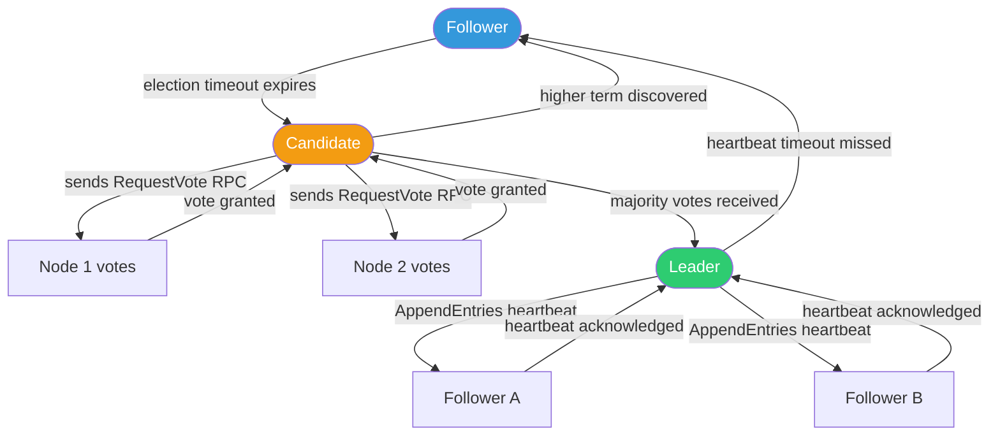

# Task: Raft Consensus Algorithm and Leader Election

**Related Issue:** #150  
**Category:** Distributed Systems  
**Prerequisites:** Basic understanding of distributed systems, Docker  
**Estimated Time:** 4–5 hours  
**Languages:** Go (primary), Python (alternative)  
**Notes App Context:** Simulate a multi-instance Notes API cluster where one node is the leader

---

## Learning Objectives

- Understand why distributed systems need consensus
- Learn the Raft algorithm: leader election, log replication, safety
- Visualize Raft to build intuition
- Implement a simple leader election simulation
- Understand how etcd uses Raft inside Kubernetes

---

## Theory Section

### The Problem: Distributed Coordination

When you have multiple servers, questions arise:
- Which server accepts writes?
- What if two servers think they are the leader?
- What if a node goes down — who takes over?

Without coordination, you get **split-brain**: two nodes both think they're leaders, accepting conflicting writes. This leads to data corruption.

### CAP Theorem

Any distributed system can only guarantee **two** of three properties:
- **C**onsistency — all nodes see the same data at the same time
- **A**vailability — every request receives a response
- **P**artition Tolerance — the system continues despite network partitions

Raft chooses CP: it sacrifices availability to maintain consistency.

### Raft Algorithm

Raft divides the problem into three sub-problems:
1. **Leader Election** — elect a single leader per term
2. **Log Replication** — leader accepts entries and replicates to followers
3. **Safety** — ensure committed entries are never lost

#### Roles
- **Leader**: Handles all client requests, replicates logs
- **Follower**: Passive, responds to leader
- **Candidate**: A follower that wants to become leader

#### Election Process
1. Follower has election timeout (150–300ms), no heartbeat received
2. Follower increments term, becomes Candidate, votes for itself
3. Candidate sends RequestVote to all nodes
4. If majority vote received → becomes Leader
5. Leader sends periodic heartbeats (AppendEntries with no entries)

---

## Step-by-Step Instructions

### Step 1: Visualize Raft

**Objective:** Build intuition before coding

**Instructions:**
1. Open https://raft.github.io/ — the animated Raft visualization
2. Click **Pause** then manually trigger a leader election
3. Observe: candidate timeout → RequestVote → votes → leader elected
4. Observe: heartbeats keeping followers from timing out
5. Stop the leader node — watch the remaining nodes elect a new leader

**What to note:**
- How long does election take?
- What happens if the network is partitioned?

### Step 2: Understand etcd's Raft Implementation

**Objective:** Connect theory to real-world usage

**Instructions:**
1. Run a 3-node etcd cluster with Docker Compose:

```yaml
version: '3'
services:
  etcd1:
    image: bitnami/etcd:latest
    environment:
      - ETCD_NAME=etcd1
      - ETCD_INITIAL_CLUSTER=etcd1=http://etcd1:2380,etcd2=http://etcd2:2380,etcd3=http://etcd3:2380
      - ETCD_INITIAL_CLUSTER_STATE=new
      - ETCD_LISTEN_PEER_URLS=http://0.0.0.0:2380
      - ETCD_LISTEN_CLIENT_URLS=http://0.0.0.0:2379
      - ETCD_ADVERTISE_CLIENT_URLS=http://etcd1:2379
      - ETCD_INITIAL_ADVERTISE_PEER_URLS=http://etcd1:2380
      - ALLOW_NONE_AUTHENTICATION=yes
  etcd2:
    image: bitnami/etcd:latest
    environment:
      - ETCD_NAME=etcd2
      - ETCD_INITIAL_CLUSTER=etcd1=http://etcd1:2380,etcd2=http://etcd2:2380,etcd3=http://etcd3:2380
      - ETCD_INITIAL_CLUSTER_STATE=new
      - ETCD_LISTEN_PEER_URLS=http://0.0.0.0:2380
      - ETCD_LISTEN_CLIENT_URLS=http://0.0.0.0:2379
      - ETCD_ADVERTISE_CLIENT_URLS=http://etcd2:2379
      - ETCD_INITIAL_ADVERTISE_PEER_URLS=http://etcd2:2380
      - ALLOW_NONE_AUTHENTICATION=yes
  etcd3:
    image: bitnami/etcd:latest
    environment:
      - ETCD_NAME=etcd3
      - ETCD_INITIAL_CLUSTER=etcd1=http://etcd1:2380,etcd2=http://etcd2:2380,etcd3=http://etcd3:2380
      - ETCD_INITIAL_CLUSTER_STATE=new
      - ETCD_LISTEN_PEER_URLS=http://0.0.0.0:2380
      - ETCD_LISTEN_CLIENT_URLS=http://0.0.0.0:2379
      - ETCD_ADVERTISE_CLIENT_URLS=http://etcd3:2379
      - ETCD_INITIAL_ADVERTISE_PEER_URLS=http://etcd3:2380
      - ALLOW_NONE_AUTHENTICATION=yes
```

2. Check who the leader is: `etcdctl endpoint status --cluster`
3. Stop the leader container and watch a new leader be elected
4. Resume the stopped container and watch it rejoin as follower

### Step 3: Build a Simple Raft Simulation in Go

**Objective:** Implement the leader election phase of Raft

**Instructions:**
1. Create a new Go project
2. Implement the Node struct with states: Follower, Candidate, Leader
3. Implement election timeout (randomized)
4. Implement RequestVote RPC
5. Implement vote counting and leader promotion
6. Implement heartbeat mechanism

See `implementation/distributed-systems/task-001-raft-simulation/starter/` for scaffolding.

---

## Verification

1. Run the simulation with 3 nodes
2. One node becomes leader and sends heartbeats
3. Kill the leader node and verify a new leader is elected
4. Verify at most one leader exists at any term

---

## Task Checklist

- [ ] Visualized Raft using the animation tool
- [ ] Ran 3-node etcd cluster and observed leader election
- [ ] Killed the leader and watched re-election
- [ ] Understood RequestVote and heartbeat mechanisms
- [ ] Built a Raft simulation (optional, advanced)

---

**Task Status:** [ ] Not Started | [ ] In Progress | [ ] Completed

---

## Diagram



## Automation Reference

> The steps above are **manual/raw** — they teach you Raft consensus by doing it yourself.  
> The `automation/` directory contains the production-grade IaC equivalent:

| What | Where | Description |
|------|-------|-------------|
| Kubernetes cluster (etcd inside) | [`automation/terraform/modules/eks/`](../../automation/terraform/modules/eks/) | Provisions AWS EKS cluster — etcd runs as a managed control-plane component handling leader election automatically |
| Local etcd cluster | [`automation/ansible/roles/docker/`](../../automation/ansible/roles/docker/) | Ansible role to install and configure Docker for running a local 3-node etcd cluster via docker-compose |
