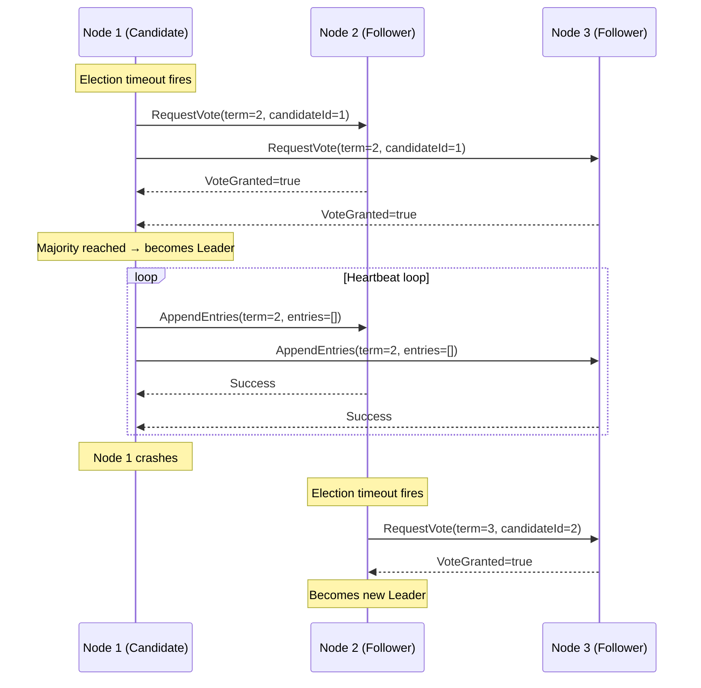

# Task: Build a Raft Leader Election Simulation

**Related Issue:** #150  
**Category:** Distributed Systems  
**Prerequisites:** task-001-raft-consensus-leader-election  
**Estimated Time:** 3–4 hours  
**Language:** Go  
**Notes App Context:** A 3-node Notes API cluster where only the leader handles write requests

---

## Learning Objectives

- Implement the Raft leader election in code (not just theory)
- Understand randomized election timeouts
- Handle vote splitting and re-election
- Simulate node failure and recovery

---

## Implementation Guide

### Project Structure

```
distributed-systems/raft-simulation/
├── main.go
├── node.go          # Raft node state machine
├── rpc.go           # RequestVote and AppendEntries
├── cluster.go       # Manages all nodes
└── README.md
```

### Key Data Structures

```go
type State int
const (
    Follower  State = iota
    Candidate
    Leader
)

type Node struct {
    id          int
    state       State
    currentTerm int
    votedFor    int
    votes       int
    peers       []*Node
    // channels for communication
    heartbeat   chan bool
    stopCh      chan struct{}
}
```

---

## Step-by-Step Instructions

### Step 1: Implement Node State Machine

**Instructions:**
1. Start all nodes as Followers
2. Each Follower starts an election timeout timer (150–300ms randomized)
3. If no heartbeat received before timeout → start election

### Step 2: Implement RequestVote

**Instructions:**
1. Candidate increments term, votes for itself
2. Sends RequestVote to all peers
3. Each Follower grants vote if: `term > currentTerm AND votedFor == -1`
4. If candidate receives majority votes → becomes Leader

### Step 3: Implement Leader Heartbeats

**Instructions:**
1. Leader sends AppendEntries (empty) to all followers every 50ms
2. Follower resets its election timeout on receiving heartbeat
3. Leader steps down if it receives a message with higher term

### Step 4: Simulate Failure

**Instructions:**
1. Kill the leader node after election
2. Watch the remaining nodes elect a new leader
3. Restart the killed node and verify it rejoins as follower

---

## Task Checklist

- [ ] Implemented Node state machine
- [ ] Implemented RequestVote
- [ ] Implemented heartbeat mechanism
- [ ] Simulated leader failure and re-election
- [ ] Verified split vote scenario is handled

---

**Task Status:** [ ] Not Started | [ ] In Progress | [ ] Completed

---

## Diagram



## Automation Reference

> The steps above are **manual/raw** — they teach you Raft implementation by building it yourself.  
> The `automation/` directory contains the production-grade IaC equivalent:

| What | Where | Description |
|------|-------|-------------|
| Kubernetes cluster | [`automation/terraform/modules/eks/`](../../automation/terraform/modules/eks/) | Provisions AWS EKS — runs production Go services with built-in Raft via etcd in the control plane |
| Docker for local simulation | [`automation/ansible/roles/docker/`](../../automation/ansible/roles/docker/) | Ansible role to install Docker, used to containerise and run the Go Raft simulation nodes locally |
