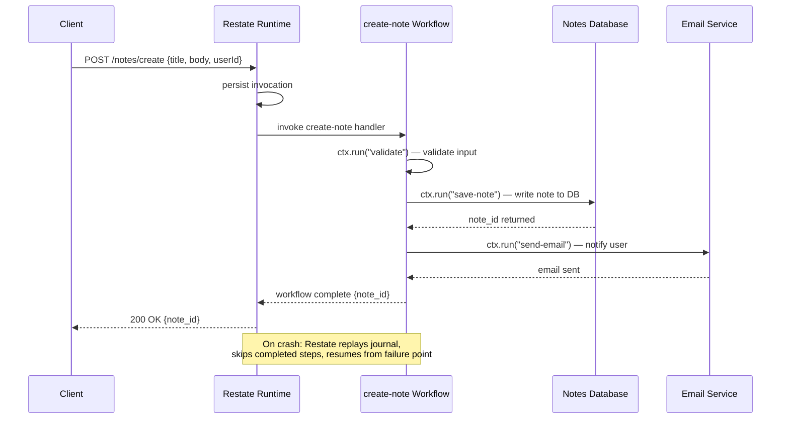

# Task: Notes App Durable Workflow with Restate

**Related Issue:** #151  
**Category:** Distributed Systems  
**Prerequisites:** task-003-durable-execution-restate  
**Estimated Time:** 3 hours  
**Language:** TypeScript or Go  
**Notes App Context:** Full durable note-creation and user-registration workflows

---

## Learning Objectives

- Build production-like durable workflows with Restate
- Integrate Restate with existing microservices
- Handle idempotency and duplicate prevention
- Observe workflow state and history

---

## Workflows to Build

### 1. Note Creation Workflow
```
1. Authenticate user
2. Validate note content
3. Save note to PostgreSQL
4. Publish event to Kafka (note.created)
5. Update Elasticsearch search index
6. Send notification to connected clients (WebSocket)
```

### 2. User Registration Workflow
```
1. Validate email + password
2. Create user in DB
3. Send welcome email
4. Create default workspace
5. Log audit event
```

---

## Step-by-Step Instructions

### Step 1: Set Up Restate with Docker Compose

Integrate Restate into the Notes App's docker-compose.yml.

### Step 2: Implement Note Creation Workflow

Use Restate durable handlers for each step.

### Step 3: Test Failure Scenarios

1. Kill the service after step 3 (save note)
2. Restart — verify workflow resumes at step 4
3. Verify no duplicate note was created
4. Check Restate's UI (http://localhost:9070) for workflow state

### Step 4: Observe with Prometheus/Grafana

1. Export Restate metrics to Prometheus
2. Create a Grafana panel showing workflow completions and failures

---

## Task Checklist

- [ ] Restate integrated in docker-compose.yml
- [ ] Note creation workflow implemented
- [ ] User registration workflow implemented
- [ ] Failure and recovery tested
- [ ] Metrics exported to Grafana

---

**Task Status:** [ ] Not Started | [ ] In Progress | [ ] Completed

---

## Diagram



## Automation Reference

> The steps above are **manual/raw** — they teach you durable workflows by building them yourself.  
> The `automation/` directory contains the production-grade IaC equivalent:

| What | Where | Description |
|------|-------|-------------|
| Kubernetes cluster | [`automation/terraform/modules/eks/`](../../automation/terraform/modules/eks/) | Provisions AWS EKS to deploy both the Restate runtime and the Notes App workflow service as pods |
| Notes App deployment | [`automation/ansible/roles/notes-app/`](../../automation/ansible/roles/notes-app/) | Ansible role that configures and deploys the Notes App, including Restate integration for durable workflows |
