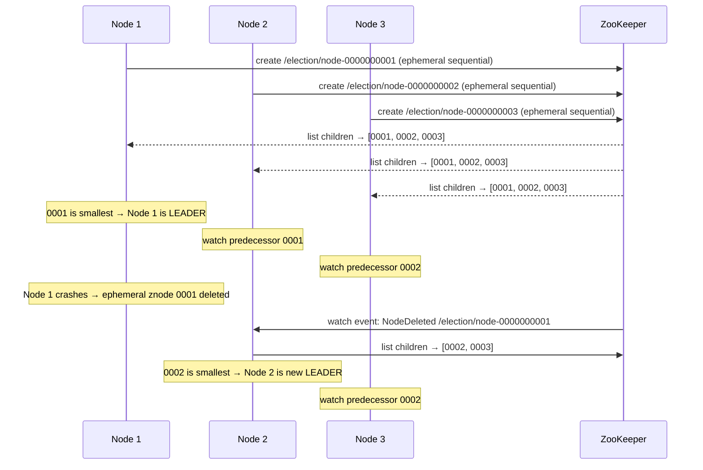

# Task: Leader Election with ZooKeeper

**Related Issue:** #158  
**Category:** Distributed Systems  
**Prerequisites:** task-005-zookeeper-fundamentals  
**Estimated Time:** 3 hours  
**Language:** Go  
**Notes App Context:** Multi-instance Notes API cluster with ZooKeeper-based leader election

---

## Learning Objectives

- Implement leader election using ZooKeeper ephemeral sequential znodes
- Understand the "herd effect" and how the recipe avoids it
- Simulate leader failure and automatic re-election
- Compare ZooKeeper leader election to Raft-based leader election

---

## The ZooKeeper Leader Election Recipe

### Algorithm

1. Each candidate creates an ephemeral sequential znode under `/election/`
   - Example: `/election/candidate-0000000001`, `/election/candidate-0000000002`
2. Each candidate reads all znodes under `/election/` and sorts by sequence number
3. If the candidate has the **lowest** sequence number → it's the leader
4. If not → watch the znode **immediately preceding** it (not all znodes)
5. When the watched znode is deleted → re-run the algorithm from step 2

### Why Watch Only the Previous Node?

This avoids the "herd effect": if all candidates watch the leader, when the leader dies, all N candidates wake up simultaneously and flood ZooKeeper with requests.

By watching only the previous node, at most one candidate wakes up when a node dies.

---

## Step-by-Step Instructions

### Step 1: Set Up 3-Node Cluster

Use Docker Compose to run 3 instances of the Notes API, each connecting to ZooKeeper.

### Step 2: Implement Election

```go
// Each Notes API instance runs this on startup:
func electLeader(zk *zookeeper.Conn, nodeID string) {
    // 1. Create ephemeral sequential znode
    path, _ := zk.Create("/election/candidate-", []byte(nodeID), 
        zookeeper.FlagEphemeral|zookeeper.FlagSequence, ...)
    
    // 2. Get all candidates, sort by sequence
    children, _, _ := zk.Children("/election")
    sort.Strings(children)
    
    // 3. If we are first → become leader
    if path == "/election/" + children[0] {
        becomeLeader()
        return
    }
    
    // 4. Watch the previous candidate
    prevIdx := indexOf(path, children) - 1
    _, _, watchCh, _ := zk.ExistsW("/election/" + children[prevIdx])
    
    // 5. When previous node disappears → re-run election
    go func() {
        <-watchCh
        electLeader(zk, nodeID)
    }()
}
```

### Step 3: Test Failure Scenarios

1. Start 3 instances — verify only one is leader
2. Kill the leader instance — verify a new leader is elected within seconds
3. Restart the killed instance — verify it rejoins as follower
4. Kill all instances simultaneously — verify a new leader emerges when they restart

---

## Verification

1. 3 Notes API instances running
2. Leader election working — only one leader at a time
3. Leader failure triggers re-election automatically
4. Re-election uses the previous-node watching pattern

---

## Task Checklist

- [ ] Implemented ZooKeeper leader election in Go
- [ ] Tested with 3 instances
- [ ] Simulated leader failure and verified re-election
- [ ] Verified no two leaders exist simultaneously
- [ ] Compared ZooKeeper election to Raft election (task-001)

---

**Task Status:** [ ] Not Started | [ ] In Progress | [ ] Completed

---

## Diagram



## Automation Reference

> The steps above are **manual/raw** — they teach you ZooKeeper leader election by implementing it yourself.  
> The `automation/` directory contains the production-grade IaC equivalent:

| What | Where | Description |
|------|-------|-------------|
| Kubernetes cluster | [`automation/terraform/modules/eks/`](../../automation/terraform/modules/eks/) | Provisions AWS EKS; Kubernetes natively handles leader election for controllers via leader-election leases, superseding manual ZooKeeper recipes |
| Docker for local ZooKeeper election | [`automation/ansible/roles/docker/`](../../automation/ansible/roles/docker/) | Ansible role to install Docker, enabling local multi-container testing of the ZooKeeper leader election recipe |
