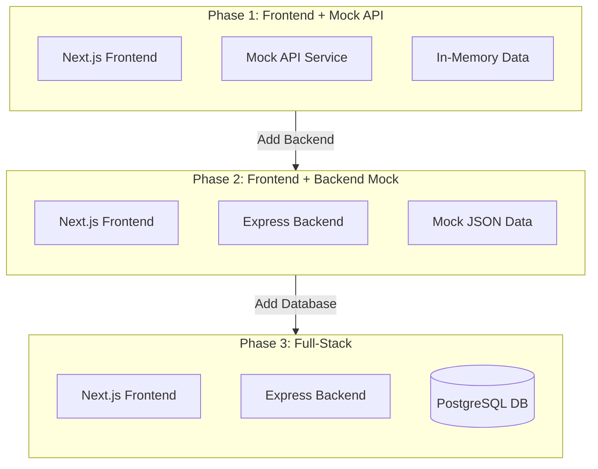

# Foundation Tasks

This directory contains the three progressive foundation tasks that establish the baseline Notes App. Each task builds on the previous one, teaching specific concepts in isolation before combining them into a full-stack solution.

## Overview

The foundation phase follows a 3-step progressive approach:



## Tasks

### Task 001: Frontend with Mock API
**File**: `task-001-frontend-mock-api.md`

Build the complete Notes App frontend without a backend. Learn component architecture, mock API patterns, and state management.

**Key Concepts**:
- React/Next.js component architecture
- Mock API for rapid prototyping
- In-memory data storage
- TypeScript types
- State management

**Branch**: `feat/layer-00-foundation-phase-1-mock-frontend`

**Implementation**: `implementation/foundation/task-001-mock-frontend/`

---

### Task 002: Backend with Mock Data
**File**: `task-002-backend-mock-data.md`

Add a real Express.js backend with mock JSON data. Learn REST API design, HTTP methods, and frontend-backend integration.

**Key Concepts**:
- Express.js REST API
- HTTP methods and status codes
- Request/response patterns
- JWT authentication simulation
- CORS middleware
- Frontend-backend integration

**Branch**: `feat/layer-00-foundation-phase-2-backend-mock`

**Implementation**: `implementation/foundation/task-002-backend-mock/`

**Prerequisites**: Task 001

---

### Task 003: Full-Stack with Database
**File**: `task-003-fullstack-database.md`

Replace mock data with a real PostgreSQL database. Learn database design, SQL queries, password hashing, and data persistence.

**Key Concepts**:
- PostgreSQL database design
- SQL queries and migrations
- bcrypt password hashing
- Database connection pooling
- Data persistence
- Real authentication flow

**Branch**: `feat/layer-00-foundation-phase-3-fullstack`

**Implementation**: `implementation/foundation/task-003-fullstack/`

**Prerequisites**: Task 002

---

## Learning Path

### Recommended Order

1. **Start with Task 001** - Build the complete UI without backend dependencies
2. **Move to Task 002** - Add backend with mock data to understand API design
3. **Complete with Task 003** - Integrate real database for persistence

Each task builds on the previous one, so complete them in order.

### Time Estimates

| Task | Estimated Time | Difficulty |
|------|----------------|------------|
| Task 001 | 2-3 hours | Beginner |
| Task 002 | 2-3 hours | Intermediate |
| Task 003 | 3-4 hours | Intermediate |
| **Total** | **7-10 hours** | - |

## Prerequisites

Before starting the foundation tasks:

- **Node.js 18+** installed
- **npm or yarn** package manager
- **Basic JavaScript/TypeScript** knowledge
- **For Task 003**: PostgreSQL installed

## Task Structure

Each task file includes:

1. **Header**: Task metadata (prerequisites, estimated time, language)
2. **Learning Objectives**: What you'll learn
3. **Theory Section**: Explanation of concepts
4. **Architecture Diagram**: Mermaid diagram showing the system
5. **Step-by-Step Instructions**: Detailed implementation steps
6. **Verification**: Manual testing steps
7. **Task Checklist**: Completion checklist
8. **Next Steps**: What to do after completion
9. **Automation Reference**: Links to related automation

## Implementation Structure

Each task has corresponding implementation code:

```
implementation/foundation/
├── task-001-mock-frontend/
│   └── frontend/          # Next.js app with mock API
├── task-002-backend-mock/
│   ├── frontend/          # Next.js app calling real API
│   └── backend/           # Express with mock JSON data
└── task-003-fullstack/
    ├── frontend/          # Next.js app
    ├── backend/           # Express with PostgreSQL
    └── database/          # Schema and setup scripts
```

## Branch Strategy

Each phase should be implemented on its own branch:

| Phase | Branch Name | PR Target |
|-------|-------------|-----------|
| Task 001 | `feat/layer-00-foundation-phase-1-mock-frontend` | `develop` |
| Task 002 | `feat/layer-00-foundation-phase-2-backend-mock` | `develop` |
| Task 003 | `feat/layer-00-foundation-phase-3-fullstack` | `develop` |

## Success Criteria

Each task must meet these criteria before moving to the next:

- ✅ Code is independently runnable
- ✅ README with clear setup instructions
- ✅ All manual verification steps pass
- ✅ Mermaid diagrams included
- ✅ Code follows TypeScript best practices
- ✅ Committed to branch with descriptive messages

## Common Issues

### Task 001 Issues

**Issue**: Next.js installation fails
**Solution**: Ensure Node.js 18+ is installed. Run `node --version` to check.

**Issue**: Mock API not responding
**Solution**: Check that the mock service is imported correctly in components.

---

### Task 002 Issues

**Issue**: CORS errors when calling backend
**Solution**: Ensure CORS middleware is configured in Express and frontend API URL is correct.

**Issue**: Backend not starting
**Solution**: Check that all dependencies are installed with `npm install`.

---

### Task 003 Issues

**Issue**: Database connection failed
**Solution**: Verify PostgreSQL is running and `.env` file has correct credentials.

**Issue**: Password hashing errors
**Solution**: Ensure bcrypt is installed and `await` is used for async operations.

## Next Steps After Foundation

After completing all three foundation tasks, you'll have a fully functional full-stack Notes App. Continue with:

- **Layer 1**: Docker containerization
- **Layer 2**: Kubernetes orchestration
- **Layer 3**: Microservices architecture
- **Layer 4**: CI/CD pipelines
- **Layer 5**: Security hardening
- **Layer 6**: Observability

See the main project README.md for the complete learning roadmap.

## Contributing

When contributing to the foundation tasks:

1. Follow the task file format exactly
2. Include Mermaid diagrams for all architecture
3. Update the implementation code to match task instructions
4. Test all verification steps
5. Update this README if adding new tasks

## Resources

- **Main Plan**: `plans/00-foundation.md`
- **Project README**: `../README.md`
- **Repo Overview**: `../../REPO_OVERVIEW.md`
- **Constitution**: `../../CONSTITUTION.md`

## Notes for Learners

- **Take your time**: Each task teaches important concepts. Don't rush.
- **Experiment**: Try modifying the code to understand how it works.
- **Ask questions**: If you're stuck, the task files include detailed explanations.
- **Build in order**: Complete tasks sequentially as they build on each other.
- **Test thoroughly**: Follow the verification steps to ensure everything works.

---

**Foundation Phase Status**: ✅ All tasks documented and ready for implementation
