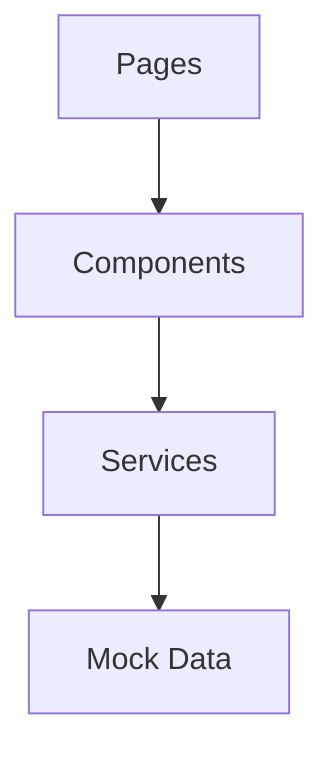
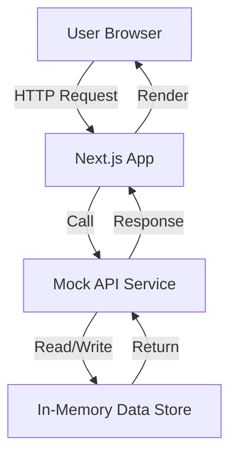

# Task 001: Frontend with Mock API

**Related Issue:** Foundation Phase 1
**Category:** Foundation
**Prerequisites:** None
**Estimated Time:** 2-3 hours
**Language:** TypeScript/JavaScript
**Notes App Context:** Build the complete UI without a backend

## Learning Objectives

By the end of this task, you will:
- Understand component-based architecture in React/Next.js
- Learn to create mock APIs for rapid prototyping
- Build a complete UI without backend dependencies
- Implement state management without external libraries
- Create reusable components with proper TypeScript types

## Theory Section

### Why Start with Mocks?

Mock APIs allow you to:
- **Develop frontend independently** from backend
- **Test UI interactions** without real data
- **Prototype quickly** and iterate on design
- **Parallel development** - frontend and backend teams can work simultaneously

### Component Architecture



### Mock API Pattern

A mock API simulates real API calls using:
- **In-memory storage** - Data stored in JavaScript variables
- **Async functions** - Simulate network delays with `setTimeout`
- **Promise-based** - Same interface as real `fetch` calls
- **Type-safe** - TypeScript ensures data consistency

## Architecture Diagram



## Step-by-Step Instructions

### Step 1: Create Directory Structure

```bash
cd implementation/foundation
mkdir -p task-001-mock-frontend/frontend/src/{app,components,services,types}
```

### Step 2: Initialize Next.js Project

```bash
cd task-001-mock-frontend/frontend
npx create-next-app@latest . --typescript --tailwind --eslint --app --src-dir
```

When prompted:
- TypeScript: Yes
- ESLint: Yes
- Tailwind CSS: Yes
- App Router: Yes
- Src directory: Yes
- Import alias: `@/*`

### Step 3: Define TypeScript Types

Create `src/types/index.ts`:

```typescript
export interface User {
  id: string;
  email: string;
  name?: string;
}

export interface Note {
  id: string;
  title: string;
  content: string;
  createdAt: string;
  updatedAt: string;
}

export interface AuthResponse {
  token: string;
  user: User;
}

export interface LoginCredentials {
  email: string;
  password: string;
}

export interface RegisterCredentials {
  email: string;
  password: string;
  name?: string;
}
```

### Step 4: Create Mock API Service

Create `src/services/mockApi.ts`:

```typescript
import { User, Note, AuthResponse, LoginCredentials, RegisterCredentials } from '@/types';

// In-memory data store
let notes: Note[] = [
  {
    id: '1',
    title: 'Welcome Note',
    content: 'This is your first note! Try creating more.',
    createdAt: new Date().toISOString(),
    updatedAt: new Date().toISOString()
  }
];

let currentUser: User | null = null;

// Simulate network delay
const delay = (ms: number) => new Promise(resolve => setTimeout(resolve, ms));

export const mockApi = {
  // Auth endpoints
  login: async (credentials: LoginCredentials): Promise<AuthResponse> => {
    await delay(500); // Simulate network delay
    
    // Mock authentication - accept any credentials
    const user: User = {
      id: '1',
      email: credentials.email,
      name: credentials.email.split('@')[0]
    };
    
    currentUser = user;
    
    return {
      token: `mock-jwt-token-${Date.now()}`,
      user
    };
  },

  register: async (credentials: RegisterCredentials): Promise<AuthResponse> => {
    await delay(500);
    
    const user: User = {
      id: Date.now().toString(),
      email: credentials.email,
      name: credentials.name || credentials.email.split('@')[0]
    };
    
    currentUser = user;
    
    return {
      token: `mock-jwt-token-${Date.now()}`,
      user
    };
  },

  logout: async (): Promise<void> => {
    await delay(200);
    currentUser = null;
  },

  getCurrentUser: async (): Promise<User | null> => {
    await delay(200);
    return currentUser;
  },

  // Notes endpoints
  getNotes: async (): Promise<Note[]> => {
    await delay(300);
    return [...notes]; // Return a copy
  },

  getNoteById: async (id: string): Promise<Note | null> => {
    await delay(200);
    return notes.find(n => n.id === id) || null;
  },

  createNote: async (title: string, content: string): Promise<Note> => {
    await delay(400);
    
    const note: Note = {
      id: Date.now().toString(),
      title,
      content,
      createdAt: new Date().toISOString(),
      updatedAt: new Date().toISOString()
    };
    
    notes.push(note);
    return note;
  },

  updateNote: async (id: string, title: string, content: string): Promise<Note | null> => {
    await delay(400);
    
    const noteIndex = notes.findIndex(n => n.id === id);
    if (noteIndex === -1) return null;
    
    notes[noteIndex] = {
      ...notes[noteIndex],
      title,
      content,
      updatedAt: new Date().toISOString()
    };
    
    return notes[noteIndex];
  },

  deleteNote: async (id: string): Promise<boolean> => {
    await delay(300);
    
    const initialLength = notes.length;
    notes = notes.filter(n => n.id !== id);
    
    return notes.length < initialLength;
  }
};
```

### Step 5: Create Components

#### NoteCard Component
Create `src/components/NoteCard.tsx`:

```typescript
import { Note } from '@/types';

interface NoteCardProps {
  note: Note;
  onEdit: (note: Note) => void;
  onDelete: (id: string) => void;
}

export default function NoteCard({ note, onEdit, onDelete }: NoteCardProps) {
  return (
    <div className="bg-white rounded-lg shadow-md p-6 hover:shadow-lg transition-shadow">
      <div className="flex justify-between items-start mb-3">
        <h3 className="text-xl font-semibold text-gray-800">{note.title}</h3>
        <div className="flex gap-2">
          <button
            onClick={() => onEdit(note)}
            className="text-blue-500 hover:text-blue-700 text-sm"
          >
            Edit
          </button>
          <button
            onClick={() => onDelete(note.id)}
            className="text-red-500 hover:text-red-700 text-sm"
          >
            Delete
          </button>
        </div>
      </div>
      <p className="text-gray-600 mb-3 whitespace-pre-wrap">{note.content}</p>
      <div className="text-sm text-gray-400">
        Created: {new Date(note.createdAt).toLocaleDateString()}
      </div>
    </div>
  );
}
```

#### CreateNoteForm Component
Create `src/components/CreateNoteForm.tsx`:

```typescript
'use client';

import { useState } from 'react';

interface CreateNoteFormProps {
  onSubmit: (title: string, content: string) => Promise<void>;
  onCancel?: () => void;
}

export default function CreateNoteForm({ onSubmit, onCancel }: CreateNoteFormProps) {
  const [title, setTitle] = useState('');
  const [content, setContent] = useState('');
  const [loading, setLoading] = useState(false);

  const handleSubmit = async (e: React.FormEvent) => {
    e.preventDefault();
    if (!title.trim() || !content.trim()) return;

    setLoading(true);
    try {
      await onSubmit(title, content);
      setTitle('');
      setContent('');
    } catch (error) {
      console.error('Failed to create note:', error);
    } finally {
      setLoading(false);
    }
  };

  return (
    <form onSubmit={handleSubmit} className="bg-white rounded-lg shadow-md p-6 mb-6">
      <h2 className="text-xl font-semibold mb-4">Create New Note</h2>
      <div className="mb-4">
        <label className="block text-sm font-medium text-gray-700 mb-2">
          Title
        </label>
        <input
          type="text"
          value={title}
          onChange={(e) => setTitle(e.target.value)}
          className="w-full px-4 py-2 border rounded-lg focus:outline-none focus:ring-2 focus:ring-blue-500"
          placeholder="Note title..."
          required
        />
      </div>
      <div className="mb-4">
        <label className="block text-sm font-medium text-gray-700 mb-2">
          Content
        </label>
        <textarea
          value={content}
          onChange={(e) => setContent(e.target.value)}
          className="w-full px-4 py-2 border rounded-lg focus:outline-none focus:ring-2 focus:ring-blue-500"
          rows={4}
          placeholder="Note content..."
          required
        />
      </div>
      <div className="flex gap-2">
        <button
          type="submit"
          disabled={loading}
          className="px-4 py-2 bg-blue-500 text-white rounded-lg hover:bg-blue-600 disabled:bg-gray-400"
        >
          {loading ? 'Creating...' : 'Create Note'}
        </button>
        {onCancel && (
          <button
            type="button"
            onClick={onCancel}
            className="px-4 py-2 bg-gray-200 text-gray-700 rounded-lg hover:bg-gray-300"
          >
            Cancel
          </button>
        )}
      </div>
    </form>
  );
}
```

#### NoteList Component
Create `src/components/NoteList.tsx`:

```typescript
'use client';

import { useState, useEffect } from 'react';
import { Note } from '@/types';
import { mockApi } from '@/services/mockApi';
import NoteCard from './NoteCard';
import CreateNoteForm from './CreateNoteForm';

export default function NoteList() {
  const [notes, setNotes] = useState<Note[]>([]);
  const [loading, setLoading] = useState(true);
  const [editingNote, setEditingNote] = useState<Note | null>(null);

  useEffect(() => {
    loadNotes();
  }, []);

  const loadNotes = async () => {
    try {
      const data = await mockApi.getNotes();
      setNotes(data);
    } catch (error) {
      console.error('Failed to load notes:', error);
    } finally {
      setLoading(false);
    }
  };

  const handleCreateNote = async (title: string, content: string) => {
    try {
      await mockApi.createNote(title, content);
      await loadNotes();
    } catch (error) {
      console.error('Failed to create note:', error);
    }
  };

  const handleDeleteNote = async (id: string) => {
    if (!confirm('Are you sure you want to delete this note?')) return;
    
    try {
      await mockApi.deleteNote(id);
      await loadNotes();
    } catch (error) {
      console.error('Failed to delete note:', error);
    }
  };

  const handleEditNote = (note: Note) => {
    setEditingNote(note);
  };

  if (loading) {
    return <div className="text-center py-8">Loading notes...</div>;
  }

  return (
    <div className="max-w-4xl mx-auto px-4 py-8">
      <h1 className="text-3xl font-bold mb-6">My Notes</h1>
      
      {!editingNote && <CreateNoteForm onSubmit={handleCreateNote} />}
      
      <div className="grid gap-4">
        {notes.map(note => (
          <NoteCard
            key={note.id}
            note={note}
            onEdit={handleEditNote}
            onDelete={handleDeleteNote}
          />
        ))}
      </div>
      
      {notes.length === 0 && (
        <div className="text-center py-12 text-gray-500">
          No notes yet. Create your first note!
        </div>
      )}
    </div>
  );
}
```

#### LoginForm Component
Create `src/components/LoginForm.tsx`:

```typescript
'use client';

import { useState } from 'react';
import { mockApi } from '@/services/mockApi';

interface LoginFormProps {
  onLogin: (user: any) => void;
}

export default function LoginForm({ onLogin }: LoginFormProps) {
  const [email, setEmail] = useState('');
  const [password, setPassword] = useState('');
  const [isRegister, setIsRegister] = useState(false);
  const [loading, setLoading] = useState(false);

  const handleSubmit = async (e: React.FormEvent) => {
    e.preventDefault();
    setLoading(true);

    try {
      if (isRegister) {
        const response = await mockApi.register({ email, password });
        onLogin(response.user);
      } else {
        const response = await mockApi.login({ email, password });
        onLogin(response.user);
      }
    } catch (error) {
      console.error('Authentication failed:', error);
    } finally {
      setLoading(false);
    }
  };

  return (
    <div className="min-h-screen flex items-center justify-center bg-gray-100">
      <div className="bg-white p-8 rounded-lg shadow-md w-full max-w-md">
        <h1 className="text-2xl font-bold mb-6 text-center">
          {isRegister ? 'Register' : 'Login'}
        </h1>
        <form onSubmit={handleSubmit}>
          <div className="mb-4">
            <label className="block text-sm font-medium text-gray-700 mb-2">
              Email
            </label>
            <input
              type="email"
              value={email}
              onChange={(e) => setEmail(e.target.value)}
              className="w-full px-4 py-2 border rounded-lg focus:outline-none focus:ring-2 focus:ring-blue-500"
              required
            />
          </div>
          <div className="mb-6">
            <label className="block text-sm font-medium text-gray-700 mb-2">
              Password
            </label>
            <input
              type="password"
              value={password}
              onChange={(e) => setPassword(e.target.value)}
              className="w-full px-4 py-2 border rounded-lg focus:outline-none focus:ring-2 focus:ring-blue-500"
              required
            />
          </div>
          <button
            type="submit"
            disabled={loading}
            className="w-full px-4 py-2 bg-blue-500 text-white rounded-lg hover:bg-blue-600 disabled:bg-gray-400"
          >
            {loading ? 'Processing...' : isRegister ? 'Register' : 'Login'}
          </button>
        </form>
        <div className="mt-4 text-center">
          <button
            onClick={() => setIsRegister(!isRegister)}
            className="text-blue-500 hover:text-blue-700"
          >
            {isRegister
              ? 'Already have an account? Login'
              : "Don't have an account? Register"}
          </button>
        </div>
      </div>
    </div>
  );
}
```

### Step 6: Create Pages

#### Update Root Layout
Update `src/app/layout.tsx`:

```typescript
import type { Metadata } from 'next';
import { Inter } from 'next/font/google';

const inter = Inter({ subsets: ['latin'] });

export const metadata: Metadata = {
  title: 'Notes App',
  description: 'A simple notes application',
};

export default function RootLayout({
  children,
}: {
  children: React.ReactNode;
}) {
  return (
    <html lang="en">
      <body className={inter.className}>{children}</body>
    </html>
  );
}
```

#### Update Home Page
Update `src/app/page.tsx`:

```typescript
'use client';

import { useState, useEffect } from 'react';
import { User } from '@/types';
import { mockApi } from '@/services/mockApi';
import LoginForm from '@/components/LoginForm';
import NoteList from '@/components/NoteList';

export default function Home() {
  const [user, setUser] = useState<User | null>(null);
  const [loading, setLoading] = useState(true);

  useEffect(() => {
    checkAuth();
  }, []);

  const checkAuth = async () => {
    try {
      const currentUser = await mockApi.getCurrentUser();
      setUser(currentUser);
    } catch (error) {
      console.error('Auth check failed:', error);
    } finally {
      setLoading(false);
    }
  };

  const handleLogin = (loggedInUser: User) => {
    setUser(loggedInUser);
  };

  const handleLogout = async () => {
    await mockApi.logout();
    setUser(null);
  };

  if (loading) {
    return <div className="text-center py-8">Loading...</div>;
  }

  if (!user) {
    return <LoginForm onLogin={handleLogin} />;
  }

  return (
    <div>
      <nav className="bg-white shadow-sm border-b">
        <div className="max-w-4xl mx-auto px-4 py-4 flex justify-between items-center">
          <h1 className="text-xl font-bold">Notes App</h1>
          <div className="flex items-center gap-4">
            <span className="text-gray-600">{user.email}</span>
            <button
              onClick={handleLogout}
              className="px-4 py-2 bg-red-500 text-white rounded-lg hover:bg-red-600 text-sm"
            >
              Logout
            </button>
          </div>
        </div>
      </nav>
      <NoteList />
    </div>
  );
}
```

## Verification

### Manual Testing Steps

1. **Start the development server**:
   ```bash
   cd implementation/foundation/task-001-mock-frontend/frontend
   npm run dev
   ```

2. **Test Login**:
   - Open http://localhost:3000
   - Enter any email and password
   - Click Login
   - ✅ Should see the notes page with user email displayed

3. **Test Note Creation**:
   - Click "Create Note"
   - Enter title and content
   - Click "Create Note"
   - ✅ Note should appear in the list

4. **Test Note Deletion**:
   - Click "Delete" on any note
   - Confirm deletion
   - ✅ Note should be removed from list

5. **Test Registration**:
   - Logout
   - Click "Register"
   - Enter new email and password
   - ✅ Should login as new user

6. **Test Logout**:
   - Click "Logout" button
   - ✅ Should return to login page

## Task Checklist

- [ ] Created directory structure
- [ ] Initialized Next.js project with TypeScript
- [ ] Defined TypeScript types in `src/types/index.ts`
- [ ] Created mock API service in `src/services/mockApi.ts`
- [ ] Created NoteCard component
- [ ] Created CreateNoteForm component
- [ ] Created NoteList component
- [ ] Created LoginForm component
- [ ] Updated root layout
- [ ] Updated home page with auth flow
- [ ] Tested login functionality
- [ ] Tested note creation
- [ ] Tested note deletion
- [ ] Tested registration
- [ ] Tested logout
- [ ] Created README with setup instructions

## Next Steps

Proceed to [Task 002: Backend with Mock Data](task-002-backend-mock-data.md) to add a real backend with mock data.

## Notes App Integration

This task establishes the complete frontend that will be used in all subsequent phases. The mock API service will be replaced with real API calls in Phase 2.

## Automation Reference

**Related Automation**: 
- Docker containerization will be added in Layer 4 (Docker tasks)
- Kubernetes deployment will be added in Layer 6 (Kubernetes tasks)

## Task Status

**Status**: Ready to implement
**Branch**: `feat/layer-00-foundation-phase-1-mock-frontend`
