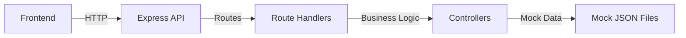
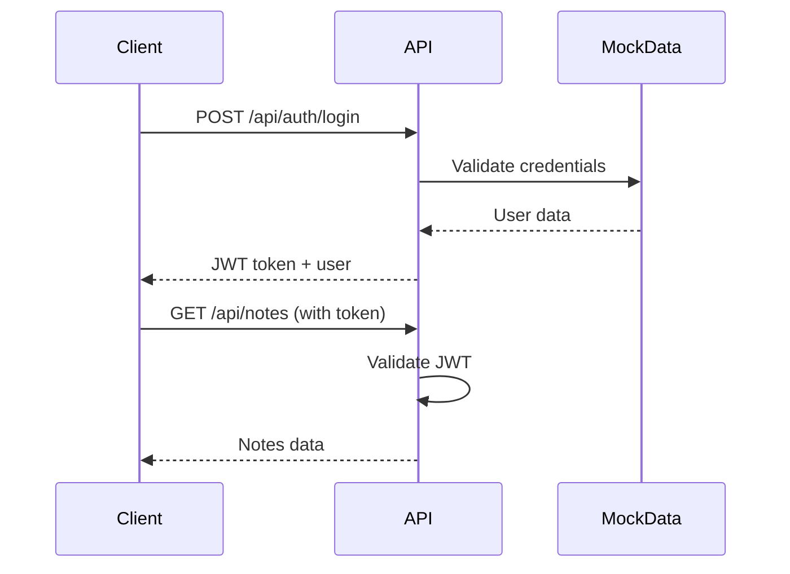
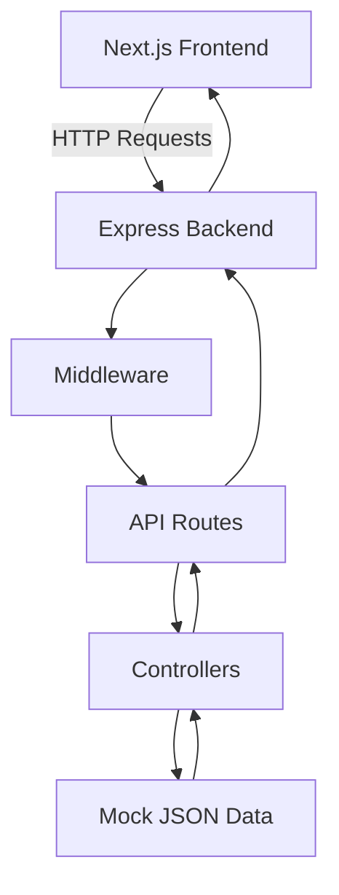

# Task 002: Backend with Mock Data

**Related Issue:** Foundation Phase 2
**Category:** Foundation
**Prerequisites:** Task 001 - Frontend with Mock API
**Estimated Time:** 2-3 hours
**Language:** TypeScript/JavaScript
**Notes App Context:** Add a real Express backend with mock data

## Learning Objectives

By the end of this task, you will:
- Understand Express.js REST API design
- Learn HTTP methods (GET, POST, PUT, DELETE) and status codes
- Implement request/response patterns
- Simulate JWT authentication
- Integrate frontend with real backend API
- Understand CORS and middleware

## Theory Section

### Why Mock Data in Backend?

Before connecting to a real database:
- **Focus on API design** without database complexity
- **Test frontend-backend integration** independently
- **Validate API contracts** before persistence layer
- **Rapid iteration** on API structure

### REST API Design



### HTTP Methods and Status Codes

| Method | Purpose | Status Codes |
|--------|---------|--------------|
| GET | Retrieve data | 200 OK, 404 Not Found |
| POST | Create data | 201 Created, 400 Bad Request |
| PUT | Update data | 200 OK, 404 Not Found |
| DELETE | Remove data | 200 OK, 204 No Content |

### JWT Authentication Flow



## Architecture Diagram



## Step-by-Step Instructions

### Step 1: Create Directory Structure

```bash
cd implementation/foundation
mkdir -p task-002-backend-mock/{frontend,backend/src/{routes,controllers,middleware,data}}
```

### Step 2: Copy Frontend from Phase 1

Copy the complete frontend from `task-001-mock-frontend/frontend/` to `task-002-backend-mock/frontend/`:

```bash
cp -r task-001-mock-frontend/frontend/* task-002-backend-mock/frontend/
```

### Step 3: Initialize Backend Project

```bash
cd task-002-backend-mock/backend
npm init -y
npm install express cors dotenv
npm install -D typescript @types/express @types/cors @types/node ts-node nodemon
```

### Step 4: Configure TypeScript

Create `tsconfig.json`:

```json
{
  "compilerOptions": {
    "target": "ES2020",
    "module": "commonjs",
    "lib": ["ES2020"],
    "outDir": "./dist",
    "rootDir": "./src",
    "strict": true,
    "esModuleInterop": true,
    "skipLibCheck": true,
    "forceConsistentCasingInFileNames": true,
    "resolveJsonModule": true
  },
  "include": ["src/**/*"],
  "exclude": ["node_modules"]
}
```

### Step 5: Create Mock Data Files

Create `src/data/users.json`:

```json
[
  {
    "id": "1",
    "email": "user@example.com",
    "password": "password123",
    "name": "Demo User"
  }
]
```

Create `src/data/notes.json`:

```json
[
  {
    "id": "1",
    "userId": "1",
    "title": "Welcome Note",
    "content": "This is your first note! Try creating more.",
    "createdAt": "2024-01-01T00:00:00.000Z",
    "updatedAt": "2024-01-01T00:00:00.000Z"
  }
]
```

### Step 6: Create Types

Create `src/types/index.ts`:

```typescript
export interface User {
  id: string;
  email: string;
  password: string;
  name?: string;
}

export interface Note {
  id: string;
  userId: string;
  title: string;
  content: string;
  createdAt: string;
  updatedAt: string;
}

export interface AuthResponse {
  token: string;
  user: Omit<User, 'password'>;
}

export interface LoginRequest {
  email: string;
  password: string;
}

export interface RegisterRequest {
  email: string;
  password: string;
  name?: string;
}
```

### Step 7: Create Controllers

Create `src/controllers/authController.ts`:

```typescript
import { Request, Response } from 'express';
import { AuthResponse, User } from '../types';
import * as fs from 'fs';
import * as path from 'path';

const usersPath = path.join(__dirname, '../data/users.json');

// Helper functions
const readUsers = (): User[] => {
  const data = fs.readFileSync(usersPath, 'utf-8');
  return JSON.parse(data);
};

const writeUsers = (users: User[]) => {
  fs.writeFileSync(usersPath, JSON.stringify(users, null, 2));
};

export const login = async (req: Request, res: Response) => {
  try {
    const { email, password }: LoginRequest = req.body;
    
    const users = readUsers();
    const user = users.find(u => u.email === email && u.password === password);
    
    if (!user) {
      return res.status(401).json({ error: 'Invalid credentials' });
    }
    
    // Remove password from response
    const { password: _, ...userWithoutPassword } = user;
    
    // Mock JWT token
    const token = `mock-jwt-token-${Date.now()}`;
    
    const response: AuthResponse = {
      token,
      user: userWithoutPassword
    };
    
    res.json(response);
  } catch (error) {
    res.status(500).json({ error: 'Internal server error' });
  }
};

export const register = async (req: Request, res: Response) => {
  try {
    const { email, password, name }: RegisterRequest = req.body;
    
    const users = readUsers();
    
    // Check if user already exists
    if (users.find(u => u.email === email)) {
      return res.status(400).json({ error: 'User already exists' });
    }
    
    const newUser: User = {
      id: Date.now().toString(),
      email,
      password,
      name: name || email.split('@')[0]
    };
    
    users.push(newUser);
    writeUsers(users);
    
    const { password: _, ...userWithoutPassword } = newUser;
    
    const token = `mock-jwt-token-${Date.now()}`;
    
    const response: AuthResponse = {
      token,
      user: userWithoutPassword
    };
    
    res.status(201).json(response);
  } catch (error) {
    res.status(500).json({ error: 'Internal server error' });
  }
};
```

Create `src/controllers/notesController.ts`:

```typescript
import { Request, Response } from 'express';
import { Note } from '../types';
import * as fs from 'fs';
import * as path from 'path';

const notesPath = path.join(__dirname, '../data/notes.json');

const readNotes = (): Note[] => {
  const data = fs.readFileSync(notesPath, 'utf-8');
  return JSON.parse(data);
};

const writeNotes = (notes: Note[]) => {
  fs.writeFileSync(notesPath, JSON.stringify(notes, null, 2));
};

export const getNotes = async (req: Request, res: Response) => {
  try {
    const userId = req.body.userId; // From middleware
    const notes = readNotes().filter(n => n.userId === userId);
    res.json(notes);
  } catch (error) {
    res.status(500).json({ error: 'Internal server error' });
  }
};

export const createNote = async (req: Request, res: Response) => {
  try {
    const { title, content } = req.body;
    const userId = req.body.userId;
    
    const notes = readNotes();
    
    const newNote: Note = {
      id: Date.now().toString(),
      userId,
      title,
      content,
      createdAt: new Date().toISOString(),
      updatedAt: new Date().toISOString()
    };
    
    notes.push(newNote);
    writeNotes(notes);
    
    res.status(201).json(newNote);
  } catch (error) {
    res.status(500).json({ error: 'Internal server error' });
  }
};

export const deleteNote = async (req: Request, res: Response) => {
  try {
    const { id } = req.params;
    const userId = req.body.userId;
    
    const notes = readNotes();
    const noteIndex = notes.findIndex(n => n.id === id && n.userId === userId);
    
    if (noteIndex === -1) {
      return res.status(404).json({ error: 'Note not found' });
    }
    
    notes.splice(noteIndex, 1);
    writeNotes(notes);
    
    res.json({ message: 'Note deleted' });
  } catch (error) {
    res.status(500).json({ error: 'Internal server error' });
  }
};
```

### Step 8: Create Middleware

Create `src/middleware/authMiddleware.ts`:

```typescript
import { Request, Response, NextFunction } from 'express';

// Mock JWT validation
export const authMiddleware = (req: Request, res: Response, next: NextFunction) => {
  const token = req.headers.authorization?.replace('Bearer ', '');
  
  if (!token) {
    return res.status(401).json({ error: 'No token provided' });
  }
  
  // Mock validation - accept any token that starts with "mock-jwt-token"
  if (!token.startsWith('mock-jwt-token-')) {
    return res.status(401).json({ error: 'Invalid token' });
  }
  
  // Mock user extraction from token
  const userId = '1'; // In real app, decode JWT to get userId
  req.body.userId = userId;
  
  next();
};
```

### Step 9: Create Routes

Create `src/routes/authRoutes.ts`:

```typescript
import { Router } from 'express';
import { login, register } from '../controllers/authController';

const router = Router();

router.post('/login', login);
router.post('/register', register);

export default router;
```

Create `src/routes/notesRoutes.ts`:

```typescript
import { Router } from 'express';
import { getNotes, createNote, deleteNote } from '../controllers/notesController';
import { authMiddleware } from '../middleware/authMiddleware';

const router = Router();

router.get('/', authMiddleware, getNotes);
router.post('/', authMiddleware, createNote);
router.delete('/:id', authMiddleware, deleteNote);

export default router;
```

### Step 10: Create Main Server File

Create `src/index.ts`:

```typescript
import express from 'express';
import cors from 'cors';
import dotenv from 'dotenv';
import authRoutes from './routes/authRoutes';
import notesRoutes from './routes/notesRoutes';

dotenv.config();

const app = express();
const PORT = process.env.PORT || 3001;

// Middleware
app.use(cors());
app.use(express.json());

// Routes
app.use('/api/auth', authRoutes);
app.use('/api/notes', notesRoutes);

// Health check
app.get('/health', (req, res) => {
  res.json({ status: 'OK' });
});

app.listen(PORT, () => {
  console.log(`Server running on port ${PORT}`);
});
```

### Step 11: Update Package.json Scripts

Update `package.json`:

```json
{
  "name": "notes-backend",
  "version": "1.0.0",
  "main": "dist/index.js",
  "scripts": {
    "dev": "nodemon src/index.ts",
    "build": "tsc",
    "start": "node dist/index.js"
  },
  "dependencies": {
    "cors": "^2.8.5",
    "dotenv": "^16.3.1",
    "express": "^4.18.2"
  },
  "devDependencies": {
    "@types/cors": "^2.8.17",
    "@types/express": "^4.17.21",
    "@types/node": "^20.10.5",
    "nodemon": "^3.0.2",
    "ts-node": "^10.9.2",
    "typescript": "^5.3.3"
  }
}
```

### Step 12: Update Frontend to Call Real API

Update `frontend/src/services/api.ts` (create this file):

```typescript
const API_URL = process.env.NEXT_PUBLIC_API_URL || 'http://localhost:3001';

export const api = {
  // Auth
  login: async (email: string, password: string) => {
    const response = await fetch(`${API_URL}/api/auth/login`, {
      method: 'POST',
      headers: { 'Content-Type': 'application/json' },
      body: JSON.stringify({ email, password })
    });
    return response.json();
  },

  register: async (email: string, password: string, name?: string) => {
    const response = await fetch(`${API_URL}/api/auth/register`, {
      method: 'POST',
      headers: { 'Content-Type': 'application/json' },
      body: JSON.stringify({ email, password, name })
    });
    return response.json();
  },

  // Notes
  getNotes: async (token: string) => {
    const response = await fetch(`${API_URL}/api/notes`, {
      headers: { Authorization: `Bearer ${token}` }
    });
    return response.json();
  },

  createNote: async (token: string, title: string, content: string) => {
    const response = await fetch(`${API_URL}/api/notes`, {
      method: 'POST',
      headers: {
        'Content-Type': 'application/json',
        Authorization: `Bearer ${token}`
      },
      body: JSON.stringify({ title, content })
    });
    return response.json();
  },

  deleteNote: async (token: string, id: string) => {
    const response = await fetch(`${API_URL}/api/notes/${id}`, {
      method: 'DELETE',
      headers: { Authorization: `Bearer ${token}` }
    });
    return response.json();
  }
};
```

Update `frontend/src/app/page.tsx` to use the real API instead of mockApi:
- Replace `import { mockApi } from '@/services/mockApi'` with `import { api } from '@/services/api'`
- Update all `mockApi.*` calls to `api.*` with token parameter
- Store token in localStorage or state

## Verification

### Manual Testing Steps

1. **Start the backend server**:
   ```bash
   cd implementation/foundation/task-002-backend-mock/backend
   npm run dev
   ```

2. **Start the frontend**:
   ```bash
   cd implementation/foundation/task-002-backend-mock/frontend
   npm run dev
   ```

3. **Test Registration**:
   - Open http://localhost:3000
   - Click "Register"
   - Enter new email and password
   - ✅ Should successfully register and login

4. **Test Login**:
   - Logout
   - Login with credentials from `users.json` (user@example.com / password123)
   - ✅ Should successfully login

5. **Test Note Creation**:
   - Create a new note
   - ✅ Note should appear in list
   - Check `backend/src/data/notes.json` - note should be saved

6. **Test Note Deletion**:
   - Delete a note
   - ✅ Note should be removed
   - Check `backend/src/data/notes.json` - note should be deleted

7. **Test API with curl**:
   ```bash
   curl http://localhost:3001/health
   # Should return: {"status":"OK"}
   ```

## Task Checklist

- [ ] Created backend directory structure
- [ ] Initialized Express backend with TypeScript
- [ ] Created mock data files (users.json, notes.json)
- [ ] Created TypeScript types
- [ ] Created auth controller (login, register)
- [ ] Created notes controller (get, create, delete)
- [ ] Created auth middleware
- [ ] Created auth routes
- [ ] Created notes routes
- [ ] Created main server file
- [ ] Updated package.json scripts
- [ ] Copied frontend from Phase 1
- [ ] Created real API service in frontend
- [ ] Updated frontend to use real API
- [ ] Tested registration
- [ ] Tested login
- [ ] Tested note creation
- [ ] Tested note deletion
- [ ] Created README with setup instructions

## Next Steps

Proceed to [Task 003: Full-Stack with Database](task-003-fullstack-database.md) to replace mock data with a real PostgreSQL database.

## Notes App Integration

This task adds a real backend API that the frontend calls. The mock JSON data will be replaced with a PostgreSQL database in Phase 3.

## Automation Reference

**Related Automation**: 
- Docker containerization will be added in Layer 4 (Docker tasks)
- Kubernetes deployment will be added in Layer 6 (Kubernetes tasks)
- Terraform infrastructure will be added in Layer 12 (Terraform tasks)

## Task Status

**Status**: Ready to implement
**Branch**: `feat/layer-00-foundation-phase-2-backend-mock`
