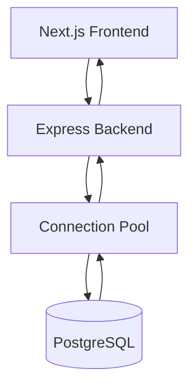
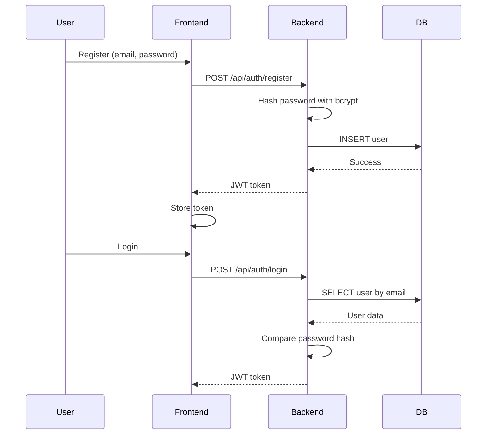
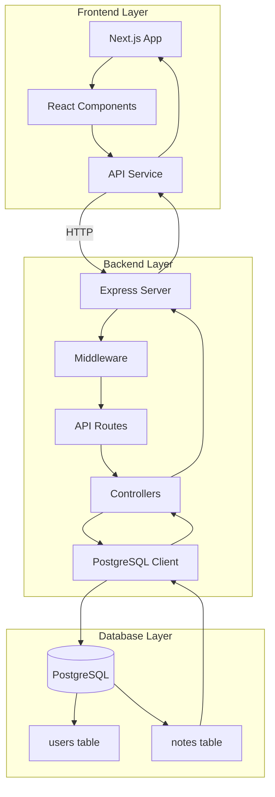

# Task 003: Full-Stack with Database

**Related Issue:** Foundation Phase 3
**Category:** Foundation
**Prerequisites:** Task 002 - Backend with Mock Data
**Estimated Time:** 3-4 hours
**Language:** TypeScript/JavaScript, SQL
**Notes App Context**: Replace mock data with real PostgreSQL database

## Learning Objectives

By the end of this task, you will:
- Understand PostgreSQL database design and schema creation
- Learn SQL queries for CRUD operations
- Implement real authentication with bcrypt password hashing
- Understand database connection pooling
- Learn data persistence and migrations
- Integrate backend with real database

## Theory Section

### Why Real Database?

Mock data is great for development, but real applications need:
- **Data persistence** across server restarts
- **Concurrent access** from multiple users
- **Data integrity** with constraints and transactions
- **Scalability** for production workloads
- **Security** with proper access controls

### Database Architecture



### SQL vs NoSQL

| Aspect | SQL (PostgreSQL) | NoSQL (MongoDB) |
|--------|------------------|-----------------|
| Schema | Fixed, structured | Flexible, dynamic |
| Queries | SQL language | Query API |
| Transactions | ACID compliant | Limited |
| Scalability | Vertical scaling | Horizontal scaling |
| Use Case | Structured data, relationships | Flexible data, high throughput |

### Authentication Flow with Real Database



## Architecture Diagram



## Step-by-Step Instructions

### Step 1: Create Directory Structure

```bash
cd implementation/foundation
mkdir -p task-003-fullstack/{frontend,backend/src/{routes,controllers,middleware,db},database}
```

### Step 2: Copy Backend from Phase 2

Copy the complete backend from `task-002-backend-mock/backend/`:

```bash
cp -r task-002-backend-mock/backend/* task-003-fullstack/backend/
```

### Step 3: Copy Frontend from Phase 2

```bash
cp -r task-002-backend-mock/frontend/* task-003-fullstack/frontend/
```

### Step 4: Install Database Dependencies

```bash
cd task-003-fullstack/backend
npm install pg bcrypt
npm install -D @types/pg @types/bcrypt
```

### Step 5: Create Database Schema

Create `database/schema.sql`:

```sql
-- Create users table
CREATE TABLE IF NOT EXISTS users (
    id SERIAL PRIMARY KEY,
    email VARCHAR(255) UNIQUE NOT NULL,
    password_hash VARCHAR(255) NOT NULL,
    name VARCHAR(255),
    created_at TIMESTAMP DEFAULT CURRENT_TIMESTAMP,
    updated_at TIMESTAMP DEFAULT CURRENT_TIMESTAMP
);

-- Create notes table
CREATE TABLE IF NOT EXISTS notes (
    id SERIAL PRIMARY KEY,
    user_id INTEGER REFERENCES users(id) ON DELETE CASCADE,
    title VARCHAR(255) NOT NULL,
    content TEXT NOT NULL,
    created_at TIMESTAMP DEFAULT CURRENT_TIMESTAMP,
    updated_at TIMESTAMP DEFAULT CURRENT_TIMESTAMP
);

-- Create index for faster lookups
CREATE INDEX IF NOT EXISTS idx_notes_user_id ON notes(user_id);
CREATE INDEX IF NOT EXISTS idx_users_email ON users(email);

-- Insert seed data
INSERT INTO users (email, password_hash, name) VALUES
('user@example.com', '$2b$10$abcdefghijklmnopqrstuv', 'Demo User')
ON CONFLICT (email) DO NOTHING;

INSERT INTO notes (user_id, title, content) VALUES
(1, 'Welcome Note', 'This is your first note! Try creating more.')
ON CONFLICT DO NOTHING;
```

### Step 6: Create Database Connection

Create `backend/src/db/connection.ts`:

```typescript
import { Pool } from 'pg';

const pool = new Pool({
  host: process.env.DB_HOST || 'localhost',
  port: parseInt(process.env.DB_PORT || '5432'),
  database: process.env.DB_NAME || 'notesapp',
  user: process.env.DB_USER || 'postgres',
  password: process.env.DB_PASSWORD || 'postgres',
  max: 20, // Maximum number of clients in the pool
  idleTimeoutMillis: 30000,
  connectionTimeoutMillis: 2000,
});

export default pool;
```

### Step 7: Create Database Queries

Create `backend/src/db/queries.ts`:

```typescript
import pool from './connection';
import bcrypt from 'bcrypt';

// User queries
export const findUserByEmail = async (email: string) => {
  const result = await pool.query(
    'SELECT * FROM users WHERE email = $1',
    [email]
  );
  return result.rows[0];
};

export const createUser = async (email: string, password: string, name?: string) => {
  const passwordHash = await bcrypt.hash(password, 10);
  
  const result = await pool.query(
    'INSERT INTO users (email, password_hash, name) VALUES ($1, $2, $3) RETURNING id, email, name, created_at',
    [email, passwordHash, name]
  );
  
  return result.rows[0];
};

export const verifyPassword = async (password: string, hash: string) => {
  return bcrypt.compare(password, hash);
};

// Notes queries
export const getNotesByUserId = async (userId: number) => {
  const result = await pool.query(
    'SELECT * FROM notes WHERE user_id = $1 ORDER BY created_at DESC',
    [userId]
  );
  return result.rows;
};

export const createNote = async (userId: number, title: string, content: string) => {
  const result = await pool.query(
    'INSERT INTO notes (user_id, title, content) VALUES ($1, $2, $3) RETURNING *',
    [userId, title, content]
  );
  return result.rows[0];
};

export const deleteNote = async (noteId: number, userId: number) => {
  const result = await pool.query(
    'DELETE FROM notes WHERE id = $1 AND user_id = $2 RETURNING *',
    [noteId, userId]
  );
  return result.rowCount > 0;
};

export const getNoteById = async (noteId: number, userId: number) => {
  const result = await pool.query(
    'SELECT * FROM notes WHERE id = $1 AND user_id = $2',
    [noteId, userId]
  );
  return result.rows[0];
};
```

### Step 8: Update Controllers to Use Database

Update `backend/src/controllers/authController.ts`:

```typescript
import { Request, Response } from 'express';
import { findUserByEmail, createUser, verifyPassword } from '../db/queries';

export const login = async (req: Request, res: Response) => {
  try {
    const { email, password } = req.body;
    
    const user = await findUserByEmail(email);
    
    if (!user) {
      return res.status(401).json({ error: 'Invalid credentials' });
    }
    
    const isValidPassword = await verifyPassword(password, user.password_hash);
    
    if (!isValidPassword) {
      return res.status(401).json({ error: 'Invalid credentials' });
    }
    
    // Remove password from response
    const { password_hash, ...userWithoutPassword } = user;
    
    // Mock JWT token (in production, use real JWT)
    const token = `mock-jwt-token-${Date.now()}`;
    
    res.json({
      token,
      user: userWithoutPassword
    });
  } catch (error) {
    console.error('Login error:', error);
    res.status(500).json({ error: 'Internal server error' });
  }
};

export const register = async (req: Request, res: Response) => {
  try {
    const { email, password, name } = req.body;
    
    // Check if user already exists
    const existingUser = await findUserByEmail(email);
    if (existingUser) {
      return res.status(400).json({ error: 'User already exists' });
    }
    
    const user = await createUser(email, password, name);
    
    // Mock JWT token
    const token = `mock-jwt-token-${Date.now()}`;
    
    res.status(201).json({
      token,
      user
    });
  } catch (error) {
    console.error('Register error:', error);
    res.status(500).json({ error: 'Internal server error' });
  }
};
```

Update `backend/src/controllers/notesController.ts`:

```typescript
import { Request, Response } from 'express';
import { getNotesByUserId, createNote, deleteNote } from '../db/queries';

export const getNotes = async (req: Request, res: Response) => {
  try {
    const userId = req.body.userId;
    const notes = await getNotesByUserId(userId);
    res.json(notes);
  } catch (error) {
    console.error('Get notes error:', error);
    res.status(500).json({ error: 'Internal server error' });
  }
};

export const createNote = async (req: Request, res: Response) => {
  try {
    const { title, content } = req.body;
    const userId = req.body.userId;
    
    const note = await createNote(userId, title, content);
    res.status(201).json(note);
  } catch (error) {
    console.error('Create note error:', error);
    res.status(500).json({ error: 'Internal server error' });
  }
};

export const deleteNote = async (req: Request, res: Response) => {
  try {
    const { id } = req.params;
    const userId = req.body.userId;
    
    const success = await deleteNote(parseInt(id), userId);
    
    if (!success) {
      return res.status(404).json({ error: 'Note not found' });
    }
    
    res.json({ message: 'Note deleted' });
  } catch (error) {
    console.error('Delete note error:', error);
    res.status(500).json({ error: 'Internal server error' });
  }
};
```

### Step 9: Create Environment File Template

Create `backend/.env.example`:

```env
# Server
PORT=3001

# Database
DB_HOST=localhost
DB_PORT=5432
DB_NAME=notesapp
DB_USER=postgres
DB_PASSWORD=postgres

# JWT Secret (in production, use a strong random string)
JWT_SECRET=your-secret-key-here
```

### Step 10: Update Main Server File

Update `backend/src/index.ts`:

```typescript
import express from 'express';
import cors from 'cors';
import dotenv from 'dotenv';
import authRoutes from './routes/authRoutes';
import notesRoutes from './routes/notesRoutes';
import pool from './db/connection';

dotenv.config();

const app = express();
const PORT = process.env.PORT || 3001;

// Middleware
app.use(cors());
app.use(express.json());

// Routes
app.use('/api/auth', authRoutes);
app.use('/api/notes', notesRoutes);

// Health check
app.get('/health', async (req, res) => {
  try {
    await pool.query('SELECT 1');
    res.json({ status: 'OK', database: 'connected' });
  } catch (error) {
    res.status(500).json({ status: 'ERROR', database: 'disconnected' });
  }
});

// Start server
app.listen(PORT, () => {
  console.log(`Server running on port ${PORT}`);
  console.log(`Database: ${process.env.DB_NAME}@${process.env.DB_HOST}`);
});

// Graceful shutdown
process.on('SIGINT', async () => {
  console.log('Shutting down gracefully...');
  await pool.end();
  process.exit(0);
});
```

### Step 11: Create Database Setup Script

Create `database/setup.sh`:

```bash
#!/bin/bash

# Database setup script
DB_NAME="notesapp"
DB_USER="postgres"

echo "Creating database..."

# Create database
createdb $DB_NAME 2>/dev/null || echo "Database already exists"

# Run schema
psql -U $DB_USER -d $DB_NAME -f schema.sql

echo "Database setup complete!"
```

### Step 12: Update Frontend Environment

Create `frontend/.env.local`:

```env
NEXT_PUBLIC_API_URL=http://localhost:3001
```

## Verification

### Manual Testing Steps

1. **Set up PostgreSQL**:
   ```bash
   # Install PostgreSQL if not already installed
   # Windows: Download from postgresql.org
   # Mac: brew install postgresql
   # Linux: sudo apt-get install postgresql postgresql-contrib
   ```

2. **Create database**:
   ```bash
   cd implementation/foundation/task-003-fullstack/database
   chmod +x setup.sh
   ./setup.sh
   # Or manually:
   createdb notesapp
   psql notesapp -f schema.sql
   ```

3. **Configure backend**:
   ```bash
   cd implementation/foundation/task-003-fullstack/backend
   cp .env.example .env
   # Edit .env with your database credentials
   ```

4. **Start the backend**:
   ```bash
   npm run dev
   ```

5. **Start the frontend**:
   ```bash
   cd implementation/foundation/task-003-fullstack/frontend
   npm run dev
   ```

6. **Test Registration**:
   - Open http://localhost:3000
   - Register a new user
   - ✅ Should successfully register
   - Check database: `psql notesapp -c "SELECT * FROM users;"`

7. **Test Login**:
   - Login with the registered user
   - ✅ Should successfully login

8. **Test Note Creation**:
   - Create a new note
   - ✅ Note should appear in list
   - Check database: `psql notesapp -c "SELECT * FROM notes;"`

9. **Test Note Deletion**:
   - Delete a note
   - ✅ Note should be removed
   - Check database: Note should be deleted

10. **Test Data Persistence**:
    - Restart the backend server
    - Refresh the frontend
    - ✅ Notes should still be there (persisted in database)

11. **Test Database Connection**:
    ```bash
    curl http://localhost:3001/health
    # Should return: {"status":"OK","database":"connected"}
    ```

## Task Checklist

- [ ] Created fullstack directory structure
- [ ] Copied backend from Phase 2
- [ ] Copied frontend from Phase 2
- [ ] Installed pg and bcrypt dependencies
- [ ] Created database schema (schema.sql)
- [ ] Created database connection module
- [ ] Created database query functions
- [ ] Updated auth controller to use database
- [ ] Updated notes controller to use database
- [ ] Created .env.example file
- [ ] Updated main server file with health check
- [ ] Created database setup script
- [ ] Created frontend .env.local
- [ ] Set up PostgreSQL database
- [ ] Ran schema.sql to create tables
- [ ] Tested registration with database
- [ ] Tested login with database
- [ ] Tested note creation with database
- [ ] Tested note deletion with database
- [ ] Tested data persistence across restarts
- [ ] Created README with setup instructions

## Next Steps

You have completed the Foundation Phase! Proceed to:
- **Layer 1**: Docker containerization
- **Layer 2**: Kubernetes orchestration
- **Layer 3**: Microservices architecture

## Notes App Integration

This task completes the foundation by adding a real PostgreSQL database. The application is now a fully functional full-stack application with:
- Complete frontend (Next.js)
- REST API backend (Express)
- Real database (PostgreSQL)
- Authentication with password hashing
- Data persistence

## Automation Reference

**Related Automation**: 
- Docker containerization will be added in Layer 4 (Docker tasks)
- Kubernetes deployment will be added in Layer 6 (Kubernetes tasks)
- Terraform infrastructure for RDS will be added in Layer 12 (Terraform tasks)
- Database migrations with Knex.js will be added in advanced database tasks

## Task Status

**Status**: Ready to implement
**Branch**: `feat/layer-00-foundation-phase-3-fullstack`
