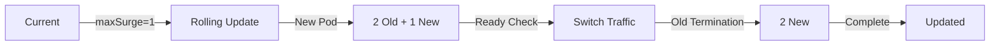

# Task: Kubernetes Deployment Configuration
**Issue:** #123 | **Category:** Kubernetes | **Priority:** High | **Effort:** 8h

---

## 📋 Objective

Design and implement production-ready Kubernetes deployment manifests for all microservices with health checks, resource limits, and rollout strategies.

---

## 📝 Description

Create comprehensive Kubernetes deployment YAML files for each microservice including:
- Pod specifications with resource requests/limits
- Liveness and readiness probes
- Rolling update strategies
- Pod disruption budgets
- Image pull policies and security contexts

---

## ✅ Acceptance Criteria

- [ ] Deployment manifests created for all 6 services
- [ ] Resource limits defined based on service requirements
- [ ] Health probes configured (liveness + readiness)
- [ ] Rolling updates with maxSurge/maxUnavailable set
- [ ] Pod disruption budgets defined
- [ ] Image pull secrets configured
- [ ] Security context applied to all pods
- [ ] Deployment tested in dev cluster
- [ ] Documentation covers all manifest options
- [ ] Team trained on deployment lifecycle

---

## 🔧 Sub-Tasks

### 1. Backend API Deployment
- [ ] Create backend-deployment.yaml with health probes
- [ ] Define resource requests (CPU: 250m, Memory: 512Mi)
- [ ] Configure liveness probe (HTTP GET /health, 30s)
- [ ] Configure readiness probe (HTTP GET /ready, 10s)
- [ ] Set rolling update: maxSurge=1, maxUnavailable=0
- [ ] Add pod disruption budget: minAvailable=1
- [ ] Document scaling considerations

### 2. Frontend Deployment
- [ ] Create frontend-deployment.yaml for Next.js
- [ ] Define resource requests (CPU: 100m, Memory: 256Mi)
- [ ] Configure HTTP health checks
- [ ] Set replica strategy based on traffic
- [ ] Add lifecycle hooks for graceful shutdown
- [ ] Document static asset caching

### 3. Authentication Service
- [ ] Create auth-deployment.yaml
- [ ] Define high availability (minReplicas=2)
- [ ] Configure JWT validation checks
- [ ] Add startup probe for slow initialization
- [ ] Document session affinity requirements

### 4. API Gateway Deployment
- [ ] Create gateway-deployment.yaml
- [ ] Define resource limits for high throughput
- [ ] Configure rate limiting health check
- [ ] Set load balancing affinity
- [ ] Document request routing rules

### 5. Worker Service Configuration
- [ ] Create worker-deployment.yaml
- [ ] Define queue processing probes
- [ ] Configure batch job handling
- [ ] Add metrics for task queue depth
- [ ] Document scaling based on queue depth

### 6. Cache Layer Deployment
- [ ] Create cache-deployment.yaml (Redis)
- [ ] Configure persistence requirements
- [ ] Set memory limits (4Gi recommended)
- [ ] Add backup/restore probes
- [ ] Document replication settings

### 7. Database Initialization Job
- [ ] Create PostgreSQL init job
- [ ] Define one-time migration tasks
- [ ] Configure backoff/retry policy
- [ ] Add seed data management
- [ ] Document restoration procedures

### 8. Network Policies Application
- [ ] Apply network policies to deployments
- [ ] Define ingress/egress rules
- [ ] Configure service-to-service communication
- [ ] Document policy hierarchy
- [ ] Test connectivity between services

### 9. RBAC Configuration
- [ ] Create service accounts per deployment
- [ ] Define role-based access control
- [ ] Configure pod security policies
- [ ] Set resource quotas per namespace
- [ ] Document permission model

### 10. Monitoring & Observability Integration
- [ ] Add Prometheus annotations to pods
- [ ] Configure metric endpoints
- [ ] Add Jaeger trace injection
- [ ] Document instrumentation setup
- [ ] Create monitoring dashboards

---

## 📚 Learning Resources

- **Kubernetes Deployment API:** https://kubernetes.io/docs/concepts/workloads/controllers/deployment/
- **Pod Lifecycle Hooks:** https://kubernetes.io/docs/concepts/containers/container-lifecycle-hooks/
- **Health Checks:** https://kubernetes.io/docs/tasks/configure-pod-container/configure-liveness-readiness-startup-probes/
- **Resource Management:** https://kubernetes.io/docs/concepts/configuration/manage-resources-containers/
- **Rolling Updates:** https://kubernetes.io/docs/tutorials/kubernetes-basics/update/update-intro/

---

## 💻 Code Example: Backend Deployment

```yaml
apiVersion: apps/v1
kind: Deployment
metadata:
  name: backend-api
  namespace: default
  labels:
    app: backend-api
    version: v1
spec:
  replicas: 2
  strategy:
    type: RollingUpdate
    rollingUpdate:
      maxSurge: 1
      maxUnavailable: 0
  selector:
    matchLabels:
      app: backend-api
  template:
    metadata:
      labels:
        app: backend-api
        version: v1
      annotations:
        prometheus.io/scrape: "true"
        prometheus.io/port: "9090"
        prometheus.io/path: "/metrics"
    spec:
      serviceAccountName: backend-api
      securityContext:
        runAsNonRoot: true
        runAsUser: 1000
      containers:
      - name: backend-api
        image: backend-api:v1.0.0
        imagePullPolicy: IfNotPresent
        ports:
        - containerPort: 3000
          name: http
          protocol: TCP
        - containerPort: 9090
          name: metrics
          protocol: TCP
        env:
        - name: NODE_ENV
          value: "production"
        - name: LOG_LEVEL
          value: "info"
        - name: DB_HOST
          valueFrom:
            configMapKeyRef:
              name: backend-config
              key: db.host
        - name: DB_PASSWORD
          valueFrom:
            secretKeyRef:
              name: backend-secret
              key: db.password
        resources:
          requests:
            cpu: "250m"
            memory: "512Mi"
          limits:
            cpu: "500m"
            memory: "1Gi"
        livenessProbe:
          httpGet:
            path: /health
            port: http
          initialDelaySeconds: 30
          periodSeconds: 10
          timeoutSeconds: 5
          failureThreshold: 3
        readinessProbe:
          httpGet:
            path: /ready
            port: http
          initialDelaySeconds: 10
          periodSeconds: 5
          timeoutSeconds: 3
          failureThreshold: 2
        startupProbe:
          httpGet:
            path: /health
            port: http
          initialDelaySeconds: 0
          periodSeconds: 10
          timeoutSeconds: 3
          failureThreshold: 30
        lifecycle:
          preStop:
            exec:
              command: ["/bin/sh", "-c", "sleep 15"]
        volumeMounts:
        - name: config
          mountPath: /app/config
          readOnly: true
        - name: tmp
          mountPath: /tmp
      volumes:
      - name: config
        configMap:
          name: backend-config
      - name: tmp
        emptyDir: {}
      affinity:
        podAntiAffinity:
          preferredDuringSchedulingIgnoredDuringExecution:
          - weight: 100
            podAffinityTerm:
              labelSelector:
                matchExpressions:
                - key: app
                  operator: In
                  values:
                  - backend-api
              topologyKey: kubernetes.io/hostname
---
apiVersion: v1
kind: PodDisruptionBudget
metadata:
  name: backend-api-pdb
spec:
  minAvailable: 1
  selector:
    matchLabels:
      app: backend-api
---
apiVersion: v1
kind: Service
metadata:
  name: backend-api
  labels:
    app: backend-api
spec:
  type: ClusterIP
  selector:
    app: backend-api
  ports:
  - port: 80
    targetPort: http
    protocol: TCP
    name: http
  - port: 9090
    targetPort: metrics
    protocol: TCP
    name: metrics
```

---

## 🔒 Security Considerations

- **Resource Limits:** Prevent resource exhaustion and denial of service
- **Security Context:** Run containers as non-root user
- **Pod Disruption Budgets:** Maintain minimum availability during node maintenance
- **Image Pull Policy:** Use IfNotPresent to reduce registry load
- **Health Probes:** Detect and restart unhealthy pods automatically
- **Service Accounts:** Grant minimum required permissions per service

---

## 📊 Deployment Strategy



---

## ✨ Success Metrics

- All deployments passing health checks
- Zero-downtime updates achieved
- Pod restart rate < 0.1 per day
- Deployment creation/update time < 1 minute
- All monitoring metrics exposed
- Team confidence in deployment process

---

## 📖 Related Tasks

- [K8s Concepts](k8s-001.md) - Foundation
- [Service Discovery](k8s-003.md) - Next step
- [StatefulSets](k8s-004.md) - Stateful apps
- [Persistent Storage](k8s-005.md) - Data persistence

---

**Created:** January 17, 2026 | **Last Updated:** January 17, 2026