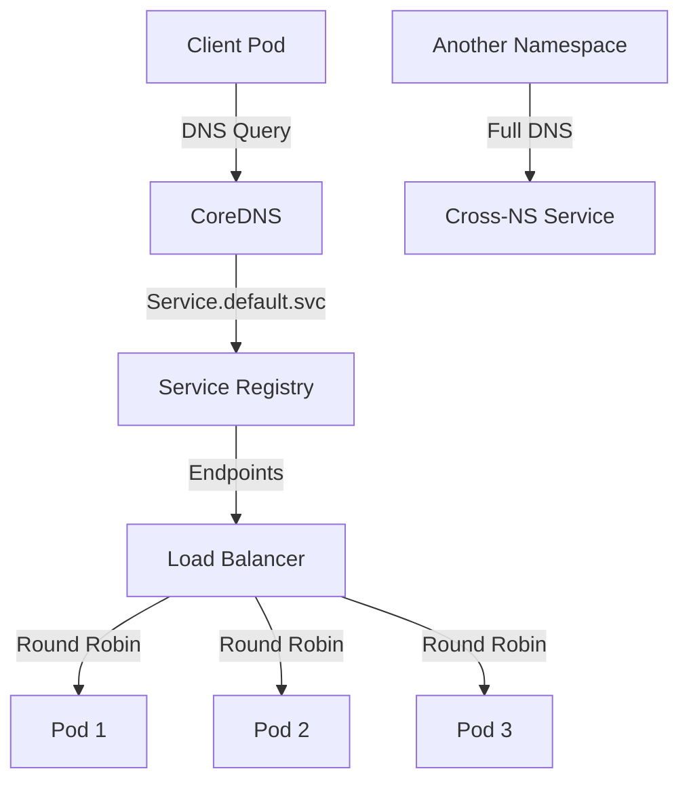

# Task: Kubernetes Service Discovery & Load Balancing
**Issue:** #124 | **Category:** Kubernetes | **Priority:** High | **Effort:** 7h

---

## 📋 Objective

Implement DNS-based service discovery and configure load balancing across all microservices in the Kubernetes cluster.

---

## 📝 Description

Configure Kubernetes Services to enable automatic service discovery and load balancing including:
- ClusterIP services for internal communication
- Headless services for StatefulSets
- ExternalName services for external databases
- Service discovery testing and verification
- Load balancing algorithm configuration

---

## ✅ Acceptance Criteria

- [ ] ClusterIP services created for all microservices
- [ ] Service DNS names properly configured
- [ ] Load balancing working across pods
- [ ] Session affinity configured where needed
- [ ] External service references configured
- [ ] Service discovery tested from pods
- [ ] Load balancing metrics available
- [ ] Documentation covers service patterns
- [ ] Team trained on service discovery
- [ ] Monitoring alerts for service health

---

## 🔧 Sub-Tasks

### 1. Core Service Configuration
- [ ] Create backend-api service manifest
- [ ] Define ClusterIP service type
- [ ] Configure port and targetPort mappings
- [ ] Set service labels and selectors
- [ ] Document DNS naming convention
- [ ] Test DNS resolution from pod

### 2. Load Balancing Setup
- [ ] Configure service load balancing algorithm
- [ ] Verify round-robin distribution
- [ ] Test failover between pods
- [ ] Monitor connection distribution
- [ ] Document load balancing behavior
- [ ] Create load balancing tests

### 3. Session Affinity Configuration
- [ ] Identify services requiring session affinity
- [ ] Configure clientIP affinity where needed
- [ ] Set affinity timeout (default: 10800s)
- [ ] Test sticky sessions
- [ ] Document affinity requirements
- [ ] Monitor session distribution

### 4. Headless Service Setup
- [ ] Create StatefulSet headless service
- [ ] Configure DNS A records for pods
- [ ] Set clusterIP: None
- [ ] Test pod DNS names
- [ ] Document headless service usage
- [ ] Create service discovery tests

### 5. External Service Configuration
- [ ] Create ExternalName service for PostgreSQL
- [ ] Create ExternalName service for Redis
- [ ] Configure external DNS names
- [ ] Test external connectivity
- [ ] Document external service usage
- [ ] Add external service monitoring

### 6. Multi-Port Services
- [ ] Define services with multiple ports
- [ ] Configure metrics port exposure
- [ ] Configure debug port access
- [ ] Document port naming conventions
- [ ] Test multi-port access
- [ ] Create port routing tests

### 7. Service Endpoints Discovery
- [ ] Monitor service endpoints
- [ ] Verify endpoint health checks
- [ ] Configure endpoint slices
- [ ] Test endpoint updates
- [ ] Monitor endpoint failures
- [ ] Document endpoint behavior

### 8. DNS Testing Strategy
- [ ] Create DNS resolution tests
- [ ] Test short DNS names (service)
- [ ] Test full DNS names (service.namespace.svc.cluster.local)
- [ ] Test cross-namespace service discovery
- [ ] Test external DNS resolution
- [ ] Document DNS troubleshooting

### 9. Load Balancing Verification
- [ ] Create load distribution tests
- [ ] Verify even distribution across pods
- [ ] Test failover scenarios
- [ ] Monitor load metrics
- [ ] Document load patterns
- [ ] Create performance tests

### 10. Observability Integration
- [ ] Add service discovery metrics
- [ ] Configure kube-proxy monitoring
- [ ] Monitor load balancing performance
- [ ] Set up service health alerts
- [ ] Document observable metrics
- [ ] Create monitoring dashboards

---

## 📚 Learning Resources

- **Kubernetes Services:** https://kubernetes.io/docs/concepts/services-networking/service/
- **Service Discovery:** https://kubernetes.io/docs/concepts/services-networking/service/#discovering-services
- **Load Balancing:** https://kubernetes.io/docs/concepts/services-networking/service/#load-balancer-behavior
- **DNS for Services:** https://kubernetes.io/docs/concepts/services-networking/dns-pod-service/
- **Endpoint Slices:** https://kubernetes.io/docs/concepts/services-networking/endpoint-slices/

---

## 💻 Code Example: Service Configuration

```yaml
---
# Backend API Service (ClusterIP)
apiVersion: v1
kind: Service
metadata:
  name: backend-api
  namespace: default
  labels:
    app: backend-api
spec:
  type: ClusterIP
  clusterIP: None  # Uncomment for headless service
  selector:
    app: backend-api
  ports:
  - name: http
    port: 80
    targetPort: 3000
    protocol: TCP
  - name: metrics
    port: 9090
    targetPort: 9090
    protocol: TCP
  sessionAffinity: None  # Use ClientIP for sticky sessions
  sessionAffinityConfig:
    clientIP:
      timeoutSeconds: 10800

---
# Frontend Service
apiVersion: v1
kind: Service
metadata:
  name: frontend
  namespace: default
  labels:
    app: frontend
spec:
  type: ClusterIP
  selector:
    app: frontend
  ports:
  - name: http
    port: 80
    targetPort: 3000
    protocol: TCP

---
# External Database Service (ExternalName)
apiVersion: v1
kind: Service
metadata:
  name: postgres-external
  namespace: default
spec:
  type: ExternalName
  externalName: postgres.example.com
  ports:
  - name: postgresql
    port: 5432
    targetPort: 5432
    protocol: TCP

---
# Redis External Service
apiVersion: v1
kind: Service
metadata:
  name: redis-external
  namespace: default
spec:
  type: ExternalName
  externalName: redis.example.com
  ports:
  - name: redis
    port: 6379
    targetPort: 6379
    protocol: TCP

---
# API Gateway Service
apiVersion: v1
kind: Service
metadata:
  name: api-gateway
  namespace: default
  labels:
    app: api-gateway
spec:
  type: ClusterIP
  selector:
    app: api-gateway
  ports:
  - name: http
    port: 80
    targetPort: 8080
    protocol: TCP
  - name: https
    port: 443
    targetPort: 8443
    protocol: TCP
```

---

## 🔐 Service Discovery Test Pod

```yaml
apiVersion: v1
kind: Pod
metadata:
  name: service-discovery-test
  namespace: default
spec:
  containers:
  - name: test
    image: busybox:1.35
    command: ['sh', '-c']
    args:
    - |
      echo "Testing service discovery..."
      
      # Test short DNS name
      nslookup backend-api
      
      # Test full DNS name
      nslookup backend-api.default.svc.cluster.local
      
      # Test cross-namespace
      nslookup backend-api.monitoring.svc.cluster.local
      
      # Test HTTP connectivity
      wget -O- http://backend-api/health
      
      # Test load balancing (multiple requests)
      for i in {1..10}; do
        wget -O- http://backend-api/node-id
      done
      
      echo "Service discovery tests completed"
    restartPolicy: Never
```

---

## 📊 Service Architecture



---

## 🔒 Security Considerations

- **Network Policies:** Control which pods can access services
- **RBAC:** Limit service account permissions
- **Service Account Tokens:** Automatically injected for authentication
- **External Service Security:** Validate external endpoints
- **DNS Security:** Consider DNSSec for DNS resolution
- **TLS Encryption:** Use service-to-service mTLS

---

## ✨ Success Metrics

- All services discoverable via DNS
- Load distribution even across pods
- Service failover < 1 second
- DNS resolution latency < 10ms
- Zero service discovery failures
- Team proficiency in service debugging

---

## 📖 Related Tasks

- [K8s Deployment](k8s-002.md) - Deployment configuration
- [Network Policies](k8s-006.md) - Service access control
- [Ingress Configuration](k8s-007.md) - External access

---

**Created:** January 17, 2026 | **Last Updated:** January 17, 2026
