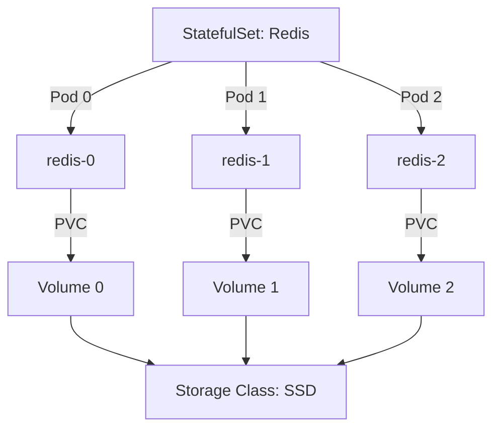

# Task: Kubernetes StatefulSets & Persistent Storage
**Issue:** #125 | **Category:** Kubernetes | **Priority:** High | **Effort:** 8h

---

## 📋 Objective

Configure StatefulSets and persistent storage for stateful applications including databases, caching layers, and message queues.

---

## 📝 Description

Implement Kubernetes StatefulSets and PersistentVolumes to manage stateful workloads:
- StatefulSet configuration for Redis, RabbitMQ, PostgreSQL
- PersistentVolumeClaim management
- Storage class configuration
- Data persistence and recovery
- Backup and restore procedures

---

## ✅ Acceptance Criteria

- [ ] StatefulSets created for all stateful services
- [ ] Persistent volumes properly configured
- [ ] Storage classes defined for different tiers
- [ ] Data persistence verified across pod restarts
- [ ] Backup procedures implemented
- [ ] Restore procedures tested
- [ ] Pod ordering and identity maintained
- [ ] Storage monitoring enabled
- [ ] Team trained on stateful management
- [ ] Disaster recovery plan documented

---

## 🔧 Sub-Tasks

### 1. Redis StatefulSet Configuration
- [ ] Design Redis StatefulSet manifest
- [ ] Configure 3-replica Redis cluster
- [ ] Set up persistent volumes for each replica
- [ ] Define redis.conf ConfigMap
- [ ] Configure health checks and probes
- [ ] Test data persistence across restarts
- [ ] Document Redis cluster topology

### 2. PostgreSQL StatefulSet Setup
- [ ] Create PostgreSQL StatefulSet manifest
- [ ] Configure primary/standby replication
- [ ] Set up persistent volumes for data
- [ ] Configure WAL archival for recovery
- [ ] Implement backup cronjobs
- [ ] Test point-in-time recovery
- [ ] Document failover procedures

### 3. RabbitMQ Cluster Configuration
- [ ] Design RabbitMQ StatefulSet manifest
- [ ] Configure 3-node cluster
- [ ] Set up persistent queues
- [ ] Enable cluster metrics
- [ ] Configure management UI access
- [ ] Test message persistence
- [ ] Document queue configuration

### 4. PersistentVolume Creation
- [ ] Create PV manifests for storage
- [ ] Configure appropriate storage classes
- [ ] Set access modes (ReadWriteOnce, ReadWriteMany)
- [ ] Define retention policies
- [ ] Document storage provisioning
- [ ] Test storage allocation

### 5. StorageClass Configuration
- [ ] Create SSD storage class for performance
- [ ] Create HDD storage class for cost
- [ ] Configure volume expansion parameters
- [ ] Set reclaim policies (Retain/Delete)
- [ ] Document storage tiers
- [ ] Test dynamic provisioning

### 6. Data Backup Strategy
- [ ] Implement automated PostgreSQL backups
- [ ] Configure Redis RDB snapshots
- [ ] Set up RabbitMQ definitions backup
- [ ] Define backup retention policies
- [ ] Implement incremental backups
- [ ] Test backup integrity

### 7. Disaster Recovery Planning
- [ ] Document recovery objectives (RTO/RPO)
- [ ] Create recovery runbooks
- [ ] Test full cluster recovery
- [ ] Validate backup restoration
- [ ] Document failure scenarios
- [ ] Train team on recovery procedures

### 8. Storage Monitoring & Alerts
- [ ] Monitor PVC usage metrics
- [ ] Set up capacity alerts (80%, 90%)
- [ ] Monitor storage latency
- [ ] Track disk I/O metrics
- [ ] Create storage dashboards
- [ ] Configure escalation policies

### 9. Pod Ordering & Identity
- [ ] Verify StatefulSet pod naming (redis-0, redis-1...)
- [ ] Test pod initialization order
- [ ] Verify stable network identity
- [ ] Test DNS names for pods
- [ ] Document pod identity usage
- [ ] Create identity tests

### 10. Migration & Scaling
- [ ] Document volume expansion procedures
- [ ] Test scaling StatefulSet replicas
- [ ] Plan storage migration strategy
- [ ] Document offline migration steps
- [ ] Test live migration tools
- [ ] Create scaling runbooks

---

## 📚 Learning Resources

- **StatefulSets:** https://kubernetes.io/docs/concepts/workloads/controllers/statefulset/
- **Persistent Volumes:** https://kubernetes.io/docs/concepts/storage/persistent-volumes/
- **Storage Classes:** https://kubernetes.io/docs/concepts/storage/storage-classes/
- **Volume Expansion:** https://kubernetes.io/docs/concepts/storage/expand-persistent-volumes/
- **Backup Best Practices:** https://kubernetes.io/docs/tasks/administer-cluster/configure-upgrade-etcd/#backing-up-an-etcd-cluster

---

## 💻 Code Example: Redis StatefulSet

```yaml
apiVersion: v1
kind: ConfigMap
metadata:
  name: redis-config
  namespace: default
data:
  redis.conf: |
    maxmemory 2gb
    maxmemory-policy allkeys-lru
    appendonly yes
    appendfsync everysec
    cluster-enabled yes
    cluster-node-timeout 5000
---
apiVersion: v1
kind: Service
metadata:
  name: redis-cluster
  namespace: default
  labels:
    app: redis
spec:
  clusterIP: None
  selector:
    app: redis
  ports:
  - port: 6379
    targetPort: 6379
    name: client
  - port: 16379
    targetPort: 16379
    name: gossip
---
apiVersion: apps/v1
kind: StatefulSet
metadata:
  name: redis
  namespace: default
spec:
  serviceName: redis-cluster
  replicas: 3
  selector:
    matchLabels:
      app: redis
  template:
    metadata:
      labels:
        app: redis
    spec:
      securityContext:
        fsGroup: 999
        runAsNonRoot: true
        runAsUser: 999
      containers:
      - name: redis
        image: redis:7.0-alpine
        ports:
        - containerPort: 6379
          name: client
        - containerPort: 16379
          name: gossip
        command:
        - redis-server
        args:
        - /usr/local/etc/redis/redis.conf
        - --cluster-enabled
        - "yes"
        - --cluster-config-file
        - /data/nodes.conf
        - --cluster-node-timeout
        - "5000"
        - --appendonly
        - "yes"
        resources:
          requests:
            cpu: "250m"
            memory: "2Gi"
          limits:
            cpu: "500m"
            memory: "2Gi"
        livenessProbe:
          exec:
            command:
            - redis-cli
            - ping
          initialDelaySeconds: 30
          periodSeconds: 10
        readinessProbe:
          exec:
            command:
            - redis-cli
            - ping
          initialDelaySeconds: 10
          periodSeconds: 5
        volumeMounts:
        - name: data
          mountPath: /data
        - name: config
          mountPath: /usr/local/etc/redis
  volumeClaimTemplates:
  - metadata:
      name: data
    spec:
      accessModes:
      - ReadWriteOnce
      storageClassName: fast-ssd
      resources:
        requests:
          storage: 10Gi
---
apiVersion: storage.k8s.io/v1
kind: StorageClass
metadata:
  name: fast-ssd
provisioner: kubernetes.io/aws-ebs
parameters:
  type: gp3
  iops: "3000"
  throughput: "125"
allowVolumeExpansion: true
reclaimPolicy: Retain
```

---

## 💾 PostgreSQL StatefulSet Example

```yaml
apiVersion: apps/v1
kind: StatefulSet
metadata:
  name: postgres
  namespace: default
spec:
  serviceName: postgres-cluster
  replicas: 2
  selector:
    matchLabels:
      app: postgres
  template:
    metadata:
      labels:
        app: postgres
    spec:
      containers:
      - name: postgres
        image: postgres:15-alpine
        ports:
        - containerPort: 5432
          name: postgres
        env:
        - name: POSTGRES_PASSWORD
          valueFrom:
            secretKeyRef:
              name: postgres-secret
              key: password
        - name: PGDATA
          value: /var/lib/postgresql/data/pgdata
        - name: POSTGRES_INITDB_ARGS
          value: "-c max_wal_senders=3 -c max_replication_slots=3"
        volumeMounts:
        - name: data
          mountPath: /var/lib/postgresql
        resources:
          requests:
            cpu: "500m"
            memory: "1Gi"
          limits:
            cpu: "1000m"
            memory: "2Gi"
        livenessProbe:
          exec:
            command:
            - /bin/sh
            - -c
            - pg_isready -U postgres
          initialDelaySeconds: 30
          periodSeconds: 10
  volumeClaimTemplates:
  - metadata:
      name: data
    spec:
      accessModes:
      - ReadWriteOnce
      storageClassName: fast-ssd
      resources:
        requests:
          storage: 50Gi
```

---

## 📊 StatefulSet Architecture



---

## 🔒 Security Considerations

- **Data Encryption:** Use encrypted volumes at rest
- **Access Control:** RBAC for PVC/PV management
- **Secrets:** Use Kubernetes Secrets for credentials
- **Network Policies:** Restrict access to stateful services
- **Backup Encryption:** Encrypt backups in transit and at rest
- **Audit Logging:** Log all storage operations

---

## ✨ Success Metrics

- Data persists across pod restarts
- Zero data loss on node failure
- Recovery time < 5 minutes
- Storage usage monitored and alerted
- Backup/restore procedures validated
- Team confident with stateful management

---

## 📖 Related Tasks

- [K8s Deployment](k8s-002.md) - Stateless deployments
- [Storage Classes](k8s-008.md) - Storage configuration
- [Backup Strategy](k8s-009.md) - Data protection

---

**Created:** January 17, 2026 | **Last Updated:** January 17, 2026
