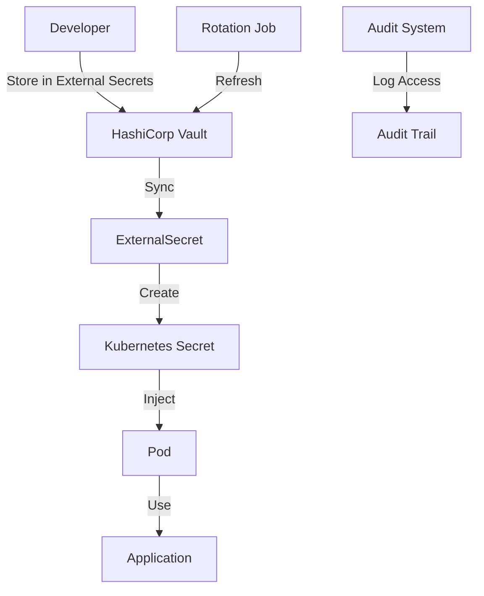

# Task: Kubernetes ConfigMaps & Secrets Management
**Issue:** #126 | **Category:** Kubernetes | **Priority:** High | **Effort:** 6h

---

## 📋 Objective

Implement secure configuration and secrets management for all microservices using Kubernetes ConfigMaps and Secrets.

---

## 📝 Description

Configure application settings and sensitive data management:
- ConfigMap creation for application configuration
- Secret management for credentials and API keys
- External secrets integration (Vault/AWS Secrets Manager)
- Configuration rotation and updates
- Secrets encryption at rest

---

## ✅ Acceptance Criteria

- [ ] ConfigMaps created for all services
- [ ] All sensitive data in Kubernetes Secrets
- [ ] External Secrets Operator integrated
- [ ] No hardcoded credentials in manifests
- [ ] Secrets encrypted at rest in etcd
- [ ] Configuration updates tested
- [ ] Secret rotation procedures implemented
- [ ] RBAC controls for ConfigMaps and Secrets
- [ ] Team trained on secret management
- [ ] Audit logging for secret access

---

## 🔧 Sub-Tasks

### 1. ConfigMap Design & Creation
- [ ] Identify all non-sensitive configuration
- [ ] Create backend service ConfigMap
- [ ] Create frontend service ConfigMap
- [ ] Create database ConfigMap
- [ ] Create cache ConfigMap
- [ ] Create logging ConfigMap
- [ ] Document ConfigMap schema

### 2. Application Environment Variables
- [ ] Define environment variable schema
- [ ] Create environment ConfigMaps
- [ ] Configure per-environment settings (dev/staging/prod)
- [ ] Document variable naming conventions
- [ ] Implement environment-specific overrides
- [ ] Test environment switching

### 3. Configuration Files Management
- [ ] Create NGINX config ConfigMap
- [ ] Create application.properties ConfigMap
- [ ] Create logging config ConfigMap
- [ ] Create monitoring config ConfigMap
- [ ] Mount ConfigMaps as files
- [ ] Test file-based configuration

### 4. Kubernetes Secrets Setup
- [ ] Create database credentials Secret
- [ ] Create API key Secret
- [ ] Create JWT signing key Secret
- [ ] Create SSL certificate Secret
- [ ] Create OAuth2 credentials Secret
- [ ] Document secret creation procedure

### 5. External Secrets Integration
- [ ] Set up External Secrets Operator
- [ ] Configure Vault backend
- [ ] Configure AWS Secrets Manager backend
- [ ] Create SecretStore resources
- [ ] Implement secret synchronization
- [ ] Test external secret updates

### 6. Secret Encryption
- [ ] Enable encryption at rest for etcd
- [ ] Configure encryption key management
- [ ] Set up key rotation schedule
- [ ] Document encryption procedures
- [ ] Test encryption verification
- [ ] Monitor encryption status

### 7. RBAC for Secrets
- [ ] Create roles for secret access
- [ ] Limit service account permissions
- [ ] Implement namespace isolation
- [ ] Document access control policies
- [ ] Test RBAC enforcement
- [ ] Create audit log tests

### 8. Configuration Rotation
- [ ] Design rotation strategy
- [ ] Implement graceful configuration reload
- [ ] Create ConfigMap rotation tests
- [ ] Implement secret rotation
- [ ] Test zero-downtime updates
- [ ] Document rollback procedures

### 9. Secret Distribution & Injection
- [ ] Configure pod environment injection
- [ ] Configure volume-based secret mounting
- [ ] Implement subPath projection
- [ ] Test secret injection timing
- [ ] Document injection mechanisms
- [ ] Create injection verification tests

### 10. Monitoring & Auditing
- [ ] Enable audit logging for secrets
- [ ] Monitor secret access patterns
- [ ] Alert on secret access anomalies
- [ ] Track secret rotation events
- [ ] Document audit procedures
- [ ] Create compliance reports

---

## 📚 Learning Resources

- **ConfigMaps:** https://kubernetes.io/docs/concepts/configuration/configmap/
- **Secrets:** https://kubernetes.io/docs/concepts/configuration/secret/
- **External Secrets:** https://external-secrets.io/
- **Encryption at Rest:** https://kubernetes.io/docs/tasks/administer-cluster/encrypt-data/
- **RBAC:** https://kubernetes.io/docs/reference/access-authn-authz/rbac/

---

## 💻 Code Example: ConfigMap & Secrets

```yaml
---
# Backend Service ConfigMap
apiVersion: v1
kind: ConfigMap
metadata:
  name: backend-config
  namespace: default
data:
  # Database configuration
  DB_HOST: "postgres-cluster.default.svc.cluster.local"
  DB_PORT: "5432"
  DB_NAME: "production_db"
  DB_POOL_SIZE: "20"
  
  # Redis configuration
  REDIS_HOST: "redis-cluster.default.svc.cluster.local"
  REDIS_PORT: "6379"
  REDIS_DB: "0"
  
  # Application settings
  NODE_ENV: "production"
  LOG_LEVEL: "info"
  API_PORT: "3000"
  METRICS_PORT: "9090"
  
  # Feature flags
  FEATURE_AUTH_ENABLED: "true"
  FEATURE_CACHING_ENABLED: "true"
  FEATURE_RATE_LIMITING_ENABLED: "true"
  
  # Time settings
  SESSION_TIMEOUT: "3600"
  TOKEN_EXPIRY: "86400"
  CACHE_TTL: "3600"

---
# Database Credentials Secret
apiVersion: v1
kind: Secret
metadata:
  name: backend-secret
  namespace: default
type: Opaque
stringData:
  DB_USER: "postgres"
  DB_PASSWORD: "your-secure-password-here"
  DB_REPLICA_PASSWORD: "your-replica-password-here"

---
# API Keys Secret
apiVersion: v1
kind: Secret
metadata:
  name: api-keys
  namespace: default
type: Opaque
stringData:
  JWT_SECRET: "your-jwt-secret-key"
  JWT_REFRESH_SECRET: "your-jwt-refresh-secret"
  OAUTH_CLIENT_ID: "your-oauth-client-id"
  OAUTH_CLIENT_SECRET: "your-oauth-client-secret"

---
# TLS Certificate Secret
apiVersion: v1
kind: Secret
metadata:
  name: tls-cert
  namespace: default
type: kubernetes.io/tls
data:
  tls.crt: LS0tLS1CRUdJTiBDRVJUSUZJQ0FURS0tLS0t...  # base64 encoded cert
  tls.key: LS0tLS1CRUdJTiBQUklWQVRFIEtFWS0tLS0t...  # base64 encoded key

---
# Deployment using ConfigMap and Secrets
apiVersion: apps/v1
kind: Deployment
metadata:
  name: backend-api
  namespace: default
spec:
  replicas: 2
  selector:
    matchLabels:
      app: backend-api
  template:
    metadata:
      labels:
        app: backend-api
    spec:
      containers:
      - name: backend-api
        image: backend-api:v1.0.0
        ports:
        - containerPort: 3000
        envFrom:
        # Load entire ConfigMap as environment variables
        - configMapRef:
            name: backend-config
        # Load entire Secret as environment variables
        - secretRef:
            name: backend-secret
        env:
        # Override specific values from ConfigMap
        - name: CUSTOM_LOG_LEVEL
          valueFrom:
            configMapKeyRef:
              name: backend-config
              key: LOG_LEVEL
        # Inject specific secret values
        - name: DB_PASSWORD
          valueFrom:
            secretKeyRef:
              name: backend-secret
              key: DB_PASSWORD
        volumeMounts:
        # Mount ConfigMap as files
        - name: app-config
          mountPath: /app/config
          readOnly: true
        # Mount Secret as files
        - name: tls-certs
          mountPath: /app/certs
          readOnly: true
      volumes:
      # ConfigMap volume
      - name: app-config
        configMap:
          name: backend-config
          items:
          - key: application.properties
            path: application.properties
      # Secret volume
      - name: tls-certs
        secret:
          secretName: tls-cert
          defaultMode: 0400
```

---

## 🔐 External Secrets Example

```yaml
---
# SecretStore for HashiCorp Vault
apiVersion: external-secrets.io/v1beta1
kind: SecretStore
metadata:
  name: vault-secretstore
  namespace: default
spec:
  provider:
    vault:
      server: "https://vault.example.com:8200"
      path: "secret"
      auth:
        kubernetes:
          mountPath: "kubernetes"
          role: "app-role"

---
# External Secret pulling from Vault
apiVersion: external-secrets.io/v1beta1
kind: ExternalSecret
metadata:
  name: vault-secret
  namespace: default
spec:
  refreshInterval: 1h
  secretStoreRef:
    name: vault-secretstore
    kind: SecretStore
  target:
    name: vault-synced-secret
    creationPolicy: Owner
  data:
  - secretKey: db-password
    remoteRef:
      key: database
      property: password
  - secretKey: api-key
    remoteRef:
      key: api-keys
      property: production-key
```

---

## 🔐 Configuration Injection Patterns

```yaml
# Pattern 1: Environment variables from ConfigMap
envFrom:
- configMapRef:
    name: backend-config

# Pattern 2: File mounting
volumeMounts:
- name: config
  mountPath: /etc/config
volumes:
- name: config
  configMap:
    name: backend-config

# Pattern 3: SubPath for individual files
volumeMounts:
- name: config
  mountPath: /etc/nginx/nginx.conf
  subPath: nginx.conf
volumes:
- name: config
  configMap:
    name: nginx-config
```

---

## 📊 Secret Management Flow



---

## 🔒 Security Considerations

- **Encryption at Rest:** Enable encryption for secrets in etcd
- **RBAC Controls:** Limit who can read/write secrets
- **Secret Rotation:** Implement automated rotation
- **Audit Logging:** Log all secret access
- **Least Privilege:** Service accounts only need required secrets
- **Backup Encryption:** Encrypt backup data
- **TLS for Transport:** Use TLS for all secret transmission

---

## ✨ Success Metrics

- Zero hardcoded credentials in code
- All secrets encrypted at rest
- Secret rotation < 1 minute
- No unauthorized secret access
- Team follows secret best practices
- Audit trail complete and accessible

---

## 📖 Related Tasks

- [Security Hardening](security-006.md) - Secret management
- [RBAC Configuration](k8s-010.md) - Access control
- [Monitoring](k8s-011.md) - Audit logging

---

**Created:** January 17, 2026 | **Last Updated:** January 17, 2026
