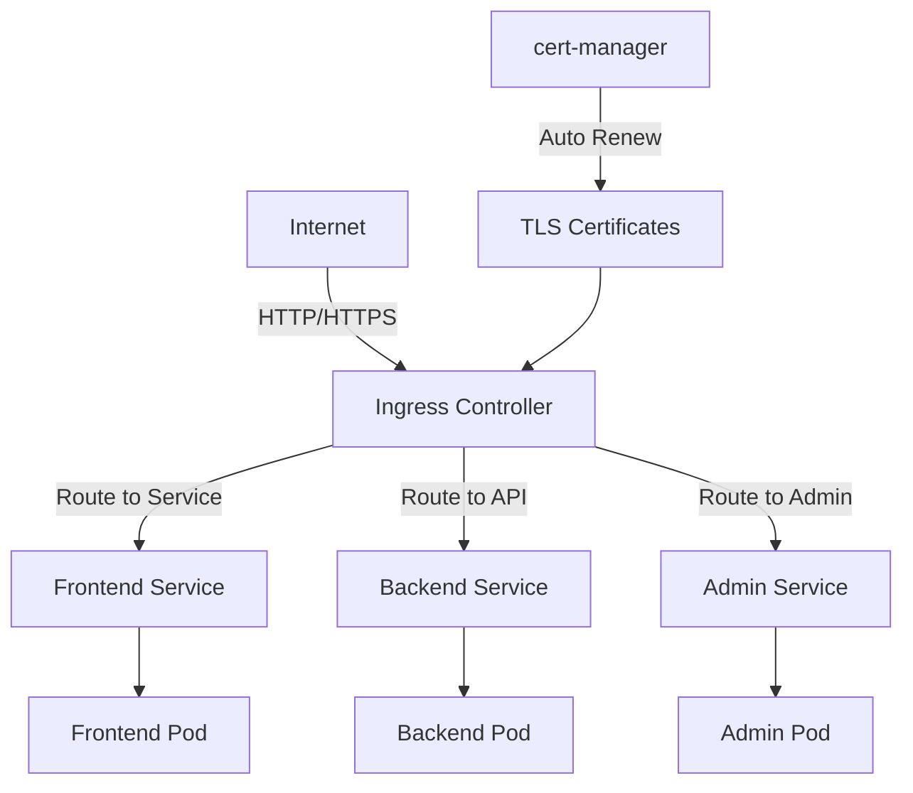

# Task: Kubernetes Ingress & API Gateway
**Issue:** #127 | **Category:** Kubernetes | **Priority:** High | **Effort:** 7h

---

## 📋 Objective

Configure Kubernetes Ingress for external traffic routing and implement API Gateway patterns for service exposure.

---

## 📝 Description

Set up external access to microservices through Ingress controllers:
- Ingress controller installation (NGINX)
- Ingress rules for service routing
- TLS/HTTPS certificate management
- API rate limiting and auth
- Path-based and host-based routing

---

## ✅ Acceptance Criteria

- [ ] Ingress controller installed and configured
- [ ] Ingress rules created for all public services
- [ ] TLS certificates provisioned and renewed
- [ ] Domain routing configured
- [ ] Rate limiting implemented
- [ ] Authentication enforced
- [ ] Load balancing working
- [ ] Monitoring and logging enabled
- [ ] Team trained on Ingress
- [ ] Failover tested

---

## 🔧 Sub-Tasks

### 1. Ingress Controller Installation
- [ ] Install NGINX Ingress Controller
- [ ] Configure controller replicas (2+)
- [ ] Set resource limits and requests
- [ ] Configure health checks
- [ ] Enable metrics exposure
- [ ] Document controller setup

### 2. Ingress Rules Configuration
- [ ] Create Ingress for frontend (example.com)
- [ ] Create Ingress for backend API (/api/*)
- [ ] Create Ingress for admin dashboard
- [ ] Create Ingress for monitoring UI
- [ ] Configure backend service references
- [ ] Test routing for all rules

### 3. TLS/HTTPS Setup
- [ ] Install cert-manager
- [ ] Configure Let's Encrypt issuer
- [ ] Create ClusterIssuer for certificates
- [ ] Configure automatic certificate renewal
- [ ] Test certificate provisioning
- [ ] Verify HTTPS connectivity

### 4. Domain Routing Configuration
- [ ] Configure example.com routing
- [ ] Configure api.example.com routing
- [ ] Configure admin.example.com routing
- [ ] Configure monitoring.example.com routing
- [ ] Set DNS A records
- [ ] Test domain resolution

### 5. Path-based Routing
- [ ] Configure /api/* routes
- [ ] Configure /admin/* routes
- [ ] Configure /health routes
- [ ] Test routing specificity
- [ ] Document routing precedence
- [ ] Create routing tests

### 6. Rate Limiting & Throttling
- [ ] Implement request rate limits
- [ ] Configure per-IP limits
- [ ] Configure per-user limits
- [ ] Set burst allowances
- [ ] Test rate limit enforcement
- [ ] Document rate limit policies

### 7. Authentication & Authorization
- [ ] Implement OAuth2 integration
- [ ] Configure JWT validation
- [ ] Set up RBAC for routes
- [ ] Implement API key validation
- [ ] Test auth enforcement
- [ ] Document auth flows

### 8. CORS Configuration
- [ ] Configure allowed origins
- [ ] Set allowed methods
- [ ] Configure allowed headers
- [ ] Implement preflight handling
- [ ] Test CORS requests
- [ ] Document CORS policies

### 9. Ingress Monitoring
- [ ] Configure request metrics
- [ ] Monitor response times
- [ ] Track error rates
- [ ] Monitor TLS certificate expiry
- [ ] Create alerting rules
- [ ] Build monitoring dashboards

### 10. High Availability & Failover
- [ ] Configure multiple Ingress replicas
- [ ] Test pod failover
- [ ] Configure pod disruption budgets
- [ ] Test node failure scenarios
- [ ] Document failover procedures
- [ ] Create failover tests

---

## 📚 Learning Resources

- **Kubernetes Ingress:** https://kubernetes.io/docs/concepts/services-networking/ingress/
- **NGINX Ingress Controller:** https://kubernetes.github.io/ingress-nginx/
- **cert-manager:** https://cert-manager.io/
- **Rate Limiting:** https://kubernetes.github.io/ingress-nginx/user-guide/nginx-configuration/annotations/#rate-limiting
- **OAuth2 Proxy:** https://oauth2-proxy.github.io/oauth2-proxy/

---

## 💻 Code Example: Ingress Configuration

```yaml
---
# Namespace for Ingress controller
apiVersion: v1
kind: Namespace
metadata:
  name: ingress-nginx

---
# NGINX Ingress Controller (Helm values)
apiVersion: v1
kind: ConfigMap
metadata:
  name: nginx-config
  namespace: ingress-nginx
data:
  use-forwarded-headers: "true"
  compute-full-forwarded-for: "true"
  use-proxy-protocol: "false"
  enable-modsecurity: "true"
  enable-owasp-core-rules: "true"

---
# ClusterIssuer for Let's Encrypt
apiVersion: cert-manager.io/v1
kind: ClusterIssuer
metadata:
  name: letsencrypt-prod
spec:
  acme:
    server: https://acme-v02.api.letsencrypt.org/directory
    email: admin@example.com
    privateKeySecretRef:
      name: letsencrypt-prod
    solvers:
    - http01:
        ingress:
          class: nginx

---
# Ingress for Frontend
apiVersion: networking.k8s.io/v1
kind: Ingress
metadata:
  name: frontend-ingress
  namespace: default
  annotations:
    cert-manager.io/cluster-issuer: letsencrypt-prod
    nginx.ingress.kubernetes.io/ssl-redirect: "true"
    nginx.ingress.kubernetes.io/force-ssl-redirect: "true"
    nginx.ingress.kubernetes.io/proxy-body-size: "50m"
spec:
  ingressClassName: nginx
  tls:
  - hosts:
    - example.com
    - www.example.com
    secretName: frontend-tls
  rules:
  - host: example.com
    http:
      paths:
      - path: /
        pathType: Prefix
        backend:
          service:
            name: frontend
            port:
              number: 80
  - host: www.example.com
    http:
      paths:
      - path: /
        pathType: Prefix
        backend:
          service:
            name: frontend
            port:
              number: 80

---
# Ingress for Backend API
apiVersion: networking.k8s.io/v1
kind: Ingress
metadata:
  name: backend-api-ingress
  namespace: default
  annotations:
    cert-manager.io/cluster-issuer: letsencrypt-prod
    nginx.ingress.kubernetes.io/ssl-redirect: "true"
    nginx.ingress.kubernetes.io/force-ssl-redirect: "true"
    # Rate limiting annotations
    nginx.ingress.kubernetes.io/limit-rps: "100"
    nginx.ingress.kubernetes.io/limit-connections: "10"
    # CORS configuration
    nginx.ingress.kubernetes.io/enable-cors: "true"
    nginx.ingress.kubernetes.io/cors-allow-origin: "*"
    nginx.ingress.kubernetes.io/cors-allow-credentials: "true"
    # Security headers
    nginx.ingress.kubernetes.io/configuration-snippet: |
      more_set_headers "X-Frame-Options: DENY";
      more_set_headers "X-Content-Type-Options: nosniff";
      more_set_headers "X-XSS-Protection: 1; mode=block";
      more_set_headers "Referrer-Policy: strict-origin-when-cross-origin";
spec:
  ingressClassName: nginx
  tls:
  - hosts:
    - api.example.com
    secretName: api-tls
  rules:
  - host: api.example.com
    http:
      paths:
      - path: /api
        pathType: Prefix
        backend:
          service:
            name: backend-api
            port:
              number: 80
      - path: /health
        pathType: Prefix
        backend:
          service:
            name: backend-api
            port:
              number: 80
      - path: /metrics
        pathType: Prefix
        backend:
          service:
            name: backend-api
            port:
              number: 9090

---
# Ingress for Admin Dashboard
apiVersion: networking.k8s.io/v1
kind: Ingress
metadata:
  name: admin-ingress
  namespace: default
  annotations:
    cert-manager.io/cluster-issuer: letsencrypt-prod
    nginx.ingress.kubernetes.io/ssl-redirect: "true"
    # Require authentication
    nginx.ingress.kubernetes.io/auth-type: "basic"
    nginx.ingress.kubernetes.io/auth-secret: "admin-auth"
    nginx.ingress.kubernetes.io/auth-realm: "Admin Area"
spec:
  ingressClassName: nginx
  tls:
  - hosts:
    - admin.example.com
    secretName: admin-tls
  rules:
  - host: admin.example.com
    http:
      paths:
      - path: /
        pathType: Prefix
        backend:
          service:
            name: admin-dashboard
            port:
              number: 3000

---
# Basic Auth Secret for Admin
apiVersion: v1
kind: Secret
metadata:
  name: admin-auth
  namespace: default
type: Opaque
stringData:
  # htpasswd -c auth admin (password: secure-password)
  auth: |
    admin:$apr1$MKyT5r2u$Gn8cflxK/8rRWaR7xI8Tz/
```

---

## 🔐 Rate Limiting Configuration

```yaml
apiVersion: networking.k8s.io/v1
kind: Ingress
metadata:
  name: api-ratelimit
  namespace: default
  annotations:
    # Global rate limit
    nginx.ingress.kubernetes.io/limit-rps: "100"
    # Per-connection limit
    nginx.ingress.kubernetes.io/limit-connections: "10"
    # Per-IP rate limit
    nginx.ingress.kubernetes.io/limit-rate: "50k"
    # Custom rate limit rule
    nginx.ingress.kubernetes.io/configuration-snippet: |
      limit_req_zone $binary_remote_addr zone=api_limit:10m rate=10r/s;
      limit_req zone=api_limit burst=20 nodelay;
spec:
  rules:
  - host: api.example.com
    http:
      paths:
      - path: /api
        pathType: Prefix
        backend:
          service:
            name: backend-api
            port:
              number: 80
```

---

## 📊 Ingress Architecture



---

## 🔒 Security Considerations

- **TLS Encryption:** All external traffic encrypted
- **Rate Limiting:** Protect against DDoS and abuse
- **Authentication:** Enforce auth on sensitive endpoints
- **CORS:** Whitelist allowed origins
- **Security Headers:** Set Content-Security-Policy, X-Frame-Options, etc.
- **WAF:** Enable ModSecurity for attack prevention
- **Certificate Management:** Automatic renewal via cert-manager

---

## ✨ Success Metrics

- All services accessible via domain names
- HTTPS enforced on all endpoints
- Certificate renewal automated
- Rate limiting preventing abuse
- Response times < 200ms
- Zero certificate expiry incidents
- Team proficient with Ingress management

---

## 📖 Related Tasks

- [Service Discovery](k8s-003.md) - Internal routing
- [Security Hardening](security-001.md) - TLS setup
- [Monitoring](k8s-011.md) - Ingress metrics

---

**Created:** January 17, 2026 | **Last Updated:** January 17, 2026
