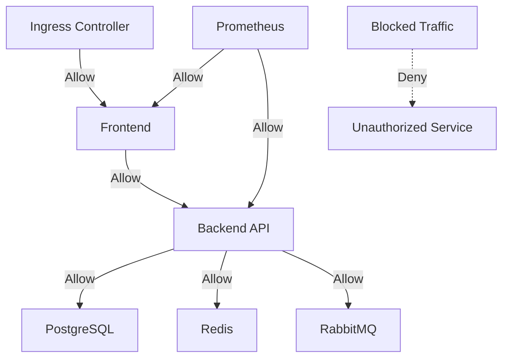

# Task: Kubernetes Network Policies & Security
**Issue:** #128 | **Category:** Kubernetes | **Priority:** High | **Effort:** 8h

---

## 📋 Objective

Implement network policies and security measures for inter-pod communication and cluster isolation.

---

## 📝 Description

Configure zero-trust networking with Kubernetes network policies:
- Default deny policies
- Allow specific pod-to-pod communication
- Namespace isolation
- Egress controls
- Network monitoring and troubleshooting

---

## ✅ Acceptance Criteria

- [ ] Default deny policies implemented
- [ ] Pod-to-pod communication rules defined
- [ ] Namespace isolation enforced
- [ ] Egress rules configured
- [ ] Inter-service communication verified
- [ ] Policy testing completed
- [ ] Network monitoring enabled
- [ ] Troubleshooting runbooks created
- [ ] Team trained on network policies
- [ ] Compliance validation passed

---

## 🔧 Sub-Tasks

### 1. Network Policy Fundamentals
- [ ] Understand network policy types
- [ ] Design policy architecture
- [ ] Identify communication patterns
- [ ] Document policy requirements
- [ ] Create policy naming convention
- [ ] Design policy testing strategy

### 2. Default Deny Policies
- [ ] Create namespace isolation policy
- [ ] Create default deny ingress policy
- [ ] Create default deny egress policy
- [ ] Test policy application
- [ ] Document deny behavior
- [ ] Create policy testing scenarios

### 3. Backend Service Policies
- [ ] Allow frontend to backend communication
- [ ] Allow backend to database access
- [ ] Allow backend to cache access
- [ ] Allow backend to queue access
- [ ] Allow metrics scraping
- [ ] Test backend connectivity

### 4. Frontend Service Policies
- [ ] Allow external traffic (Ingress)
- [ ] Allow frontend to backend communication
- [ ] Restrict internal traffic
- [ ] Allow metrics exposure
- [ ] Test frontend connectivity
- [ ] Document frontend policies

### 5. Database Service Policies
- [ ] Allow backend access to PostgreSQL
- [ ] Allow backup container access
- [ ] Restrict other access
- [ ] Allow health checks
- [ ] Allow replication traffic
- [ ] Test database connectivity

### 6. Cache Service Policies
- [ ] Allow backend access to Redis
- [ ] Allow cache invalidation access
- [ ] Restrict unauthorized access
- [ ] Allow metrics exposure
- [ ] Allow replication traffic
- [ ] Test cache connectivity

### 7. Monitoring & Logging Policies
- [ ] Allow metric collection
- [ ] Allow log shipping
- [ ] Allow trace collection
- [ ] Allow monitoring alerting
- [ ] Restrict monitoring access
- [ ] Test monitoring paths

### 8. External API Access
- [ ] Allow egress to external APIs
- [ ] Restrict egress destinations
- [ ] Allow DNS resolution
- [ ] Configure allowed hosts
- [ ] Test external connectivity
- [ ] Document API access rules

### 9. Policy Troubleshooting
- [ ] Enable network policy logging
- [ ] Configure logging levels
- [ ] Analyze policy violations
- [ ] Create troubleshooting tools
- [ ] Document debugging procedures
- [ ] Create troubleshooting runbooks

### 10. Policy Compliance & Auditing
- [ ] Audit active policies
- [ ] Verify policy effectiveness
- [ ] Track policy changes
- [ ] Document compliance status
- [ ] Create audit reports
- [ ] Schedule policy reviews

---

## 📚 Learning Resources

- **Network Policies:** https://kubernetes.io/docs/concepts/services-networking/network-policies/
- **Calico:** https://www.projectcalico.org/
- **Cilium:** https://cilium.io/
- **Policy Testing:** https://cilium.io/blog/2021/04/13/connectivity-testing/
- **Policy Best Practices:** https://kubernetes.io/docs/tasks/administer-cluster/securing-a-cluster/#network-policies

---

## 💻 Code Example: Network Policies

```yaml
---
# Namespace for network policy testing
apiVersion: v1
kind: Namespace
metadata:
  name: app
  labels:
    name: app

---
# Default deny all ingress traffic in namespace
apiVersion: networking.k8s.io/v1
kind: NetworkPolicy
metadata:
  name: default-deny-ingress
  namespace: app
spec:
  podSelector: {}
  policyTypes:
  - Ingress

---
# Default deny all egress traffic in namespace
apiVersion: networking.k8s.io/v1
kind: NetworkPolicy
metadata:
  name: default-deny-egress
  namespace: app
spec:
  podSelector: {}
  policyTypes:
  - Egress
  # Allow DNS for all pods
  - to:
    - namespaceSelector: {}
      podSelector:
        matchLabels:
          k8s-app: kube-dns
    ports:
    - protocol: UDP
      port: 53

---
# Allow frontend to accept external traffic
apiVersion: networking.k8s.io/v1
kind: NetworkPolicy
metadata:
  name: allow-frontend-ingress
  namespace: app
spec:
  podSelector:
    matchLabels:
      app: frontend
  policyTypes:
  - Ingress
  ingress:
  - from:
    - namespaceSelector:
        matchLabels:
          name: ingress-nginx
    ports:
    - protocol: TCP
      port: 3000

---
# Allow frontend to communicate with backend
apiVersion: networking.k8s.io/v1
kind: NetworkPolicy
metadata:
  name: allow-frontend-to-backend
  namespace: app
spec:
  podSelector:
    matchLabels:
      app: backend-api
  policyTypes:
  - Ingress
  ingress:
  - from:
    - podSelector:
        matchLabels:
          app: frontend
    ports:
    - protocol: TCP
      port: 3000

---
# Allow backend to communicate with PostgreSQL
apiVersion: networking.k8s.io/v1
kind: NetworkPolicy
metadata:
  name: allow-backend-to-database
  namespace: app
spec:
  podSelector:
    matchLabels:
      app: postgres
  policyTypes:
  - Ingress
  ingress:
  - from:
    - podSelector:
        matchLabels:
          app: backend-api
    ports:
    - protocol: TCP
      port: 5432
  # Allow backup container access
  - from:
    - podSelector:
        matchLabels:
          app: backup-agent
    ports:
    - protocol: TCP
      port: 5432

---
# Allow backend to communicate with Redis
apiVersion: networking.k8s.io/v1
kind: NetworkPolicy
metadata:
  name: allow-backend-to-cache
  namespace: app
spec:
  podSelector:
    matchLabels:
      app: redis
  policyTypes:
  - Ingress
  ingress:
  - from:
    - podSelector:
        matchLabels:
          app: backend-api
    ports:
    - protocol: TCP
      port: 6379

---
# Allow backend to communicate with RabbitMQ
apiVersion: networking.k8s.io/v1
kind: NetworkPolicy
metadata:
  name: allow-backend-to-queue
  namespace: app
spec:
  podSelector:
    matchLabels:
      app: rabbitmq
  policyTypes:
  - Ingress
  ingress:
  - from:
    - podSelector:
        matchLabels:
          app: backend-api
    - podSelector:
        matchLabels:
          app: worker
    ports:
    - protocol: TCP
      port: 5672
    - protocol: TCP
      port: 15672

---
# Allow Prometheus to scrape metrics
apiVersion: networking.k8s.io/v1
kind: NetworkPolicy
metadata:
  name: allow-metrics-scraping
  namespace: app
spec:
  podSelector: {}
  policyTypes:
  - Ingress
  ingress:
  - from:
    - namespaceSelector:
        matchLabels:
          name: monitoring
      podSelector:
        matchLabels:
          app: prometheus
    ports:
    - protocol: TCP
      port: 9090

---
# Allow backend egress to external APIs
apiVersion: networking.k8s.io/v1
kind: NetworkPolicy
metadata:
  name: allow-backend-external-apis
  namespace: app
spec:
  podSelector:
    matchLabels:
      app: backend-api
  policyTypes:
  - Egress
  egress:
  # Allow DNS
  - to:
    - namespaceSelector: {}
      podSelector:
        matchLabels:
          k8s-app: kube-dns
    ports:
    - protocol: UDP
      port: 53
  # Allow HTTPS to external APIs
  - to:
    - podSelector: {}
    ports:
    - protocol: TCP
      port: 443
  # Allow HTTP to specific domains (requires CNI support)
  - to:
    - ipBlock:
        cidr: 0.0.0.0/0
        except:
        - 169.254.169.254/32  # AWS metadata service
    ports:
    - protocol: TCP
      port: 80
    - protocol: TCP
      port: 443
```

---

## 📊 Network Policy Architecture



---

## 🔒 Security Considerations

- **Zero Trust:** Default deny all, explicitly allow necessary traffic
- **Least Privilege:** Only allow required ports and protocols
- **Namespace Isolation:** Separate policies per namespace
- **Service-to-Service:** Implement mTLS for additional security
- **DNS Security:** Protect DNS resolution
- **Monitoring:** Log and alert on policy violations
- **Testing:** Regular policy testing and updates

---

## 🔧 Troubleshooting Tools

```bash
# Check applied policies
kubectl get networkpolicies -n app

# Describe policy
kubectl describe networkpolicy allow-backend-to-database -n app

# Enable policy logging (requires Calico)
kubectl annotate networkpolicy allow-backend-to-database \
  -n app \
  projectcalico.org/policy-action=log

# Test connectivity between pods
kubectl run test-pod --image=busybox -n app
kubectl exec -it test-pod -n app -- sh
# Inside pod: wget -O- http://backend-api:3000/health
```

---

## ✨ Success Metrics

- All traffic flows explicitly allowed
- No unexpected inter-pod communication
- Network policy violations < 0.1% of traffic
- Policy enforcement latency < 1ms
- Troubleshooting time reduced 50%
- Compliance audit passing

---

## 📖 Related Tasks

- [K8s Deployment](k8s-002.md) - Pod deployment
- [Service Discovery](k8s-003.md) - Service communication
- [Security Hardening](security-007.md) - Additional security

---

**Created:** January 17, 2026 | **Last Updated:** January 17, 2026
