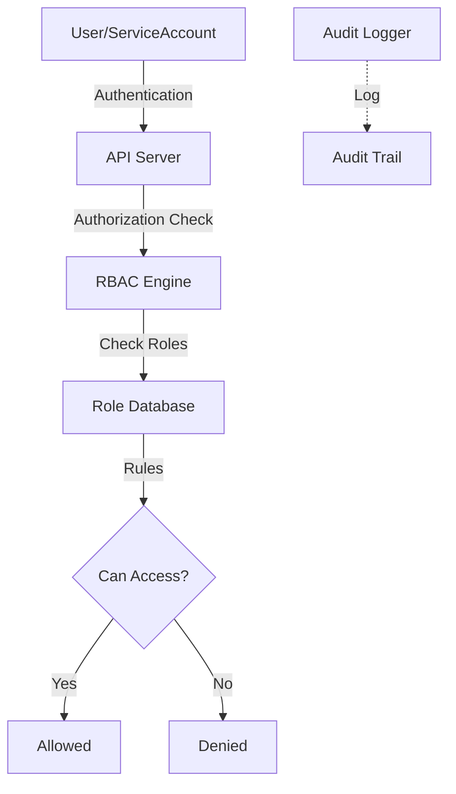

# Task: Kubernetes RBAC & Security Hardening
**Issue:** #131 | **Category:** Kubernetes | **Priority:** Critical | **Effort:** 8h

---

## 📋 Objective

Implement role-based access control and comprehensive security hardening for Kubernetes cluster.

---

## 📝 Description

Secure cluster with RBAC and security policies:
- Service account creation and management
- Role and ClusterRole definitions
- RoleBinding and ClusterRoleBinding
- Pod Security Standards
- API server hardening
- Audit logging

---

## ✅ Acceptance Criteria

- [ ] Service accounts created for all services
- [ ] RBAC roles defined with least privilege
- [ ] Pod Security Standards enforced
- [ ] API server audit logging enabled
- [ ] Network policies deployed
- [ ] Secrets encrypted at rest
- [ ] RBAC access verified
- [ ] Security audit completed
- [ ] Team trained on security
- [ ] Compliance verified

---

## 🔧 Sub-Tasks

### 1. Service Account Creation
- [ ] Create backend-api service account
- [ ] Create frontend service account
- [ ] Create database service account
- [ ] Create monitoring service account
- [ ] Document service account purposes
- [ ] Test service account tokens

### 2. RBAC Role Design
- [ ] Design backend-api role (API, cache, DB access)
- [ ] Design frontend role (read-only, metrics)
- [ ] Design database role (persistent volume access)
- [ ] Design monitoring role (metric reading)
- [ ] Design admin role (cluster management)
- [ ] Document role permissions

### 3. Role Implementation
- [ ] Create backend-api role
- [ ] Create frontend role
- [ ] Create database role
- [ ] Create monitoring role
- [ ] Create custom admin roles
- [ ] Test role access

### 4. RoleBinding Configuration
- [ ] Bind backend-api role to service account
- [ ] Bind frontend role to service account
- [ ] Bind database role to service account
- [ ] Bind monitoring role to service account
- [ ] Create namespace-specific bindings
- [ ] Test binding enforcement

### 5. ClusterRole for Cross-namespace
- [ ] Create cluster-wide read-only role
- [ ] Create cluster-wide monitoring role
- [ ] Create cluster-wide admin role
- [ ] Bind to appropriate service accounts
- [ ] Document cluster roles
- [ ] Test cluster role access

### 6. Pod Security Standards
- [ ] Enable PSS for namespace
- [ ] Implement restricted policy
- [ ] Define baseline policy
- [ ] Create policy violations audit
- [ ] Document security standards
- [ ] Test policy enforcement

### 7. API Server Hardening
- [ ] Disable insecure bind address
- [ ] Enable HTTPS only
- [ ] Configure audit logging
- [ ] Set up webhook authentication
- [ ] Limit API server exposure
- [ ] Document API security

### 8. Audit Logging Configuration
- [ ] Enable API audit logging
- [ ] Configure audit policy
- [ ] Set log retention
- [ ] Configure log forwarding
- [ ] Create audit dashboards
- [ ] Monitor for anomalies

### 9. Secrets Security
- [ ] Enable encryption at rest
- [ ] Configure encryption key rotation
- [ ] Implement secret backup encryption
- [ ] Audit secret access
- [ ] Document secret handling
- [ ] Test encryption

### 10. Security Compliance & Testing
- [ ] Run security audit tools
- [ ] Check RBAC rules with kubectl
- [ ] Test unauthorized access (should fail)
- [ ] Verify encryption status
- [ ] Review audit logs
- [ ] Create compliance report

---

## 📚 Learning Resources

- **RBAC Authorization:** https://kubernetes.io/docs/reference/access-authn-authz/rbac/
- **Pod Security Standards:** https://kubernetes.io/docs/concepts/security/pod-security-standards/
- **API Audit Logging:** https://kubernetes.io/docs/tasks/debug-application-cluster/audit/
- **Kubelet Security:** https://kubernetes.io/docs/reference/command-line-tools-reference/kubelet/
- **Security Best Practices:** https://kubernetes.io/docs/concepts/security/

---

## 💻 Code Example: RBAC Configuration

```yaml
---
# Backend API Service Account
apiVersion: v1
kind: ServiceAccount
metadata:
  name: backend-api
  namespace: default

---
# Backend API Role
apiVersion: rbac.authorization.k8s.io/v1
kind: Role
metadata:
  name: backend-api-role
  namespace: default
rules:
# Pod management
- apiGroups: [""]
  resources: ["pods"]
  verbs: ["get", "list", "watch"]
# Secrets access (database credentials, API keys)
- apiGroups: [""]
  resources: ["secrets"]
  verbs: ["get"]
  resourceNames:
  - "backend-secret"
  - "api-keys"
# ConfigMaps access
- apiGroups: [""]
  resources: ["configmaps"]
  verbs: ["get", "list", "watch"]
  resourceNames:
  - "backend-config"
# Services discovery
- apiGroups: [""]
  resources: ["services", "endpoints"]
  verbs: ["get", "list", "watch"]

---
# Backend API RoleBinding
apiVersion: rbac.authorization.k8s.io/v1
kind: RoleBinding
metadata:
  name: backend-api-rolebinding
  namespace: default
roleRef:
  apiGroup: rbac.authorization.k8s.io
  kind: Role
  name: backend-api-role
subjects:
- kind: ServiceAccount
  name: backend-api
  namespace: default

---
# Frontend Service Account
apiVersion: v1
kind: ServiceAccount
metadata:
  name: frontend
  namespace: default

---
# Frontend Role (read-only)
apiVersion: rbac.authorization.k8s.io/v1
kind: Role
metadata:
  name: frontend-role
  namespace: default
rules:
# Read-only access to pods
- apiGroups: [""]
  resources: ["pods"]
  verbs: ["get", "list"]
# Read-only access to services
- apiGroups: [""]
  resources: ["services"]
  verbs: ["get", "list"]
# ConfigMaps access
- apiGroups: [""]
  resources: ["configmaps"]
  verbs: ["get"]
  resourceNames:
  - "frontend-config"

---
# Frontend RoleBinding
apiVersion: rbac.authorization.k8s.io/v1
kind: RoleBinding
metadata:
  name: frontend-rolebinding
  namespace: default
roleRef:
  apiGroup: rbac.authorization.k8s.io
  kind: Role
  name: frontend-role
subjects:
- kind: ServiceAccount
  name: frontend
  namespace: default

---
# Monitoring ClusterRole
apiVersion: rbac.authorization.k8s.io/v1
kind: ClusterRole
metadata:
  name: monitoring-role
rules:
# Node metrics
- apiGroups: [""]
  resources: ["nodes", "nodes/proxy"]
  verbs: ["get", "list", "watch"]
# Pod metrics
- apiGroups: [""]
  resources: ["pods"]
  verbs: ["get", "list", "watch"]
# Endpoints discovery
- apiGroups: [""]
  resources: ["endpoints"]
  verbs: ["get", "list", "watch"]
# Custom Metrics
- apiGroups: ["custom.metrics.k8s.io"]
  resources: ["*"]
  verbs: ["get", "list"]

---
# Monitoring ClusterRoleBinding
apiVersion: rbac.authorization.k8s.io/v1
kind: ClusterRoleBinding
metadata:
  name: monitoring-rolebinding
roleRef:
  apiGroup: rbac.authorization.k8s.io
  kind: ClusterRole
  name: monitoring-role
subjects:
- kind: ServiceAccount
  name: prometheus
  namespace: monitoring

---
# Pod Security Policy
apiVersion: policy/v1beta1
kind: PodSecurityPolicy
metadata:
  name: restricted
spec:
  privileged: false
  allowPrivilegeEscalation: false
  requiredDropCapabilities:
  - ALL
  volumes:
  - 'configMap'
  - 'emptyDir'
  - 'projected'
  - 'secret'
  - 'downwardAPI'
  - 'persistentVolumeClaim'
  hostNetwork: false
  hostIPC: false
  hostPID: false
  runAsUser:
    rule: 'MustRunAsNonRoot'
  seLinux:
    rule: 'MustRunAs'
    seLinuxOptions:
      level: "s0:c123,c456"
  supplementalGroups:
    rule: 'RunAsAny'
  fsGroup:
    rule: 'RunAsAny'
  readOnlyRootFilesystem: false
```

---

## 🔐 Audit Policy Configuration

```yaml
apiVersion: audit.k8s.io/v1
kind: Policy
rules:
# Log all requests at RequestResponse level
- level: RequestResponse
  omitStages:
  - RequestReceived
  resources:
  - group: ""
    resources: ["secrets", "configmaps"]
  namespaces: ["default"]

# Log pod exec at RequestResponse level
- level: RequestResponse
  verbs: ["create"]
  resources:
  - group: ""
    resources: ["pods/exec"]

# Log all pod changes
- level: Metadata
  resources:
  - group: ""
    resources: ["pods"]
  verbs: ["create", "update", "patch", "delete"]

# Log RBAC changes
- level: Metadata
  resources:
  - group: rbac.authorization.k8s.io
    resources: ["*"]
  verbs: ["create", "update", "patch", "delete"]

# Catch all - log at Metadata level
- level: Metadata
```

---

## 🔒 Security Testing Commands

```bash
#!/bin/bash
# Test RBAC enforcement

# Create test pod with frontend service account
kubectl run test-frontend \
  --serviceaccount=frontend \
  --image=busybox:1.35 \
  --overrides='{"spec":{"serviceAccount":"frontend"}}'

# Try to access restricted secret (should fail)
kubectl exec -it test-frontend -- sh
# Inside pod:
# $ cat /run/secrets/kubernetes.io/serviceaccount/token
# (token for frontend SA)

# Try to read backend-secret (should fail for frontend)
# kubectl get secret backend-secret -o yaml
# Error: secrets "backend-secret" is forbidden

# Verify backend can access its secrets
kubectl run test-backend \
  --serviceaccount=backend-api \
  --image=busybox:1.35

# Check which secrets backend-api can access
kubectl auth can-i get secrets --as=system:serviceaccount:default:backend-api
# Yes

# Check which secrets frontend can access
kubectl auth can-i get secrets --as=system:serviceaccount:default:frontend
# No
```

---

## 📊 RBAC Architecture



---

## ✨ Success Metrics

- All service accounts have minimal required permissions
- No wildcards (*) in role definitions
- RBAC violations < 0.1% of requests
- Audit log retention > 30 days
- Team can implement new RBAC rules
- Security audit score > 95%

---

## 📖 Related Tasks

- [Network Policies](k8s-007.md) - Network security
- [Secrets Management](k8s-005.md) - Secret handling
- [Monitoring](k8s-008.md) - Audit logging

---

**Created:** January 17, 2026 | **Last Updated:** January 17, 2026
