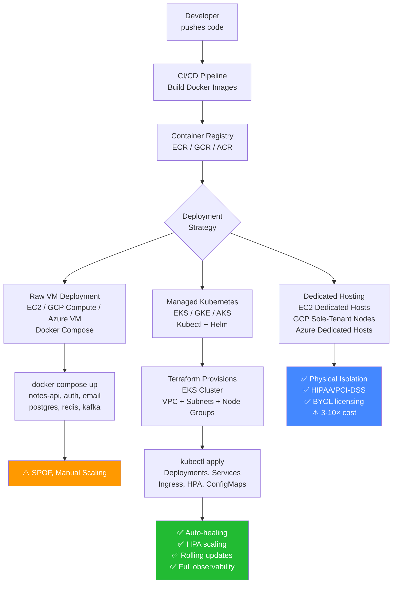

# Task: Kubernetes - Deploy Microservices to Cloud (EC2, EKS, GCP, Azure)

**Related Issue:** [#167](https://github.com/FoushWare/request-journey-client-to-server/issues/167)  
**Category:** Kubernetes / Cloud Deployment  
**Prerequisites:** task-001 through task-012 (Kubernetes basics → rolling updates → comprehensive coverage), tasks/microservices/ (all microservice tasks), tasks/aws/ (AWS fundamentals)  
**Estimated Time:** 5–7 hours  
**Languages:** Bash, YAML, HCL (Terraform)  
**Notes App Context:** Take everything built so far — Notes API, Auth Service, Email Service, CQRS/Event Sourcing write/read sides, observability stack — and deploy it to a real cloud environment. Compare a raw EC2/VM deployment to a managed Kubernetes cluster (EKS), and understand when dedicated single-tenant hosting is required.

---

## Learning Objectives

By the end of this task, you will be able to:

- Describe the VM instance types available in AWS, GCP, and Azure and when to choose each
- Explain the difference between multi-tenant VMs and dedicated/sole-tenant hosts
- Deploy the Notes App microservices to an EC2 instance using Docker Compose
- Provision an EKS cluster with Terraform and deploy all services via `kubectl`
- Understand when managed Kubernetes (EKS/GKE/AKS) is preferable over raw VMs
- Understand compliance-driven use cases for dedicated/sole-tenant hosting
- Compare cost, isolation, and operational complexity across deployment strategies

---

## Theory Section

### 1. Cloud VM Families

Every cloud provider offers a spectrum of virtual machine types optimized for different workloads:

| Family | AWS (EC2) | GCP (Compute Engine) | Azure VMs | Best For |
|--------|-----------|---------------------|-----------|----------|
| General Purpose | m7g, t3, m6i | N2, E2 | D-series | Most microservices |
| Compute Optimized | c7g, c6i | C2 | F-series | CPU-intensive: encoding, gaming |
| Memory Optimized | r7g, x2i | M3 | E-series | In-memory DBs, analytics |
| Storage Optimized | i4i, d3 | Z3 | L-series | High IOPS storage workloads |
| GPU | p5, g5 | A3 | N-series | ML inference, video rendering |
| HPC | hpc7g | H3 | HB-series | Scientific simulation |

**For the Notes App**: General Purpose instances (t3.medium on AWS / e2-medium on GCP / D2s on Azure) are sufficient.

### 2. Multi-Tenant vs. Dedicated Hosting

```
Multi-Tenant VM (default):
┌──────────────────────────────────────────────────┐
│            Physical Host (shared)                │
│  ┌────────┐  ┌────────┐  ┌────────┐  ┌────────┐ │
│  │ VM: A  │  │ VM: B  │  │ VM: C  │  │ VM: D  │ │
│  │(your   │  │(other  │  │(other  │  │(other  │ │
│  │ app)   │  │ tenant)│  │ tenant)│  │ tenant)│ │
│  └────────┘  └────────┘  └────────┘  └────────┘ │
└──────────────────────────────────────────────────┘

Dedicated Host / Sole-Tenant Node:
┌──────────────────────────────────────────────────┐
│          Physical Host (your exclusive use)      │
│  ┌────────┐  ┌────────┐  ┌────────┐             │
│  │ VM: A  │  │ VM: B  │  │ VM: C  │  (empty)    │
│  │(your   │  │(your   │  │(your   │             │
│  │ svc 1) │  │ svc 2) │  │ svc 3) │             │
│  └────────┘  └────────┘  └────────┘             │
└──────────────────────────────────────────────────┘
```

**When you need dedicated hosting:**
- HIPAA / PCI-DSS: regulatory requirement for physical isolation
- BYOL: Windows Server or SQL Server licensing tied to physical cores
- Noisy-neighbor risk: latency-sensitive financial or real-time workloads
- Workload isolation policy: data never co-located with other tenants

### 3. Deployment Strategies for Microservices

| Strategy | Description | Pros | Cons |
|----------|------------|------|------|
| **Raw VM + Docker Compose** | Each service runs as a Docker container on a single VM | Simple, fast to set up | Single point of failure, manual scaling |
| **Managed Kubernetes (EKS/GKE/AKS)** | Cloud runs the control plane; you manage worker nodes | Auto-healing, rolling updates, HPA, load balancing | More complex initial setup |
| **Serverless (Fargate/Cloud Run)** | No servers to manage; pay per request | Zero ops | Cold starts, vendor lock-in, not great for stateful |
| **Dedicated Hosts** | Compliance-grade physical isolation | Compliance, BYOL | 3–10× more expensive than shared VMs |

**Recommended path for Notes App**: EKS (or GKE/AKS) with Terraform-provisioned cluster.

---

## Diagram



---

## Step-by-Step Instructions

### Option A: Raw VM Deployment (EC2 + Docker Compose)

#### Step 1: Launch an EC2 Instance

```bash
# Using AWS CLI
aws ec2 run-instances \
  --image-id ami-0c55b159cbfafe1f0 \
  --instance-type t3.medium \
  --key-name my-keypair \
  --security-group-ids sg-12345678 \
  --subnet-id subnet-12345678 \
  --tag-specifications 'ResourceType=instance,Tags=[{Key=Name,Value=notes-app}]'
```

#### Step 2: Install Docker on the EC2 Instance

```bash
ssh -i my-keypair.pem ec2-user@<public-ip>

sudo yum update -y
sudo yum install docker -y
sudo service docker start
sudo usermod -a -G docker ec2-user

# Install Docker Compose
sudo curl -L "https://github.com/docker/compose/releases/latest/download/docker-compose-linux-x86_64" \
  -o /usr/local/bin/docker-compose
sudo chmod +x /usr/local/bin/docker-compose
```

#### Step 3: Deploy with Docker Compose

```bash
# Pull docker-compose.yml from your repo or copy it up
scp -i my-keypair.pem docker-compose.prod.yml ec2-user@<public-ip>:~/

# On the instance:
docker-compose -f docker-compose.prod.yml up -d

# Verify all services running:
docker-compose -f docker-compose.prod.yml ps
```

---

### Option B: Managed Kubernetes on EKS (Recommended)

#### Step 1: Provision EKS with Terraform

```hcl
# terraform/eks.tf  (uses existing automation/terraform/modules/eks/)
module "eks" {
  source          = "./modules/eks"
  cluster_name    = "notes-app-cluster"
  cluster_version = "1.29"
  vpc_id          = module.vpc.vpc_id
  subnet_ids      = module.vpc.private_subnets

  node_groups = {
    general = {
      instance_types = ["t3.medium"]
      min_size       = 2
      max_size       = 6
      desired_size   = 3
    }
  }
}
```

```bash
cd automation/terraform
terraform init
terraform plan -out=tfplan
terraform apply tfplan
```

#### Step 2: Configure kubectl

```bash
aws eks update-kubeconfig --region us-east-1 --name notes-app-cluster
kubectl get nodes   # verify 3 nodes Ready
```

#### Step 3: Push Images to ECR

```bash
# Authenticate Docker to ECR
aws ecr get-login-password --region us-east-1 | \
  docker login --username AWS --password-stdin <account-id>.dkr.ecr.us-east-1.amazonaws.com

# Build and push each service
docker build -t notes-api ./services/notes-api
docker tag notes-api:latest <account-id>.dkr.ecr.us-east-1.amazonaws.com/notes-api:v1.0
docker push <account-id>.dkr.ecr.us-east-1.amazonaws.com/notes-api:v1.0
```

#### Step 4: Deploy All Services to EKS

```bash
# Apply all Kubernetes manifests from previous tasks
kubectl apply -f k8s/namespaces/
kubectl apply -f k8s/configmaps/
kubectl apply -f k8s/secrets/
kubectl apply -f k8s/deployments/
kubectl apply -f k8s/services/
kubectl apply -f k8s/ingress/
kubectl apply -f k8s/hpa/

# Verify
kubectl get pods -n notes-app
kubectl get svc -n notes-app
kubectl get ingress -n notes-app
```

#### Step 5: Verify the Deployment

```bash
# Check all pods are Running
kubectl get pods -n notes-app -w

# Check the ingress endpoint
kubectl get ingress notes-api -n notes-app

# Test the API
curl https://notes-app.yourdomain.com/health
curl https://notes-app.yourdomain.com/api/notes
```

---

### Option C: GCP (GKE)

```bash
# Create GKE cluster
gcloud container clusters create notes-app-cluster \
  --zone us-central1-a \
  --num-nodes 3 \
  --machine-type e2-medium \
  --enable-autoscaling --min-nodes 2 --max-nodes 6

# Get credentials
gcloud container clusters get-credentials notes-app-cluster --zone us-central1-a

# Push to GCR
docker tag notes-api gcr.io/<project-id>/notes-api:v1.0
docker push gcr.io/<project-id>/notes-api:v1.0

# Deploy
kubectl apply -f k8s/
```

---

### Option D: Azure (AKS)

```bash
# Create AKS cluster
az aks create \
  --resource-group notes-app-rg \
  --name notes-app-cluster \
  --node-count 3 \
  --node-vm-size Standard_D2s_v3 \
  --enable-cluster-autoscaler \
  --min-count 2 --max-count 6

# Get credentials
az aks get-credentials --resource-group notes-app-rg --name notes-app-cluster

# Push to ACR
az acr build --registry notesappreg --image notes-api:v1.0 ./services/notes-api

# Deploy
kubectl apply -f k8s/
```

---

## Cloud Provider Comparison

| Factor | AWS EKS | GCP GKE | Azure AKS | Raw EC2/VM |
|--------|---------|---------|-----------|-----------|
| Managed control plane | ✅ | ✅ | ✅ | ❌ |
| Auto-healing | ✅ | ✅ | ✅ | ❌ |
| Integrated IAM | ✅ IAM Roles | ✅ Workload Identity | ✅ AAD | ✅ |
| Cost (3-node cluster) | ~$150/mo | ~$130/mo | ~$120/mo | ~$60–90/mo |
| Dedicated hosting | EC2 Dedicated Hosts | Sole-Tenant Nodes | Azure Dedicated Hosts | Same instance on dedicated HW |
| Recommended for Notes App | ⭐ Best docs + Terraform | Good alternative | Good alternative | Dev/test only |

---

## Verification Checklist

- [ ] EC2 instance running with Docker Compose (Option A works)
- [ ] EKS cluster provisioned via Terraform (3 nodes Ready)
- [ ] All Notes App images pushed to ECR
- [ ] All Kubernetes manifests applied (`kubectl apply -f k8s/`)
- [ ] All pods in Running state (`kubectl get pods -n notes-app`)
- [ ] Ingress endpoint reachable via HTTPS
- [ ] HPA configured and scaling works under load
- [ ] Observability stack (Prometheus, Grafana, Jaeger) deployed and accessible
- [ ] Understood when to use dedicated hosting vs. multi-tenant VMs

---

## Automation Reference

> The steps above are **manual/raw** — they teach cloud deployment by doing it yourself.

| What | Where | Description |
|------|-------|-------------|
| EKS cluster (AWS) | [`automation/terraform/modules/eks/`](../../automation/terraform/modules/eks/) | Terraform module provisions EKS control plane, node groups, OIDC provider |
| VPC + networking | [`automation/terraform/modules/vpc/`](../../automation/terraform/modules/vpc/) | VPC, public/private subnets, NAT gateway for EKS worker nodes |
| Container registry | [`automation/terraform/modules/ecr/`](../../automation/terraform/modules/ecr/) | ECR repositories for each microservice image |
| IAM roles | [`automation/terraform/modules/iam/`](../../automation/terraform/modules/iam/) | Node group IAM roles, EKS service account IRSA roles |
| Security groups | [`automation/terraform/modules/security_groups/`](../../automation/terraform/modules/security_groups/) | EKS control-plane and worker-node security group rules |
| Kubernetes deployment | [`automation/ansible/roles/kubernetes/`](../../automation/ansible/roles/kubernetes/) | Ansible role applies all Kubernetes manifests to the cluster |
| Notes App deployment | [`automation/ansible/roles/notes-app/`](../../automation/ansible/roles/notes-app/) | Ansible role deploys notes-app services with correct image tags |

> 💡 Terraform provisions the EKS cluster, VPC, ECR, IAM, and security groups. Ansible then deploys all microservice manifests onto the running cluster. This matches exactly what you do manually in Option B above — the IaC just automates and repeats it reliably.

---

## Task Checklist

- [ ] Read and understood the theory section
- [ ] Viewed the deployment strategy diagram
- [ ] Completed all prerequisite tasks
- [ ] Understand EC2/GCP/Azure instance families and when to choose each
- [ ] Deployed Notes App to EC2 with Docker Compose (Option A)
- [ ] Provisioned EKS cluster with Terraform
- [ ] Pushed all service images to ECR
- [ ] Deployed all Kubernetes manifests to EKS
- [ ] Verified all pods healthy and ingress reachable
- [ ] Explored GKE or AKS as an alternative (at least read the steps)
- [ ] Understood dedicated hosting trade-offs
- [ ] Documented learnings

---

**Task Status:** [ ] Not Started | [ ] In Progress | [ ] Completed  
**Date Started:** ___  
**Date Completed:** ___
