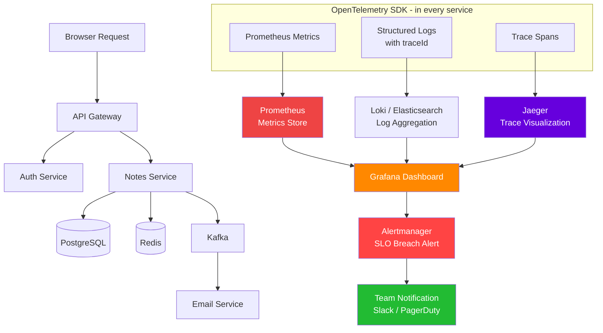

# Task: Logging - The Three Pillars of Observability (Logs, Metrics, Distributed Tracing)

**Related Issue:** [#166](https://github.com/FoushWare/request-journey-client-to-server/issues/166)  
**Category:** Logging / Observability  
**Prerequisites:** task-001 (logging basics), task-005 (distributed tracing Jaeger), task-010 (alerting on critical logs)  
**Estimated Time:** 4–6 hours  
**Languages:** TypeScript/Node.js, YAML  
**Notes App Context:** Instrument all Notes App microservices with OpenTelemetry to emit structured logs with correlation IDs, Prometheus metrics (RED method), and distributed traces visible in Jaeger — so a single request can be traced from the browser through every service.

---

## Learning Objectives

By the end of this task, you will be able to:

- Explain the three pillars of observability and why each one is necessary
- Add structured JSON logs with traceId/spanId correlation to all services
- Instrument a Node.js service with the OpenTelemetry SDK
- Export traces to Jaeger and visualize the request flow across services
- Expose Prometheus metrics for the RED method (Rate, Errors, Duration)
- Build a Grafana dashboard for service health
- Configure an alert that fires when a service SLO is breached
- Correlate a single request across logs, metrics, and traces by traceId

---

## Theory Section

### Why Observability > Monitoring

**Monitoring** tells you *that* something is wrong (a metric crossed a threshold).  
**Observability** tells you *why* — by correlating logs, metrics, and traces from the moment of failure.

In a monolith, one log file is enough. In 10+ microservices:
- A slow response could be in the API gateway, the auth service, the DB, or the network
- An error may cascade from one service to five others
- Without correlation IDs, you can't tell which request caused which log line

### The Three Pillars

#### Pillar 1: Distributed Logs
- **What**: Human-readable records of events with structured fields (JSON)
- **Key fields**: `timestamp`, `level`, `service`, `traceId`, `spanId`, `requestId`, `message`
- **Tools**: Winston/Pino (Node.js) → Fluent Bit (collector) → Loki or Elasticsearch → Grafana/Kibana
- **Rule**: Never log plain text strings — always log structured JSON

#### Pillar 2: Metrics
- **What**: Time-series numerical signals sampled at intervals
- **RED Method** (per service):
  - **R**ate — requests per second
  - **E**rrors — error rate (%)
  - **D**uration — request latency (p50, p95, p99)
- **USE Method** (per resource: CPU, memory, disk):
  - **U**tilization — % busy
  - **S**aturation — queue depth
  - **E**rrors — error count
- **Tools**: Prometheus (scrape /metrics) → Grafana (visualize + alert)

#### Pillar 3: Distributed Tracing
- **What**: A trace follows one request through all services; each hop creates a "span"
- **TraceId**: Shared across all services for one logical request
- **SpanId**: Unique per service call within that trace
- **Tools**: OpenTelemetry SDK (instrument) → Jaeger / Zipkin / Uptrace (visualize)

### OpenTelemetry (OTel)
The industry standard for observability instrumentation:
- One SDK covers traces + metrics + logs
- Vendor-neutral: export to Jaeger, Zipkin, Datadog, Grafana Tempo, Uptrace
- Auto-instrumentation available for Express, Fastify, gRPC, Kafka, PostgreSQL, Redis

---

## Diagram



---

## Step-by-Step Instructions

### Step 1: Add OpenTelemetry SDK to the Notes Service

```bash
npm install @opentelemetry/sdk-node \
            @opentelemetry/auto-instrumentations-node \
            @opentelemetry/exporter-trace-otlp-http \
            @opentelemetry/exporter-prometheus \
            pino
```

### Step 2: Initialize OpenTelemetry (must be first import)

```typescript
// src/tracing.ts  — import this before anything else
import { NodeSDK } from '@opentelemetry/sdk-node';
import { getNodeAutoInstrumentations } from '@opentelemetry/auto-instrumentations-node';
import { OTLPTraceExporter } from '@opentelemetry/exporter-trace-otlp-http';
import { PrometheusExporter } from '@opentelemetry/exporter-prometheus';

const sdk = new NodeSDK({
  serviceName: 'notes-service',
  traceExporter: new OTLPTraceExporter({
    url: process.env.OTEL_EXPORTER_OTLP_ENDPOINT ?? 'http://jaeger:4318/v1/traces',
  }),
  metricReader: new PrometheusExporter({ port: 9464 }),  // Prometheus scrapes :9464/metrics
  instrumentations: [getNodeAutoInstrumentations()],      // auto-instruments Express, PG, Redis, etc.
});

sdk.start();
process.on('SIGTERM', () => sdk.shutdown());
```

```typescript
// src/main.ts — must be first line
import './tracing';
import express from 'express';
// ... rest of app
```

### Step 3: Add Structured Logging with TraceId Correlation

```typescript
// src/logger.ts
import pino from 'pino';
import { trace } from '@opentelemetry/api';

export function createLogger(service: string) {
  return pino({
    base: { service },
    mixin() {
      const span = trace.getActiveSpan();
      const ctx = span?.spanContext();
      return ctx
        ? { traceId: ctx.traceId, spanId: ctx.spanId }
        : {};
    },
  });
}

// Usage in a handler:
// logger.info({ noteId: '123' }, 'Note created');
// Output: {"level":"info","service":"notes-service","traceId":"abc123","spanId":"xyz","noteId":"123","msg":"Note created"}
```

### Step 4: Add Custom Prometheus Metrics (RED Method)

```typescript
// src/metrics.ts
import { metrics } from '@opentelemetry/api';

const meter = metrics.getMeter('notes-service');

export const notesRequestCounter = meter.createCounter('notes_requests_total', {
  description: 'Total requests to the Notes service',
});

export const notesErrorCounter = meter.createCounter('notes_errors_total', {
  description: 'Total errors in the Notes service',
});

export const notesRequestDuration = meter.createHistogram('notes_request_duration_ms', {
  description: 'Notes request duration in milliseconds',
  unit: 'ms',
});

// Usage in middleware:
// const start = Date.now();
// notesRequestCounter.add(1, { method: req.method, route: req.path });
// notesRequestDuration.record(Date.now() - start, { method: req.method, status: res.statusCode });
```

### Step 5: Configure Prometheus to Scrape the Service

```yaml
# prometheus/prometheus.yml
scrape_configs:
  - job_name: notes-service
    static_configs:
      - targets: ['notes-service:9464']
  - job_name: auth-service
    static_configs:
      - targets: ['auth-service:9464']
  - job_name: email-service
    static_configs:
      - targets: ['email-service:9464']
```

### Step 6: Deploy Jaeger

```yaml
# k8s/jaeger.yaml
apiVersion: apps/v1
kind: Deployment
metadata:
  name: jaeger
spec:
  replicas: 1
  selector:
    matchLabels: { app: jaeger }
  template:
    metadata:
      labels: { app: jaeger }
    spec:
      containers:
        - name: jaeger
          image: jaegertracing/all-in-one:latest
          ports:
            - containerPort: 16686  # Jaeger UI
            - containerPort: 4318   # OTLP HTTP receiver
          env:
            - name: COLLECTOR_OTLP_ENABLED
              value: "true"
```

### Step 7: Build a Grafana Dashboard

Import the standard Node.js RED method dashboard (ID: 12156 from grafana.com/dashboards) and add:
- Panel: Requests/sec (`rate(notes_requests_total[5m])`)
- Panel: Error rate (`rate(notes_errors_total[5m]) / rate(notes_requests_total[5m])`)
- Panel: p99 latency (`histogram_quantile(0.99, notes_request_duration_ms_bucket)`)
- Link to Jaeger: embed trace explorer panel

### Step 8: Configure SLO Alert

```yaml
# prometheus/alerts.yml
groups:
  - name: notes-service-slo
    rules:
      - alert: NotesServiceHighErrorRate
        expr: rate(notes_errors_total[5m]) / rate(notes_requests_total[5m]) > 0.01
        for: 5m
        labels:
          severity: critical
        annotations:
          summary: "Notes service error rate > 1% for 5 minutes"
          description: "Error rate is {{ $value | humanizePercentage }}"
```

### Step 9: Verify End-to-End Correlation

1. Make a request: `curl http://notes-api/notes`
2. Note the `X-Trace-Id` response header (or find it in the response log)
3. Open Jaeger UI → search by traceId → see all spans across services
4. Open Loki/Kibana → filter by `traceId=<same id>` → see correlated logs
5. Open Grafana → see request counted in metrics

---

## Verification Checklist

- [ ] OpenTelemetry SDK initialized before all other imports
- [ ] All services emit structured JSON logs with `traceId` and `spanId`
- [ ] Jaeger UI shows traces spanning multiple services for one request
- [ ] Prometheus scrapes `/metrics` from all services
- [ ] Grafana dashboard shows Rate, Error Rate, and p99 Duration per service
- [ ] Alert fires when error rate exceeds 1% for 5 minutes
- [ ] Single traceId can be found in Jaeger traces, Loki logs, and Grafana exemplars
- [ ] Auto-instrumentation covers HTTP, PostgreSQL, Redis, and Kafka calls

---

## Automation Reference

> The steps above are **manual/raw** — they teach you observability by doing it yourself.

| What | Where | Description |
|------|-------|-------------|
| Monitoring stack | [`automation/ansible/roles/monitoring/`](../../automation/ansible/roles/monitoring/) | Ansible role deploying Prometheus + Grafana + Alertmanager |
| Notes App deployment | [`automation/ansible/roles/notes-app/`](../../automation/ansible/roles/notes-app/) | Full deployment including OTel SDK env vars and Jaeger endpoint |
| Kubernetes cluster | [`automation/ansible/roles/kubernetes/`](../../automation/ansible/roles/kubernetes/) | Cluster where Jaeger, Prometheus, and Grafana pods run |
| EKS cluster (cloud) | [`automation/terraform/modules/eks/`](../../automation/terraform/modules/eks/) | AWS EKS module for running the full observability stack in the cloud |
| Security | [`automation/ansible/roles/security/`](../../automation/ansible/roles/security/) | Ensures Jaeger and Grafana endpoints are not exposed publicly |

> 💡 The Ansible monitoring role deploys Prometheus, Grafana, and Alertmanager. The notes-app role injects `OTEL_EXPORTER_OTLP_ENDPOINT` pointing to Jaeger. Terraform EKS provides the cluster where all observability tools run.

---

## Task Checklist

- [ ] Read and understood the theory section
- [ ] Viewed the observability diagram
- [ ] Completed all prerequisite tasks
- [ ] OpenTelemetry SDK installed and initialized
- [ ] Auto-instrumentation working (traces appear for HTTP calls automatically)
- [ ] Structured logging with Pino — traceId included in every log line
- [ ] Custom Prometheus metrics added (RED method)
- [ ] Prometheus scrape config updated for all services
- [ ] Jaeger deployed and receiving traces
- [ ] Grafana dashboard built: rate, error rate, p99 latency
- [ ] SLO alert configured in Alertmanager
- [ ] Correlated a single request across traces + logs + metrics
- [ ] Documented learnings

---

**Task Status:** [ ] Not Started | [ ] In Progress | [ ] Completed  
**Date Started:** ___  
**Date Completed:** ___
